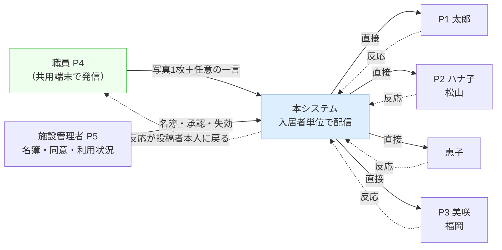

# 要件定義（機能要件・非機能要件）

本書は、[04_to-be.md](04_to-be.md) で定めた解決方針を、**実装可能な粒度の要件**に落とす。
あわせて、前工程が step4 に申し送った**論点（論点1〜4・認証・ターンキー度）の決着**をここで付ける。

> 本書のスコープは「**何を満たすか（What）**」まで。
> **どう作るか（How）＝画面設計・DB設計・API設計・特定プロダクト／技術の選定は書かない**（step5）。
> したがって本書には製品名・フレームワーク名・認証方式の実装名を書かない。「記憶・入力を求めない認証」のように**満たすべき性質**で記述する。
> 登場人物・課題・方針は [01_personas.md](01_personas.md) / [02_as-is.md](02_as-is.md) / [03_existing-solutions.md](03_existing-solutions.md) / [04_to-be.md](04_to-be.md) を参照。

---

## 1. プロダクトの目的とMVPの定義

### 1-1. 目的（一文）

**施設で暮らす高齢者の日常の様子を、施設から家族一人ひとりへ入居者単位で直接届け、家族の反応を職員本人に返す。データは施設が持ち続ける。**

### 1-2. MVPに含むもの／含まないもの

| | 内容 |
|---|---|
| **含む** | 日常の様子の発信（職員→家族）、個別配信と通知、反応の返送（家族→職員）、家族の参加（記憶・入力を求めない認証）、施設側の管理と利用状況の把握 |
| **含まない** | 緊急連絡、介護記録（法定記録）の公開・連携、医療／ケアプラン／請求、外部への転送・SNS共有 |

「含まない」の根拠は [04_to-be.md](04_to-be.md) 6章。緊急連絡は同期性・確実性の要件が別物のため次段に送る。

### 1-3. 成功指標（MVPの検証仮説）

要件の優先度は、この指標に効くかどうかで判断する。

| # | 指標 | 目標値（導入3ヶ月後） | 誰の課題 |
|---|---|---|---|
| M1 | 入居者1人あたりの発信頻度 | **週2回以上**が入居者の80%で継続 | K1・P4 |
| M2 | 1投稿あたりの所要時間（撮影開始〜送信完了） | **中央値60秒以内** | P4 |
| M3 | 高齢家族（P2相当）の自力閲覧 | 支援なしで**週2回以上**閲覧 | K6・P2 |
| M4 | 投稿に対する家族の反応率 | **50%以上**の投稿に何らかの反応 | K3・P4 |
| M5 | 家族から施設への問い合わせ電話 | 導入前比で**減少**（増えていない） | K5・P5 |
| M6 | 家族代表を経由せず直接届いている家族の割合 | 登録家族の**100%** | K2 |

> M5 は「減らす」ことを直接の施策にしない（04_to-be 2章のとおり K5 は帰結）。**悪化していないこと**の確認指標として置く。

---

## 2. 申し送り論点の決着

[04_to-be.md](04_to-be.md) 7章から引き継いだ論点に、本書で結論を出す。

### 2-1. 論点1：通知の頻度 → **デフォルトは「投稿の都度」。変更は任意、代理変更を可能にする**

| ペルソナ | 要求 | 決着後にどうなるか |
|---|---|---|
| P1 太郎 | まとめて1日数回。連打はつらい | 「1日1回まとめ」に**自分で変更できる** |
| P2 ハナ子 | 都度知りたい。設定変更はできない | **何もしなくても希望どおり**（デフォルトのまま） |
| P3 美咲 | リアルタイム可。頻度は自分で調整したい | デフォルトのままで可。変更も停止も自分でできる |

**なぜ「都度」をデフォルトにできるか。** 通知過多は投稿頻度の関数である。本システムは論点3の歯止めにより、入居者1人あたりの投稿を週2〜3回に想定している（M1）。したがって P1 が受け取る通知は**週2〜3件**であり、P1 が懸念する「1件ごとの連打」は構造的に発生しない。連打が起きうるのは複数入居者に紐づく場合のみで、それは FR-207 で吸収する。

**設定を変更できるのは誰か。** 本人・家族代表・施設管理者の3者。P2 は設定に到達できない前提のため、**家族代表が代理で変更できる**ことを要件に含める（FR-204）。ただし P2 はデフォルトが最適なので、代理変更が必要になるのは例外である——**「最も弱いユーザーが設定を触らなくて済むデフォルト」を選ぶ**、が本決着の原則。

### 2-2. 論点2：家族の本人確認 → **受け入れ基準で縛り、方式選定は step5 に渡す**

方式は選ばない（step5）。代わりに、**どの方式を選んでも満たすべき合格ラインを数値で固定**する。

| # | 受け入れ基準 |
|---|---|
| AC-A1 | 利用開始から最初の投稿を見るまでに、**文字入力が0回**であること（ID・メールアドレス・パスワード・確認コードのいずれも入力させない） |
| AC-A2 | 利用開始の操作が**3ステップ以内**で完了すること |
| AC-A3 | **説明書・口頭説明なし**で、対象年代の被験者が単独で完了できること（検証方法は 6-2） |
| AC-A4 | 2回目以降は、**ログイン操作なしで**内容に到達できること（同一端末を使い続ける限り、再認証を求めない） |
| AC-A5 | 端末の紛失・家族関係の変化に対し、**施設側から一方的にアクセスを失効**できること |
| AC-A6 | 認証の到達性が、施設外の特定事業者のアカウント保有を**必須条件にしない**こと |

AC-A6 は F軸（データ主権）との整合のために置く。外部アカウント連携を排除するものではないが、それが**唯一の入口になる設計は不可**とする。

> **緊張点（明示）**：AC-A1〜A4 は認証強度を下げる方向に働く。これは「P2が使えない設計は他がどれだけ良くても不可」（04_to-be 3-3）という床の帰結として**意図的に受け入れる**。埋め合わせは、扱う情報を日常の様子に限定すること（1-2）・アクセス範囲を入居者単位に限ること（NFR-41）・失効手段を施設が持つこと（AC-A5）の3点で行う。

### 2-3. 論点3：職員の入力負荷 vs 家族が欲しい情報量 → **必須入力を1つに固定し、増やさないことを要件にする**

- **1投稿の必須入力は「写真1枚」のみ。** テキスト・入居者の状態・カテゴリ等は**すべて任意**とする。
- テキストは**文例からの1タップ挿入**で代替できる（ゼロから書かせない）。
- 受け入れ基準は M2（所要時間の中央値60秒以内）。**新しい入力項目の追加は、この計測値を悪化させない範囲でのみ許す。**
- **歯止めルール（要件レベルの制約）**：*家族側の要望を根拠に、職員の必須入力項目を増やす変更は行わない。* 家族の情報量への要求は、職員の入力を増やす以外の手段（過去投稿の閲覧・入居者プロフィール・反応のやり取り）で満たす。

なぜ写真を必須にし、テキストを任意にするか。P2 の Need は「夫の**顔**を毎日見たい」であり、P3 の Need は「**素**の様子」である。どちらも一次情報は写真であって文章ではない。一方 P4 の Pain は「書く内容に気を遣う→結局書かなくなる」であり、負荷と恐れの源は文章側にある。**価値が高く負荷が低いものを必須に、価値が低く負荷が高いものを任意にする。**

> **残る緊張点（未解決として記録）**：P2 の「毎日ひとつ見たい」に対し、本書の目標は週2回（M1）である。差分は埋まっていない。MVPでは過去投稿をいつでも見られること（FR-205）で部分的に緩和し、実運用の頻度実績を見て次段で再検討する。**職員の入力負荷を上げて毎日を強制する解は採らない**（歯止めルールに反するため）。

### 2-4. 論点4：情報の公開範囲 → **投稿時は選ばせない。範囲は名簿で決まり、追加は「申請＋施設承認」**

| ペルソナ | 要求 | 決着後にどうなるか |
|---|---|---|
| P4 さくら | 毎回選ぶのは負荷 | **選択操作をゼロにする**（宛先は自動決定） |
| P5 中村 | 運用が分岐すると事故る。一律が望ましい | 宛先は常に「その入居者の家族名簿の全員」。分岐なし |
| P1 太郎 | 親族間で共有したい。見せる相手を増やしたい | **申請できる**（毎回の操作ではなく、一度きりの追加） |

- 公開範囲は**投稿ごとに決めない**。入居者ごとの家族名簿によって決まる（FR-106）。
- 名簿の初期登録は施設管理者が行う（入居契約時の連絡先情報が土台）。
- 家族の追加は、**家族代表が申請 → 施設管理者が承認**で有効になる（FR-405）。施設は誰が見ているかを常に把握でき、家族は自分で輪を広げられる。
- **投稿単位の公開範囲指定（この写真は特定の人だけ）はMVPに含めない。** P4・P5 の要求と正面から衝突するため。

### 2-5. ターンキー度 → **「ITに強い職員1人が4時間以内」を非機能要件として定義**

NFR-71〜74 で定義する。P5 の「ITに強い職員1人が数時間でできる」を、検証可能な数値と条件に落とす。

---

## 3. 利用者と役割

### 3-1. ロール定義

| ロール | 該当ペルソナ | 位置づけ |
|---|---|---|
| **施設管理者** | P5 中村 | 施設のデータ・利用者・設定を管理する。1施設に1名以上 |
| **職員** | P4 さくら | 担当入居者の様子を発信し、反応を受け取る |
| **家族代表** | P1 太郎 | 入居者ごとに1名以上。家族の追加申請と、他の家族の設定の代理変更ができる |
| **家族** | P2 ハナ子、P3 美咲、恵子 | 閲覧と反応を行う。管理操作は持たない |

**P2 に専用ロールを与えない。** 「かんたん向け」の別ロールを作ると、誰がそれに該当するかを施設が判断・設定する運用負荷が生じる（P5 の「一律が望ましい」に反する）。代わりに、**家族ロールのデフォルト体験そのものを P2 の水準に合わせる**（NFR-1 群）。P3 のようなユーザーには、設定変更という上向きの逃げ道だけを用意する。

### 3-2. 権限マトリクス

| 操作 | 施設管理者 | 職員 | 家族代表 | 家族 |
|---|:---:|:---:|:---:|:---:|
| 投稿の作成 | ○ | ○ | × | × |
| 自分の投稿の訂正・削除 | ○ | ○ | × | × |
| 他者の投稿の削除 | ○ | × | × | × |
| 担当入居者の投稿閲覧 | ○（全員） | ○（担当） | ― | ― |
| 紐づく入居者の投稿閲覧 | ― | ― | ○ | ○ |
| 反応・コメントの送信 | × | × | ○ | ○ |
| 自分の通知設定の変更 | ○ | ○ | ○ | ○ |
| 他の家族の通知設定の代理変更 | ○ | × | ○（同一入居者内） | × |
| 家族の追加**申請** | ― | × | ○ | × |
| 家族の追加**承認**・失効 | ○ | × | × | × |
| 入居者・職員の登録／変更 | ○ | × | × | × |
| 写真掲載同意の記録・変更 | ○ | × | × | × |
| 利用状況の閲覧・書き出し | ○ | × | × | × |

---

## 4. To-Be の情報の流れ（要件レベル）

[02_as-is.md](02_as-is.md) 1-0 の構造（すべてが P1 に集約）が、要件充足後にどう変わるか。

as-is からの差分は3点。**(1)** 施設→家族の経路が P1 の1本から家族全員への直接経路になった（K2）。**(2)** 点線だった P2・P3 への経路が実線になった（K6・K4）。**(3)** 反応の戻り経路（破線）が新設された（K3）。

---

## 5. 機能要件

優先度は **Must**（MVP必須）／**Should**（MVPに入れたい）／**Could**（次段）で示す。「課題」は [02_as-is.md](02_as-is.md) の K番号、「軸」は [03_existing-solutions.md](03_existing-solutions.md) の A〜G。

### 5-1. FR-1 発信（職員）

| ID | 要件 | 優先 | 課題／軸 |
|---|---|:---:|---|
| FR-101 | 職員は、施設管理下の共用端末から担当入居者を選び、様子を投稿できる | Must | K1／D |
| FR-102 | 投稿は**写真1枚以上を必須**、テキストを任意とする（論点3の決着） | Must | K1／D |
| FR-103 | 撮影から送信までを同一端末上で完結できる（他端末への取り込み・転送を必要としない） | Must | K1・P4／D |
| FR-104 | テキストは**文例からの選択**で入力できる。文例は施設で編集できる | Must | P4／D |
| FR-105 | 作成中に中断（離席・呼び出し・アプリ切替）されても、入力内容が失われない | Must | P4／D |
| FR-106 | 職員は宛先・公開範囲を選択しない。宛先は当該入居者の家族名簿から自動決定される（論点4の決着） | Must | P4・P5／B |
| FR-107 | 職員は自分の投稿を訂正・削除できる。管理者は全投稿を削除できる | Must | ―／― |
| FR-108 | 投稿は**事前承認を経ずに**家族へ届く。管理者は事後に全投稿を確認できる | Must | P4／D |
| FR-109 | 職員は担当入居者の「人となり」（好物・以前の仕事・思い出など）を閲覧できる | Should | P4／― |
| FR-110 | 家族は入居者の「人となり」を書き込める（職員はそれを FR-109 で読む） | Should | P3／― |
| FR-111 | 職員は自分の担当外の入居者を投稿対象に選べない | Must | ―／セキュリティ |

**FR-108 の判断根拠**：管理者の事前承認を挟むと、投稿が届くまでの時間が承認者の勤務時間に律速され、P4 の即時性（D軸）と発信量（K1）が失われる。誤りは事後の訂正・削除（FR-107）と事後確認で回収する。**発信量の確保を、誤りゼロより優先する**という判断である。

### 5-2. FR-2 受信・通知（家族）

| ID | 要件 | 優先 | 課題／軸 |
|---|---|:---:|---|
| FR-201 | 家族は、自分に紐づく入居者の投稿を新しい順に閲覧できる | Must | K2・K4／A・B |
| FR-202 | 新しい投稿があったことが、家族一人ひとりに直接通知される（家族代表を経由しない） | Must | K2／A |
| FR-203 | 通知の頻度を「投稿の都度」／「1日1回まとめ」／「通知しない」から選べる。**既定は「投稿の都度」**（論点1の決着） | Must | 論点1／― |
| FR-204 | 家族代表および施設管理者は、同一入居者に紐づく他の家族の通知設定を代理で変更できる | Should | P2／C |
| FR-205 | 家族は過去の投稿をさかのぼって閲覧できる（面会前のおさらい） | Must | P1／― |
| FR-206 | 通知の文面に技術用語・カタカナ語を使わない（NFR-13 に従う） | Must | P2／C |
| FR-207 | 複数の入居者に紐づく家族には、通知をまとめて届ける | Could | 論点1／― |

### 5-3. FR-3 反応（家族→職員）

| ID | 要件 | 優先 | 課題／軸 |
|---|---|:---:|---|
| FR-301 | 家族は、**文章を書かずに一度の操作で**感謝・反応を伝えられる | Must | K3・P2／E |
| FR-302 | 反応は、その投稿を行った**職員本人**に届く（施設宛ての一般連絡にしない） | Must | K3・P4／E |
| FR-303 | 家族は任意で短いコメントを送れる | Should | P1・P3／E |
| FR-304 | 職員は、自分の投稿に届いた反応を一覧で確認できる | Must | P4／E |
| FR-305 | 反応・コメントは、同じ入居者に紐づく家族間でも見える | Could | P1／― |

**FR-302 の判断根拠**：反応が「施設」宛てで止まると、P4 の Pain（自分の仕事の意義を感じにくい）が解けない。K3 の解消は**誰に届くか**が本体であり、反応機能の有無ではない。

### 5-4. FR-4 家族の参加・本人確認

| ID | 要件 | 優先 | 課題／軸 |
|---|---|:---:|---|
| FR-401 | 家族は、記憶・入力を求められない方法で本人確認し、利用を開始できる（AC-A1〜A6 を満たすこと） | Must | K6・論点2／C |
| FR-402 | 利用開始の導線は、家族が既に到達できる手段（施設からの案内物・家族からの受け渡し等）から始められる | Must | P2／C |
| FR-403 | 一度利用を開始した端末では、次回以降ログイン操作を求めない | Must | P2／C |
| FR-404 | 施設管理者は、入居者ごとの家族名簿を登録・編集できる | Must | 論点4／B |
| FR-405 | 家族代表は家族の追加を申請でき、施設管理者の承認によって有効になる | Must | P1・P5／論点4 |
| FR-406 | 施設管理者は、家族のアクセスを即時に失効できる（端末紛失・退居・関係の変化） | Must | AC-A5／セキュリティ |
| FR-407 | 1人の家族が複数の入居者に紐づけられる | Could | ―／― |

### 5-5. FR-5 施設の管理

| ID | 要件 | 優先 | 課題／軸 |
|---|---|:---:|---|
| FR-501 | 管理者は入居者を登録・編集し、退居の状態にできる | Must | ―／― |
| FR-502 | 管理者は職員を登録し、担当入居者の割り当てと利用停止ができる | Must | ―／― |
| FR-503 | 管理者は、入居者ごとの**最終投稿日と投稿件数**を一覧で把握できる（発信が止まっている入居者に気づける） | Must | P5・M1／― |
| FR-504 | 管理者は利用状況を、施設の既存の報告業務に転用できる形式で書き出せる | Should | P5／― |
| FR-505 | 管理者は入居者ごとに**写真掲載同意の有無**を記録でき、同意がない入居者では写真を伴う投稿ができない | Must | NFR-52／法令 |
| FR-506 | 管理者は施設内の全投稿と全反応を事後に閲覧できる | Must | FR-108／― |
| FR-507 | 管理者は文例（FR-104）を施設の方針に合わせて編集できる | Should | P4／― |

### 5-6. FR-6 データの管理（施設）

| ID | 要件 | 優先 | 課題／軸 |
|---|---|:---:|---|
| FR-601 | 施設は、蓄積したデータ（投稿・写真・名簿）を施設の手元に取り出せる | Must | P5／F |
| FR-602 | 退居時に、当該入居者に関するデータを保存または削除する扱いを管理者が選択・実行できる | Must | P5／法令 |
| FR-603 | 家族は、自分に紐づく入居者の写真を自分の端末に保存できる | Should | P1・P2／― |

---

## 6. 非機能要件

### 6-1. NFR-1 ユーザビリティ・アクセシビリティ（P2を床とする）

**この群は本システムの最重要要件である。** 機能要件が全て満たされても、この群が満たされなければ K6 は解けない（04_to-be 3-3）。

| ID | 要件 |
|---|---|
| NFR-11 | 家族向けの主要導線は、**説明を読まずに**目的を達成できること |
| NFR-12 | 本文の文字サイズは既定で**18px相当以上**、端末の文字サイズ設定拡大に追従して崩れないこと |
| NFR-13 | 家族向けの文言に技術用語・カタカナ語・システム用語を使わないこと（例：「同期」「アカウント」「ログイン」等を画面と通知に出さない） |
| NFR-14 | 操作要素の当たり判定は**48×48px相当以上**、要素間に十分な間隔を取ること |
| NFR-15 | 家族の閲覧導線に、**横スワイプ・長押し・階層移動を必須としない**こと（縦スクロールと単純なタップで完結する） |
| NFR-16 | 1画面に情報を詰め込まないこと。写真を最大の要素として扱うこと |
| NFR-17 | 職員の投稿導線は**片手で**完結できること |
| NFR-18 | 色のみに依存して情報を伝えないこと。文字と背景のコントラスト比 4.5:1 以上 |

### 6-2. NFR-2 検証（受け入れの確かめ方）

| ID | 要件 |
|---|---|
| NFR-21 | AC-A3・NFR-11 は、**70歳以上・スマートフォンの利用がメッセージアプリに限られる被験者3名以上**による、無支援・無説明の実地確認をもって合格とする |
| NFR-22 | M2（1投稿60秒）は、実機での計測をもって確認する。開発者の主観評価では合格としない |

### 6-3. NFR-3 対応環境・性能

| ID | 要件 |
|---|---|
| NFR-31 | 家族側は**発売から5年程度が経過した端末**で実用的に動作すること（P2 は子のお下がり機種を使用） |
| NFR-32 | 家族側は**アプリのインストールを必須としない**こと（P2 の Pain：インストールでつまずく） |
| NFR-33 | 職員側は施設管理下の共用スマートフォン／タブレットで動作すること。専用端末の新規導入を前提としない |
| NFR-34 | 通知を受けてから内容が表示されるまで、標準的なモバイル回線で**3秒以内**（写真の初期表示を含む） |
| NFR-35 | 施設内の回線品質が低い場合でも、写真の送信が失敗したまま失われないこと（再送・保留） |
| NFR-36 | 想定規模：1施設あたり入居者80名・職員50名・家族200名。1入居者あたり月10投稿 |

### 6-4. NFR-4 セキュリティ

| ID | 要件 |
|---|---|
| NFR-41 | 家族は、**自分が紐づく入居者の情報のみ**にアクセスできること。他の入居者の情報に到達する経路が存在しないこと |
| NFR-42 | 職員は、担当として割り当てられた入居者の情報のみを投稿・閲覧できること |
| NFR-43 | 通信は暗号化されること。写真を含む個人情報は保存時にも保護されること |
| NFR-44 | 写真等のファイルは、**推測可能なURLで第三者が到達できない**こと（リンクを知っていれば誰でも見られる状態を作らない） |
| NFR-45 | 誰がいつ何を投稿・閲覧・削除・失効したかの記録を残し、管理者が確認できること |
| NFR-46 | 認証の到達性を弱めた分（2-2 の緊張点）を、NFR-41・NFR-44・FR-406 で補うこと |

### 6-5. NFR-5 プライバシー・法令

| ID | 要件 |
|---|---|
| NFR-51 | 個人情報保護法に準拠すること。利用目的を家族・入居者に明示できること |
| NFR-52 | 写真の掲載は、入居者本人または代理人の**同意の記録がある場合に限る**（FR-505） |
| NFR-53 | 健康状態・医療に関する情報を扱わない（要配慮個人情報の取得を避ける）。本システムが扱うのは**日常の様子**に限る |
| NFR-54 | 撮影・投稿に他の入居者が写り込む可能性への運用上の注意を、導入手順書に記載すること |
| NFR-55 | 施設外への転送・SNS共有を機能として提供しないこと（FR-603 の端末保存は家族の私的利用の範囲） |

**NFR-53 の位置づけ**：これは制約であると同時に**設計上の防御**である。扱う情報を日常の様子に限ることで、認証を緩めた（2-2）際のリスク上限を下げている。

### 6-6. NFR-6 データ主権（F軸）

| ID | 要件 |
|---|---|
| NFR-61 | 入居者・家族の個人情報が、**施設が契約する環境**に保持されること。開発者や第三者のサービス提供者が全施設のデータを保持する構成を採らないこと |
| NFR-62 | 物理サーバーの設置を必要としないこと（G軸：固定費・運用負荷の回避） |
| NFR-63 | 日常のデータ管理が、管理者向けの機能から完結すること。クラウドの管理コンソールの直接操作を日常運用で必要としないこと |
| NFR-64 | 施設がデータを取り出し、別環境へ移せること（特定事業者への固定化を作らない） |

### 6-7. NFR-7 導入・運用（G軸／ターンキー度）

| ID | 要件 |
|---|---|
| NFR-71 | **ITに強い職員1人が、4時間以内**に1施設分の導入を完了できること |
| NFR-72 | 導入手順・運用手順・障害時の復旧手順が**日本語**で提供されること（英語ドキュメントのみでは P5 は判断も実行もできない） |
| NFR-73 | 環境構築が**コード化**され、手作業の設定を必要とせず再現可能であること |
| NFR-74 | 80名規模の施設が継続できる運用費であること。**上限は月額1万円程度**とし、既存ベンダーの家族向けサービス（月額数十万円規模）と桁で異なること |
| NFR-75 | バックアップと復旧の手順が定義され、管理者が実行できること |

### 6-8. NFR-8 その他

| ID | 要件 |
|---|---|
| NFR-81 | 表示言語は日本語のみ（MVP） |
| NFR-82 | 特定の1施設に固有の前提を作り込まないこと（他施設が導入できる汎用性を保つ） |
| NFR-83 | 稼働率の目標は**平日日中帯で99%**。24時間365日の無停止は要件としない（緊急連絡をスコープ外としているため） |
| NFR-84 | OSSとして公開すること。ライセンスと第三者ライブラリの利用条件を明示すること |

---

## 7. 扱う情報（概念レベル）

DB設計は step5 で行う。ここでは**どんな情報を扱う必要があるか**だけを列挙する。

| 情報 | 主な内容 | 関連要件 |
|---|---|---|
| 施設 | 施設の識別、文例、運用設定 | FR-507 |
| 入居者 | 氏名、状態（入居中／退居）、写真掲載同意の有無、人となり | FR-501・FR-505・FR-109 |
| 職員 | 氏名、権限、担当入居者の割り当て、利用可否 | FR-502・FR-111 |
| 家族 | 入居者との関係、家族代表かどうか、通知設定、アクセスの有効／失効 | FR-404・FR-203・FR-406 |
| 投稿 | 対象入居者、投稿者、写真、テキスト、日時、訂正・削除の履歴 | FR-101〜107 |
| 反応 | 対象投稿、送信した家族、種別（一押し／コメント）、日時 | FR-301〜303 |
| 家族追加の申請 | 申請者、対象、承認状態 | FR-405 |
| 操作の記録 | 誰が・いつ・何を | NFR-45 |

> 「施設」を最上位に置くのは、複数施設が同一の仕組みを使う場合でもデータが交差しないことを要件（NFR-41・NFR-82）から要求されるため。**その実現方式は step5。**

---

## 8. 前提・制約

| # | 内容 | 出所 |
|---|---|---|
| C1 | 職員の私物スマートフォンでの入居者撮影は施設ルールで禁止。発信は施設管理下の共用端末で行う | 01_personas P4／02_as-is 脚注 |
| C2 | 施設には共用スマートフォンまたはタブレットが1台以上ある。新規端末の導入は前提としない | 04_to-be 3-1 |
| C3 | 既存の介護記録ソフトとの連携は行わない。家族向けの新しい経路を別に作る | 04_to-be 3-1 |
| C4 | 写真掲載の同意は入居契約時に紙で取得済み（**仮定**、要検証） | 02_as-is 脚注 |
| C5 | 家族の連絡先は施設長がExcelで管理している（**仮定**、要検証）。初期の名簿登録はここからの移行を想定 | 02_as-is 脚注 |
| C6 | 個人開発・OSSであり、専任の運用担当を置けない。運用負荷の低さが機能の豊富さより優先する | CLAUDE.md |

---

## 9. スコープ外（MVPに含めないと明示するもの）

| 対象 | 理由 |
|---|---|
| 緊急連絡（発熱・転倒・受診） | 同期性・確実性の要件が別物。まず日常の様子とP2適合に集中する（04_to-be 6章） |
| 介護記録（法定記録）の公開・連携 | 法定記録の代替を狙わない（04_to-be 3-1） |
| 医療・ケアプラン・請求 | 02_as-is のスコープを踏襲 |
| 投稿単位の公開範囲指定 | P4の入力負荷・P5の一律運用と衝突（2-4） |
| 施設外への転送・SNS共有機能 | 個人情報が施設の管理外へ出る（NFR-55）。家族全員へ直接届くため転送の必要性自体が下がる |
| 家族→職員への一般的なメッセージ送受信 | 職員の応答負荷が青天井になり、K1の解決を打ち消す。反応（FR-301〜303）に限定する |
| 入居者本人による利用 | 想定ユーザーに含めていない（01_personas は将来の追加候補として記載） |
| 複数施設をまたぐ横断機能 | 1施設単位で完結させる |

---

## 10. トレーサビリティ

### 10-1. 課題（K1〜K6）→ 要件

| 課題 | 対応要件 |
|---|---|
| K1 発信の入口が細い | FR-101〜105・FR-108・NFR-17・NFR-33 |
| K2 太郎ボトルネック | FR-201・FR-202・FR-404 |
| K3 反応が戻らない | FR-301・FR-302・FR-304 |
| K4 記録が家族に届かない | FR-101・FR-201・FR-205 |
| K5 施設長が問い合わせ対応に追われる | （帰結。直接の要件を置かず M5 で監視） |
| K6 P2が届いても受け取れない | FR-401〜403・NFR-11〜18・NFR-31・NFR-32 |

### 10-2. 必要条件（A〜G）→ 要件

| 軸 | 対応要件 |
|---|---|
| A 直接到達 | FR-202・FR-404 |
| B 個別配信 | FR-106・FR-201・NFR-41 |
| C P2が使える | FR-401〜403・AC-A1〜A6・NFR-1群・NFR-32 |
| D 現場で完結 | FR-102〜105・FR-106・NFR-33・M2 |
| E 反応が返る | FR-301〜304 |
| F 施設で管理 | NFR-61〜64・FR-601 |
| G 見合うコスト | NFR-62・NFR-71〜74 |

**A〜G のすべてに要件が対応している。** また、[03_existing-solutions.md](03_existing-solutions.md) 5-2 が「下回ってはならない基準」とした3点——LINE の C（P2適合）と G（低コスト）、紙／電話の F（施設内で完結）——は、それぞれ NFR-1群、NFR-74、NFR-61 で明示的に基準化した。

### 10-3. 論点 → 決着

| 論点 | 決着 | 該当要件 |
|---|---|---|
| 論点1 通知頻度 | 既定は都度。任意で変更、代理変更可 | FR-203・FR-204 |
| 論点2 本人確認 | 方式は step5。受け入れ基準で固定 | AC-A1〜A6・FR-401 |
| 論点3 入力負荷 | 必須は写真1枚のみ。増やさないことを制約化 | FR-102・FR-104・M2 |
| 論点4 公開範囲 | 投稿時は選ばせない。名簿で決定、追加は申請＋承認 | FR-106・FR-404・FR-405 |
| ターンキー度 | 1人・4時間以内、日本語手順 | NFR-71〜74 |

---

## 11. 未決事項（step5 へ送る）

本書は What までを決めた。以下は **How の判断**であり、設計工程で候補を比較して決める。

| # | 未決事項 | 判断の材料になる要件 |
|---|---|---|
| U1 | 記憶・入力を求めない認証を、どの方式で実現するか | AC-A1〜A6・NFR-46・NFR-61 |
| U2 | 家族が利用を開始する導線を、物理的に何で渡すか | FR-402・NFR-21 |
| U3 | アプリのインストールを不要とする実現手段 | NFR-32・NFR-31 |
| U4 | 通知をどの経路で届けるか（到達率と P2 の到達可能性の両立） | FR-202・NFR-13・NFR-34 |
| U5 | どのクラウドを、施設のどの契約形態で使うか | NFR-61・NFR-62・NFR-74 |
| U6 | 環境構築の自動化手段 | NFR-73・NFR-71 |
| U7 | 複数施設のデータを交差させない実現方式 | NFR-41・NFR-82 |
| U8 | 写真の保存・配信と、推測不能なアクセス制御の実現方式 | NFR-44・NFR-43 |
| U9 | 画面構成・情報設計（NFR-1群を満たす具体） | NFR-11〜18 |

---

## 脚注：本書の前提について

- **成功指標（1-3）の数値は仮置き**である。実運用のデータがないため、導入初期の実績で見直す。特に M1（週2回）は、P2 の「毎日見たい」との差分（2-3 の緊張点）を残したまま置いた暫定値である。
- **NFR の数値（文字サイズ・秒数・費用上限など）は、ペルソナの記述と一般的な水準から導いた設定値**であり、実測に基づくものではない。step5 以降および実地検証で調整する。
- 前提 C4・C5 は [02_as-is.md](02_as-is.md) 脚注で「仮定」とされた項目を引き継いでいる。実施設へのヒアリング時に検証する。
- 本書は特定の製品・技術を選定していない。もし本書に製品名が現れた場合、それは step4 のスコープ違反であり、削除して step5 の文書へ移すこと。

---

## 次のドキュメント候補

- [ ] `docs/06_screens.md` — 画面設計（NFR-1群をどう具体化するか。U9）
- [ ] `docs/07_database.md` — DB設計（7章の概念モデルを具体化。U7）
- [ ] `docs/08_api.md` — API設計
- [ ] `docs/09_architecture.md` — 技術選定と構成（U1・U3〜U8。認証方式・クラウド・自動化の候補比較）
