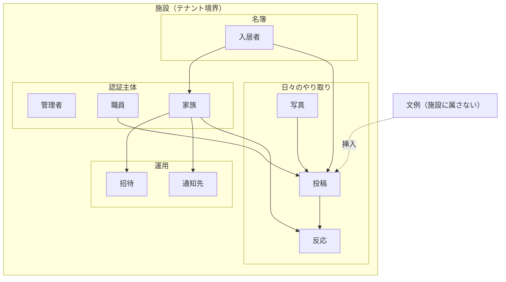
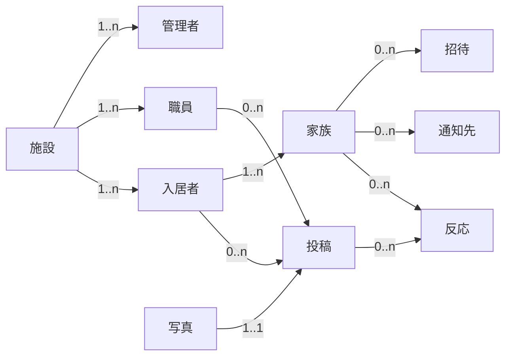
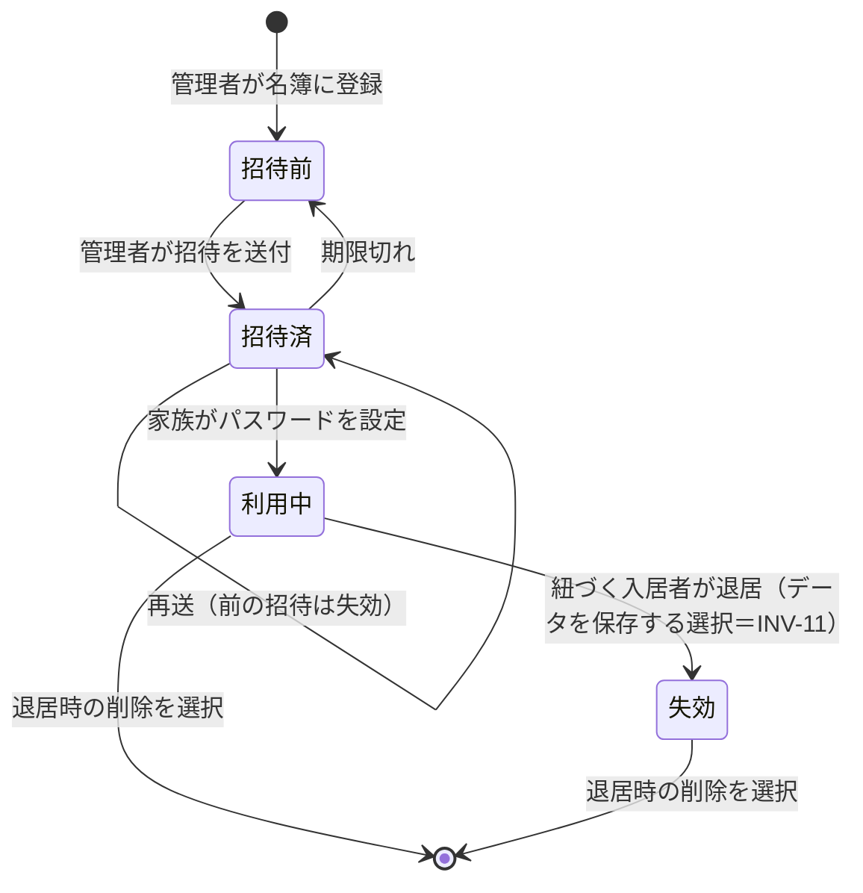
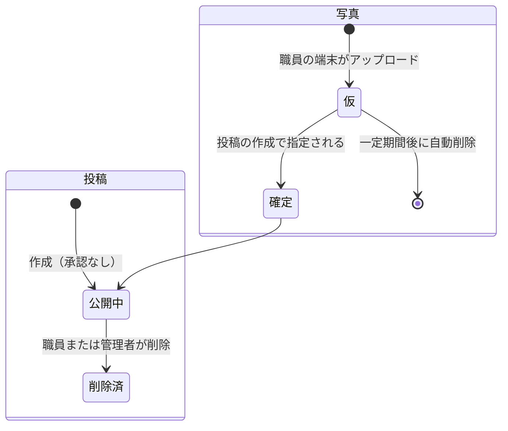
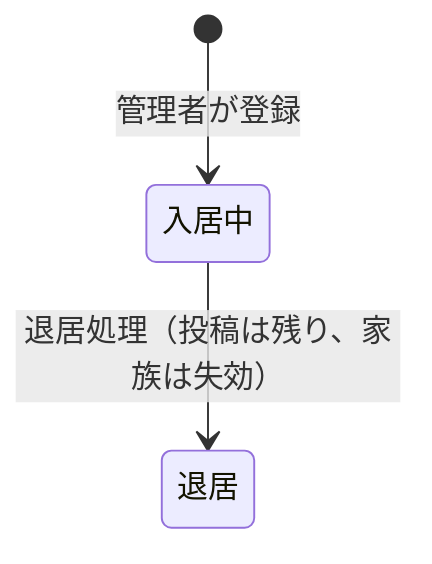

# リソース設計

本書は、[05_要件定義.md](05_要件定義.md) 6章「扱う情報（概念レベル）」を、**システムが操作する単位＝リソース**として具体化する。step5（設計）の1本目であり、[07_API設計.md](07_API設計.md) と [08_DB設計.md](08_DB設計.md) の共通の土台になる。

> **本書のスコープ**
> - **含む**：リソースの同定／所有関係とテナント境界／識別子の方式／属性（論理レベル）／ライフサイクル（状態遷移）／リソース間の関係／アクセス規則／不変条件。
> - **含まない**：URL・HTTPメソッド・ステータスコード・ペイロード形（→ [07_API設計.md](07_API設計.md)）、テーブル・カラム型・インデックス・制約の実装（→ [08_DB設計.md](08_DB設計.md)）、画面構成（→ 次段）。
> - **設計判断とトレードオフは本書に書かず、[ADR.md](ADR.md) に置く。** 本書は結論とその参照先を示す。
>
> 要件ID（FR-／NFR-／AC-B／M／K／C）の出典は [05_要件定義.md](05_要件定義.md)。

---

## 0. 本書の出発点

本書が前提として受け取っている決定は次のとおり。**これらは本書で覆さない。**

| 決定 | 本書への影響 |
|---|---|
| [ADR-001](ADR.md#adr-001) 提供側の共有環境に施設をテナントとして収容 | すべてのリソースが**施設に属する**構造になる |
| [ADR-003](ADR.md#adr-003) 全施設を単一のユーザープールに収容 | 認証主体の識別子が**施設内ではなく全体で一意**である必要がある（→ [ADR-048](ADR.md#adr-048)） |
| [ADR-006](ADR.md#adr-006) 1投稿の必須入力は写真1枚 | 投稿リソースの必須属性は写真1枚。他はすべて任意 |
| [ADR-047](ADR.md#adr-047) 認証主体は**職員個人** | **職員が認証主体になる**（R4）。端末はリソースではない（R3＝欠番）。投稿は**セッションから帰属**し、投稿者の選択を持たない。[ADR-007](ADR.md#adr-007)・[ADR-018](ADR.md#adr-018)・[ADR-042](ADR.md#adr-042) は撤回 |
| [ADR-008](ADR.md#adr-008) 宛先は家族名簿で決まる | 投稿に宛先属性を持たせない。到達範囲は**関係から導出**する |
| [ADR-009](ADR.md#adr-009) 事前承認なし | 投稿に承認待ち状態を持たせない |
| [ADR-010](ADR.md#adr-010) 通知は都度・停止のみ | 家族に通知頻度の設定を持たせない。可否の1ビットのみ |
| [ADR-011](ADR.md#adr-011) 反応は一押しのみ | 反応リソースは本文を持たない（→ [ADR-020](ADR.md#adr-020)） |
| [ADR-048](ADR.md#adr-048) 全主体をメールアドレスで識別 | 管理者・**職員**・家族のすべてが**メールアドレスを必須属性として持つ**。ユーザー名で識別する主体は存在しない（[ADR-015](ADR.md#adr-015) は撤回） |
| [ADR-012](ADR.md#adr-012) MVPの家族認証はメールアドレス＋パスワード | 家族リソースが**メールアドレスを必須属性として持つ**。招待は Cognito の標準機能（管理者によるユーザー作成＋招待の送付）で行い、**引換の仕組みを自前で持たない**（→ [ADR-016](ADR.md#adr-016)） |

### 0-1. 05_要件定義 6章からの差分

| 05 の記述 | 本書での扱い | 理由 |
|---|---|---|
| 施設（テナント）に「文例」が属する | **文例は施設に属さない**（システム共通・読み取り専用） | [05](05_要件定義.md) 9章で「文例の施設ごとの編集」をMVP対象外としたため。施設配下へ移す拡張点は 9章 V9 に記録 |
| 「家族」に通知の可否 | **通知の可否は家族の属性、通知の宛先は別リソース**（通知先） | 宛先の形が通知経路（U4）の結論に依存するため、方式非依存に切り離す |
| 「投稿」に写真 | **写真は独立したリソース**（[ADR-017](ADR.md#adr-017)） | ~~NFR-35（送信が失敗しても失われない）を満たすため~~ → **NFR-35 は欠番**（[ADR-050](ADR.md#adr-050)）。現在の理由は **NFR-76（転送量をアプリに乗せない）と NFR-44（推測不能な経路）** |
| （記載なし） | **招待**を追加 | [ADR-016](ADR.md#adr-016) による。**旧版は「端末」も追加していたが [ADR-047](ADR.md#adr-047) で撤回**（R3＝欠番）、**「エクスポート」も FR-601/602 の欠番により撤回した**（R15＝欠番。[ADR-050](ADR.md#adr-050)） |

---

## 1. リソース一覧

| # | リソース | 一言 | 認証主体 | 主な要件 |
|---|---|---|---|---|
| R1 | **施設** | テナントのルート。すべての所有関係の起点 | ― | NFR-47・NFR-82 |
| R2 | **管理者** | 名簿・同意を管理する人 | ○ | FR-404・FR-501・FR-502・FR-504・FR-505 |
| ~~R3~~ | ~~**端末**~~ | **欠番** — [ADR-047](ADR.md#adr-047) により端末は認証主体でなくなった | ― | ― |
| R4 | **職員** | 投稿の帰属先であり、**認証主体** | ○ | FR-302・FR-502・[ADR-047](ADR.md#adr-047) |
| R5 | **入居者** | 発信の単位。家族の紐づけ先 | ― | FR-501・FR-504 |
| R6 | **家族** | 閲覧と反応の主体。入居者に紐づく | ○ | FR-404・AC-B |
| R7 | **招待** | 家族に資格情報を渡す一度きりの引換券 | ― | FR-401・AC-B1・[ADR-016](ADR.md#adr-016) |
| R8 | **投稿** | 写真1枚＋任意の短文 | ― | FR-101〜106 |
| R9 | **写真** | 投稿から独立したメディア | ― | NFR-44・NFR-76・[ADR-017](ADR.md#adr-017) |
| R10 | **反応** | 家族の一押し。1家族×1投稿＝1件 | ― | FR-301〜303・[ADR-020](ADR.md#adr-020) |
| R11 | **通知先** | 家族に通知を届ける宛先（方式は未決） | ― | FR-202・U4 |
| ~~R12~~ | ~~**操作記録**~~ | **欠番** — NFR-45 の欠番による（[ADR-050](ADR.md#adr-050)） | ― | ― |
| R13 | **文例** | 1タップ挿入できる定型文。施設共通 | ― | FR-103 |
| ~~R14~~ | ~~**発信状況**~~ | **欠番** — FR-503 の欠番による（[ADR-050](ADR.md#adr-050)） | ― | ― |
| ~~R15~~ | ~~**エクスポート**~~ | **欠番** — FR-601・FR-602 の欠番による（[ADR-050](ADR.md#adr-050)） | ― | ― |

**認証主体は3種（管理者・職員・家族）。** [05](05_要件定義.md) のロール3種（施設管理者・職員・家族）と**そのまま一致する**——旧版は端末が職員の「発信する」を代行して認証していたためズレていたが、[ADR-047](ADR.md#adr-047) で職員個人が認証主体になり、ズレが解消した。ロールと認証主体の対応は 6-1 に示す。

---

## 2. テナント境界

### 2-1. 所有の原則

- **文例（R13）を除くすべてのリソースは、ちょうど1つの施設に属する**（INV-1）。
- **施設をまたぐ関連を持たない。** 関連はすべて同一施設内で閉じる（INV-2）。
- **施設の識別子は経路（URL・パラメータ）に現れない。** 操作対象の施設は、常に**認証トークンに載ったテナント識別子から解決する**（[ADR-013](ADR.md#adr-013)）。クライアントが施設を指定する経路を作らない。

これにより、テナント越境の防止は「**アクセスの起点でテナントを解決し、データアクセス層で必ず条件に加える**」の一点に集約される。[ADR-003](ADR.md#adr-003) が「担保箇所を一系統に寄せる」と決めたことの、リソース設計上の表現である。

### 2-2. 到達範囲（誰がどこまで見えるか）

| 主体 | 到達できる範囲 | 根拠 |
|---|---|---|
| 管理者 | **自施設のすべて**（削除済みの投稿を含む） | NFR-42・FR-505 |
| 職員 | 自施設の入居者・職員・文例・投稿・反応 | NFR-42 |
| 家族 | **自分に紐づく1人の入居者**の、公開中の投稿と自分の反応のみ | NFR-41 |

> **家族の到達範囲は「施設」ではなく「入居者」で切れる。** テナント条件だけでは NFR-41 を満たせない——施設内の他の入居者に届いてしまう。**家族のアクセスは、テナント条件に加えて必ず「紐づく入居者」の条件を伴う**（INV-4）。この二段の絞り込みを、実装で片方だけ書ける形にしない（[ADR-013](ADR.md#adr-013) の緩和策）。

---

## 3. リソース定義

属性は**論理レベル**（何を持つ必要があるか）であり、型・桁・NULL可否は [08_DB設計.md](08_DB設計.md) で決める。識別子は全リソース共通で UUIDv7（[ADR-014](ADR.md#adr-014)）。

### R1. 施設

| 属性 | 説明 |
|---|---|
| 識別子 | UUIDv7 |
| 施設コード | 人が読める短い一意の文字列。提供側が運用で施設を識別するために使う（[ADR-001](ADR.md#adr-001)）。**旧版は端末のユーザー名の前半に使っていたが、その用途は [ADR-047](ADR.md#adr-047) で消えた** |
| 名称 | 表示用 |
| 状態 | 利用中／停止 |
| 作成日時 | ― |

- **ライフサイクル**：提供側が作成する。施設は自分で作れない（NFR-71：施設は環境構築を行わない）。
- **アクセス**：施設の作成・停止は提供側の運用操作であり、**MVPの管理画面に置かない**（管理者は自施設の属性を読めるだけ）。
- **関連要件**：NFR-47・NFR-71・NFR-82

### R2. 管理者

| 属性 | 説明 |
|---|---|
| 識別子 | UUIDv7 |
| 施設 | 所属（1件） |
| 氏名 | ― |
| ログイン識別子 | メールアドレス |
| 状態 | 有効／停止 |

- **認証主体**。標準的な認証（[ADR-012](ADR.md#adr-012)）。管理者は P5（施設長）を想定しており、家族と違ってメールアドレスを使える前提に立てる（[01_ペルソナ.md](01_ペルソナ.md)）。したがって**資格情報の再設定を本人が行える**（NFR-46）。
- **ライフサイクル**：最初の1人は提供側が作成する。2人目以降は管理者が作成できる（1施設に1名以上＝[05](05_要件定義.md) 3-1）。
- **関連要件**：FR-404・FR-501〜505・NFR-46

### R3. ~~端末~~ —— **撤回・欠番**

**端末はリソースではなくなった**（[ADR-047](ADR.md#adr-047)）。C1 撤回（[ADR-046](ADR.md#adr-046)）により「端末は施設の物理的管理下にある」という前提が失われ、端末を認証主体とする根拠が消えた。**認証主体は職員個人（R4）である。**

**採番は詰めず、欠番のまま残す**（[05](05_要件定義.md) の AC-A・NFR-61 と同じ扱い）。旧 R3 が担っていた要素の引き継ぎ先は次のとおり。

| 旧 R3 の要素 | 引き継ぎ先 |
|---|---|
| 認証主体 | **R4 職員**（[ADR-047](ADR.md#adr-047)） |
| ログイン識別子 | R4 職員の**メールアドレス**（[ADR-048](ADR.md#adr-048)） |
| 状態（有効／失効） | R4 職員の状態（FR-502） |
| 投稿の端末記録 | **引き継がない。** [ADR-047](ADR.md#adr-047) が代償として明記したとおり、追跡の軸は職員の認証で代替する |

### R4. 職員

| 属性 | 説明 |
|---|---|
| 識別子 | UUIDv7 |
| 施設 | 所属（1件） |
| 氏名 | 投稿に表示される（家族が「誰が書いたか」を見る） |
| メールアドレス | ログイン識別子（[ADR-048](ADR.md#adr-048)）。**全テナントで一意** |
| 状態 | 在籍／利用停止 |

- **認証主体である**（[ADR-047](ADR.md#adr-047)）。職員はサインインし、**投稿はセッションから帰属する**——申告ではない。**旧版で職員が「帰属先であってアクセスの主体ではない」としていた整理は、C1 撤回とともに撤回された。**
- **ライフサイクル**：管理者が登録・利用停止にする（FR-502）。登録は家族の招待（R7）と同じ Cognito の標準フローで行う（[ADR-016](ADR.md#adr-016)・[ADR-048](ADR.md#adr-048)）。**利用停止にしても過去の投稿の帰属は消えない**（削除ではなく状態変更）。**利用停止は認証情報の即時失効を伴う**（[ADR-025](ADR.md#adr-025)：DAL が毎リクエストで状態を確認する）。
- **表示順を持たない。** 旧版は「投稿時の選択を速くするための並び」を持っていたが、**投稿者の選択そのものが無くなった**（[ADR-042](ADR.md#adr-042) 撤回）。
- **担当入居者の割り当ては持たない**（[05](05_要件定義.md) 9章）。同一施設の職員は全入居者に投稿できる。
- **関連要件**：FR-302・FR-502・[ADR-047](ADR.md#adr-047)

### R5. 入居者

| 属性 | 説明 |
|---|---|
| 識別子 | UUIDv7 |
| 施設 | 所属（1件） |
| 氏名 | ― |
| 状態 | 入居中／退居 |
| 写真掲載同意 | 有／無（[ADR-022](ADR.md#adr-022)） |
| 同意の記録日時・記録者 | 誰がいつ記録したか（FR-504・NFR-51） |
| 退居日 | 状態が退居のときのみ |

- **健康状態・医療に関する属性を持たない**（NFR-53）。この禁止はリソース設計の制約として明示しておく——**後から「バイタル」「食事量」などの属性を足さない。**
- **ライフサイクル**：登録 → 入居中 → 退居。~~退居時に、当該入居者のデータを**保存するか削除するか**を管理者が選ぶ（FR-602）。~~ **FR-602 の欠番（[ADR-050](ADR.md#adr-050)）により、退居時の選択は存在しない。** 退居は状態の変更のみであり、**データは保持される**。紐づく家族は全員失効する（INV-11）。
- **不変条件**：同意が「無」の入居者、または退居した入居者には投稿を作成できない（INV-3）。
- **関連要件**：FR-501・FR-504・NFR-52・NFR-53

### R6. 家族

| 属性 | 説明 |
|---|---|
| 識別子 | UUIDv7 |
| 施設 | 所属（1件） |
| 入居者 | 紐づく入居者（**1件必須**） |
| 氏名 | ― |
| 続柄 | 「長男」「妻」など。管理者が名簿を見分けるため |
| メールアドレス | ログイン識別子（[ADR-012](ADR.md#adr-012)・[ADR-048](ADR.md#adr-048)）。**全テナントで一意** |
| 通知の可否 | 受け取る／止める の1ビットのみ（[ADR-010](ADR.md#adr-010)） |
| 状態 | 招待前／招待済／利用中／失効 |
| 利用開始日時 | 最初にパスワードを設定した日時 |

- **入居者との関連を中間リソースにしない。** 「1人の家族が複数の入居者に紐づく」はMVP対象外（[05](05_要件定義.md) 9章）のため、家族が入居者を直接1件持つ。**将来これを許すときは、中間リソースの追加で拡張する**（家族の識別子と資格情報はそのまま使える）。
- **メールアドレスが実質の主キーになる。** 単一プール（[ADR-003](ADR.md#adr-003)）＋メールアドレス認証（[ADR-012](ADR.md#adr-012)）の帰結として、**1メールアドレス＝1家族＝1入居者**になる。夫婦入居や複数施設への紐づけがこの制約に当たる（[ADR-048](ADR.md#adr-048) の代償。**[ADR-047](ADR.md#adr-047) 以降は職員にも同じ制約が及び、掛け持ち勤務で表面化しうる**）。
- **状態の意味**：*招待前*＝名簿にはあるがまだ招待していない／*招待済*＝招待を送ったがパスワード未設定／*利用中*＝設定済み／*失効*＝紐づく入居者が退居した（FR-501・INV-11）。**失効は削除ではない**（誰が見ていたかの記録を残すため＝[ADR-019](ADR.md#adr-019)）。**管理者が個別に任意で失効させる操作はMVPに無い**（[05](05_要件定義.md) 9章：旧 FR-405）。
- **P2（メールアドレスを持つが使えない）は、名簿に載っても到達しない**——[ADR-012](ADR.md#adr-012) が引き受けた代償。リソース設計はこれを解決しない。
- **関連要件**：FR-404・FR-203・FR-501・AC-B1〜B4・NFR-41

### R7. 招待

| 属性 | 説明 |
|---|---|
| 識別子 | UUIDv7 |
| 施設 | 所属（1件） |
| 家族 | 対象（1件） |
| 発行者 | 管理者 |
| 発行日時／有効期限 | 期限の初期値は7日（Cognito の仮パスワードの既定） |
| 送付先 | 発行時点の家族のメールアドレス（**変更されても記録は当時の値を保つ**） |
| 種別 | 初回／再送 |
| 状態 | 送付済／引換済／期限切れ／失効 |
| 引換日時 | ― |

- **引換の仕組みを自前で持たない。** ユーザー作成・招待メール・仮パスワード・初回のパスワード設定は Cognito の標準機能に委ね、**アプリ側は「いつ誰が誰に招待を送ったか」の記録として招待リソースを持つ**（[ADR-016](ADR.md#adr-016)）。**引換コード（仮パスワード）をアプリは保持しない。**
- **独立したリソースとして持つ理由**：家族の属性にすると、再送のたびに前の招待が消え、「いつ誰に何度送ったか」が残らない。名簿の正確さが安全性の前提（[ADR-008](ADR.md#adr-008)）である以上、**招待の履歴は名簿の正確さを保つための材料**になる（同ADR根拠と同じ筋）。
- **1つの家族に対して有効な招待は同時に1つ**（再送すると前の招待は失効する＝INV-6）。これは Cognito の仮パスワードが再発行で置き換わる挙動と一致させる。
- **関連要件**：FR-401・AC-B1・AC-B2

### R8. 投稿

| 属性 | 説明 |
|---|---|
| 識別子 | UUIDv7 |
| 施設 | 所属（1件） |
| 入居者 | 対象（1件必須） |
| 職員 | 投稿者（1件必須。[ADR-047](ADR.md#adr-047) により**セッションから定まる**） |
| 写真 | **1件必須**（[ADR-006](ADR.md#adr-006)・[ADR-017](ADR.md#adr-017)） |
| 本文 | 任意。空でよい |
| 投稿日時 | ― |
| 状態 | 公開中／削除済 |
| 削除者・削除日時 | 状態が削除済のときのみ |

- **宛先属性を持たない**（[ADR-008](ADR.md#adr-008)）。誰に届くかは「入居者 → 家族」の関連から導出する。
- **承認待ち状態を持たない**（[ADR-009](ADR.md#adr-009)）。作成された瞬間に公開中になる。
- **削除は論理削除**（[ADR-019](ADR.md#adr-019)）。家族からは見えなくなるが、管理者は事後に確認できる（FR-505）。
- **下書きを持たない。** ~~FR-105（中断されても入力内容が失われない）は**端末側での保持**で満たし、~~ **FR-105 が欠番になった（[ADR-050](ADR.md#adr-050)）ため、端末側の保持も持たない。** 中断したら作り直す。サーバーの下書きリソースも作らない（V10＝欠番）。
- **関連要件**：FR-101〜106・FR-505・M2

### R9. 写真

| 属性 | 説明 |
|---|---|
| 識別子 | UUIDv7 |
| 施設 | 所属（1件） |
| 状態 | 仮（アップロード済・未使用）／確定（投稿に紐づいた） |
| 保存場所の鍵 | ストレージ上の位置。**推測不能な値**（NFR-44） |
| 大きさ・寸法 | 表示の最適化用 |
| 作成日時 | ― |
| 投稿 | 確定後に1件（確定前は無し） |

- **投稿より先に存在する**（[ADR-017](ADR.md#adr-017)）。①写真をアップロードする ②投稿を作成して写真を指定する、の2段階。~~回線が悪くても、①だけを繰り返し再試行できる（NFR-35）。~~ **2段階の理由は NFR-35 ではなく、写真のバイト列をアプリに通さないこと（NFR-76・[ADR-027](ADR.md#adr-027)）に移った**（[ADR-017](ADR.md#adr-017) 改訂）。
- **仮のまま一定期間を過ぎた写真は削除する**（INV-8）。掃除の仕組みが必要になる点は代償として [ADR-017](ADR.md#adr-017) に記録。
- **配信は推測不能かつ時限付きの経路で行う**（NFR-44）。具体の方式は 9章 V2。
- **関連要件**：NFR-43・NFR-44・NFR-76

### R10. 反応

| 属性 | 説明 |
|---|---|
| 識別子 | UUIDv7 |
| 施設 | 所属（1件） |
| 投稿 | 対象（1件） |
| 家族 | 送信者（1件） |
| 送信日時 | ― |

- **本文を持たない**（[ADR-011](ADR.md#adr-011)）。種類も1つだけ。
- **1家族×1投稿につき1件**（[ADR-020](ADR.md#adr-020)）。取り消しは削除で表す。**同じ投稿に2回送っても2件にならない**（INV-5）。
- **職員に「届く」の形**：反応はプッシュされない。**職員が自分の投稿への反応を一覧で見る**（[ADR-021](ADR.md#adr-021)）。[ADR-047](ADR.md#adr-047) で職員が認証主体になったため個人宛ての経路は作れるが、**通知を送らない決定は維持する**（同ADR 結果）。
- **関連要件**：FR-301〜303・M4

### R11. 通知先

| 属性 | 説明 |
|---|---|
| 識別子 | UUIDv7 |
| 施設 | 所属（1件） |
| 家族 | 所有者（1件） |
| 方式 | **未決（U4）**。経路の種別 |
| 宛先 | 方式に依存する値 |
| 状態 | 有効／無効 |
| 登録日時・最終成功日時 | 届かなくなった宛先に気づくため |

- **家族の属性に埋めない。** 1人の家族が複数の端末で受け取りうること、方式が U4 の結論で変わることの2点から、従属リソースとして切り離す。
- **通知の可否（受け取る／止める）は家族の属性**、**どこへ届けるかは本リソース**、と役割を分ける。停止しても宛先は消さない（再開できるようにするため）。
- **通知の履歴をMVPでは持たない**（送った記録を残すと、リソースが1つ増えるわりに MVP で読む人がいない）。
- **関連要件**：FR-202・FR-203・U4

### ~~R12. 操作記録~~ —— **欠番**

**NFR-45 の欠番（[ADR-050](ADR.md#adr-050)）により、本リソースは存在しない。**

事後の追跡は **FR-505**（管理者が自施設の全投稿・全反応を事後に閲覧できる）だけになった。**拒否されたアクセス（越境の試行）はどこにも残らない**——[ADR-003](ADR.md#adr-003) が「防止だけに賭けない」として置いた検出の層が消えたことを意味する（[ADR-050](ADR.md#adr-050) の最も重い代償）。

**採番は詰めず、欠番のまま残す。** 復活させるときは、旧版の属性（実行主体・操作・対象・日時・結果）と INV-9（追記専用）をそのまま戻せばよい。

### R13. 文例

| 属性 | 説明 |
|---|---|
| 識別子 | UUIDv7 |
| 本文 | 「お食事を完食されました」など |
| 表示順 | ― |

- **施設に属さない。システム共通・読み取り専用**（0-1 参照）。施設ごとの編集はMVP対象外（[05](05_要件定義.md) 9章）。
- **唯一のテナント非依存リソース**である。施設配下へ移す拡張点は 9章 V9。
- **関連要件**：FR-103

### ~~R14. 発信状況（派生）~~ —— **欠番**

**FR-503 の欠番（[ADR-050](ADR.md#adr-050)）により、本リソースは存在しない。** [ADR-023](ADR.md#adr-023)（保存せず都度求める）も同時に撤回された。

M1（発信が続くか）は検証指標として残るが、**管理者向けの機能としては提供しない**。確認が必要になれば投稿データから直接集計する。

### ~~R15. エクスポート~~ —— **欠番**

**FR-601・FR-602 の欠番（[ADR-050](ADR.md#adr-050)）により、本リソースは存在しない。**

FR-601 は撤回済みの「データ主権」制約の生き残りであり、ロックイン回避は **OSS として API が外から見える契約になっていること**（[ADR-024](ADR.md#adr-024)）に委ねる。**稼働中のデータを施設が自分で取り出す手段は MVP に無い。**

---

## 4. リソース間の関係

| 関係 | 多重度 | 備考 |
|---|---|---|
| 施設 → 管理者／職員／入居者 | 1 : n | すべての起点（INV-1） |
| 入居者 → 家族 | 1 : n | **家族側は必ず1人の入居者**（MVP。[05](05_要件定義.md) 9章） |
| 家族 → 招待 | 1 : n | 有効な招待は同時に1つ（INV-6） |
| 家族 → 通知先 | 1 : n | 端末ごとに増えうる |
| 入居者 → 投稿 | 1 : n | ― |
| 職員 → 投稿 | 1 : n | 帰属であって所有ではない（職員を利用停止にしても投稿は残る） |
| 写真 → 投稿 | 1 : 1 | 必須1枚（[ADR-006](ADR.md#adr-006)）。**写真が先に作られる**（[ADR-017](ADR.md#adr-017)） |
| 投稿 → 反応 | 1 : n | ― |
| 家族 × 投稿 → 反応 | 0 or 1 | 重複しない（INV-5・[ADR-020](ADR.md#adr-020)） |

> **投稿と家族の間に直接の関連を置かない。** 「誰に届くか」は *投稿 → 入居者 → 家族* をたどって得る（[ADR-008](ADR.md#adr-008)）。名簿を1箇所（家族リソース）に閉じ込めることで、退居に伴う失効（FR-501・INV-11）が**過去の投稿にも遡って効く**——配信先を投稿にコピーしていたら、失効しても既存投稿からは見え続けることになる。

---

## 5. ライフサイクル

### 5-1. 家族と招待

- **家族が自分でアカウントを作る経路が存在しない**（AC-B1）。入口は常に管理者の登録である。**名簿への登録と招待の送付を分ける**のは、名簿の一括登録（C5：Excel からの移行）と、家族への送付のタイミングが一致しないため。
- **利用開始に求める入力は、招待メールの仮パスワードと、新しいパスワードの設定まで**（AC-B2）。プロフィール等の付随入力は求めない。
- **初回以降、同一端末では再入力なしに利用できる**（AC-B3）。再認証を求めるのは AC-B4 の2つの契機——①一定期間の経過／②明示的なログアウト（FR-406）——に限る。このとき求められるメールアドレスとパスワードの入力は、[ADR-012](ADR.md#adr-012) で引き受けた代償であり、リソース設計では解消できない。
- **②の明示的なログアウトは、家族自身が引ける唯一の契機である。** ①は時間の経過で自動的に起きる。セッションの終了を家族側から行う手段はここだけなので、**リソースとして「セッション」は家族が消せる対象でもある**（07 の `DELETE /api/auth/session`）。
- **失効は削除ではない**（[ADR-019](ADR.md#adr-019)）。過去に誰が見ていたかを管理者が確認できなくなるため（[ADR-008](ADR.md#adr-008) が安全性の前提に置いた「誰が見ているかを施設が把握している」の、過去形の部分）。**NFR-45 の欠番後は、この論理削除が『誰が見ていたか』を残す唯一の手段になった。**

### 5-2. 投稿と写真

- **通知は「公開中」への遷移を起点に送られる**（FR-202）。削除しても**通知は届いた後**である（[ADR-009](ADR.md#adr-009) の代償）。
- **削除済の投稿に反応は付けられない**（INV-5）。既に付いている反応は残る（職員が受け取った事実は消さない）。

### 5-3. 入居者

- **退居処理は複合操作**である：入居者を退居にする／紐づく家族をすべて失効にする（INV-11）。**この2つが1つの操作として実行されること**を要求する（片方だけ実行された状態を作らない）。
- ~~データの保存か削除かを選ぶ（FR-602）~~ は **FR-602 の欠番（[ADR-050](ADR.md#adr-050)）により消えた。** 退居後も**データは保持される**。
- **退居後のデータ保持期間は決めない。** 旧 V6 と [ADR-034](ADR.md#adr-034)（1年で自動削除）は撤回された——**MVP はデータを消さない**。法令上の削除請求は提供者の運用で対応する（[05](05_要件定義.md) 5-5 脚注）。

---

## 6. アクセス規則

### 6-1. ロールと認証主体の対応

| 05 のロール | 認証主体 | 備考 |
|---|---|---|
| 施設管理者 | 管理者（個人） | メールアドレス＋パスワード |
| 職員 | **職員（個人）**（[ADR-047](ADR.md#adr-047)） | メールアドレス＋パスワード（[ADR-048](ADR.md#adr-048)）。**旧版は端末が認証主体だった** |
| 家族 | 家族（個人） | メールアドレス＋パスワード（[ADR-012](ADR.md#adr-012)） |

### 6-2. リソース × 主体 × 操作

○＝可、×＝不可、△＝条件付き（条件を脚注に示す）、―＝そもそも操作が存在しない

| リソース | 管理者 | 職員 | 家族 |
|---|:---:|:---:|:---:|
| 施設 | 読 ○／書 × | 読 ○ | × |
| 管理者 | 読書 ○ | × | × |
| ~~端末~~ | ― | ― | ― |
| 職員 | 読書 ○ | 自分の情報のみ ○ | × |
| 入居者 | 読書 ○ | 読 ○ | 読 △¹ |
| 家族 | 読書 ○ | × | 読 △¹ |
| 招待 | 送付・再送・失効 ○ | × | 記録は読めない △² |
| 投稿 | 読 ○（削除済含む）／作成 ׳／削除 ○ | 作成 ○／読 ○／削除 △⁴ | 読 △¹ |
| 写真 | 読 ○ | 作成 ○／読 ○ | 読 △¹ |
| 反応 | 読 ○ | 読 ○ | 作成・取消 △¹／読 △¹ |
| 通知先 | 読 ○ | × | 自分のものを作成・削除 ○ |
| 文例 | 読 ○ | 読 ○ | × |

1. **自分に紐づく1人の入居者に関するものだけ**（NFR-41）。投稿は公開中のもののみ。家族リソースは「同じ入居者に紐づく他の家族の氏名・続柄」までを読めるものとする（家族間で誰が見ているか分かる状態にする）。
2. 家族は招待リソースに触れない。**引き換え（仮パスワードでのサインインとパスワード設定）は Cognito 側で完結する**ため、本システムのリソース操作にならない（[ADR-016](ADR.md#adr-016)）。アプリが知るのは「引き換えられた」という結果だけである。
3. **管理者は投稿を作成できない**（[05](05_要件定義.md) 3-2）。発信は現場で起きるという前提を要件で固定したもの。管理者が発信するには**職員としてサインインする**必要がある。
4. **職員は自分の投稿だけを削除できる**（FR-106）。管理者は自施設の全投稿を削除できる（FR-505）。~~削除は操作記録に残る（NFR-45）。~~ **NFR-45 の欠番により、削除の操作そのものは記録されない**——残るのは論理削除された投稿が管理者から見えること（INV-10）だけである。

> **旧版がここに置いていた「要件との差分」は解消した。** 職員を認証していなかった当時は、FR-106 の「職員は**自分の**投稿を削除できる」を技術的な境界として実現できず、*画面上の既定を自分の投稿に絞る*ことで代替していた（[ADR-007](ADR.md#adr-007) が引き受けた代償）。**[ADR-047](ADR.md#adr-047) により職員が認証主体になったため、要件どおりに実装できる。** 脚注4 が条件付き（△）なのは、*他人の投稿は削除できない*という制限を表すためであり、要件を満たせないという意味ではない。

---

## 7. 不変条件

**実装とテストが直接参照できる形**で置く。ここに書いたものは、[08_DB設計.md](08_DB設計.md) で制約として、[07_API設計.md](07_API設計.md) で検証として現れる。

| # | 不変条件 | 根拠 |
|---|---|---|
| INV-1 | 文例を除くすべてのリソースは、ちょうど1つの施設に属する | NFR-47 |
| INV-2 | 関連するリソースどうしは、必ず同じ施設に属する（投稿の入居者・職員・写真はすべて投稿と同施設） | NFR-47・[ADR-013](ADR.md#adr-013) |
| INV-3 | 写真掲載同意が「無」の入居者、または退居した入居者には投稿を作成できない | FR-504・NFR-52 |
| INV-4 | 家族が読めるのは、**自分に紐づく入居者**の**公開中**の投稿のみ。他の経路が存在しない | NFR-41 |
| INV-5 | 反応は、その家族が読める投稿にのみ付けられる。1家族×1投稿につき最大1件 | NFR-41・[ADR-020](ADR.md#adr-020) |
| INV-6 | 1つの家族に対して有効な招待は同時に1つ。引換済・失効・期限切れの招待は引き換えられない | [ADR-016](ADR.md#adr-016) |
| INV-7 | 失効した家族の資格情報では、いかなるリソースにも到達できない | FR-405・AC-B5 |
| INV-8 | 写真は、確定後はちょうど1つの投稿に属する。仮のまま期限を過ぎた写真は削除される | [ADR-017](ADR.md#adr-017) |
| ~~INV-9~~ | ~~操作記録は追記のみ。更新・削除の経路を持たない~~ | **欠番** — R12 の欠番による（[ADR-050](ADR.md#adr-050)） |
| INV-10 | 投稿の削除は表示からの除外であり、**管理者の事後閲覧は残る**（操作記録は R12 の欠番により存在しない） | FR-505・[ADR-019](ADR.md#adr-019) |
| INV-11 | 入居者が退居したとき、紐づく家族はすべて失効する | FR-501（FR-405・FR-602 はいずれも欠番だが、**本不変条件は MVP 唯一のアクセス遮断手段として残る**） |
| INV-12 | 外部に出る識別子は、連番を含まず、他のリソースの識別子から推測できない | NFR-44・[ADR-014](ADR.md#adr-014) |

> **INV-4 と INV-7 は、テナント分離の要（かなめ）である。** [ADR-003](ADR.md#adr-003) が「1箇所の実装漏れが越境事故に直結する」と記録したリスクは、具体的にはこの2つが破れることを指す。**この2つは、個々の画面・APIごとの確認に委ねず、データアクセス層で必ず通る経路に置く**（実装方式は 9章 V7）。

---

## 8. トレーサビリティ

### 8-1. 要件 → リソース

| 要件 | 主に担うリソース |
|---|---|
| FR-101〜106 発信 | 投稿・写真・入居者・職員・文例 |
| ~~FR-107~~ 職員を識別 | **職員**（[ADR-047](ADR.md#adr-047)。要件は欠番だが、投稿の帰属は認証で担保される） |
| FR-201〜204 受信・通知 | 投稿・通知先・家族 |
| FR-301〜303 反応 | 反応・投稿・職員 |
| FR-401〜403 参加 | 招待・家族 |
| FR-404・FR-405 名簿と失効 | 家族・入居者 |
| FR-501・502・504・505 施設の管理 | 入居者・職員・家族・投稿 |
| NFR-41・NFR-42・NFR-47 分離 | 施設（すべてのリソースの所有）・家族 |
| NFR-44 推測不能 | 識別子（全リソース）・写真 |
| NFR-52 同意 | 入居者 |

### 8-2. リソースを持たない要件

| 要件 | どこで満たすか |
|---|---|
| NFR-11〜18 ユーザビリティ | 画面設計（次段）。リソース設計では**家族向けリソースの属性を増やさない**ことで支える（NFR-16：1画面に詰め込まない） |
| NFR-31〜33 対応環境 | 配信方式（V2）・通知経路（V1）。リソースの粒度は**1画面＝1リソースの取得**で足りるように設計した（NFR-34・NFR-35 は欠番） |
| NFR-51・NFR-54〜56 法令・責任分界 | 文書（導入手順書）。リソースは持たない |

---

## 9. 未決事項（07・08 へ）

| # | 未決事項 | 依存 | 送り先 |
|---|---|---|---|
| V1 | 通知の配信経路と、通知先リソースの方式依存属性 | U4 | 07 |
| V2 | 写真の配信方式（時限付きの経路の作り方と有効期限） | U7・NFR-44 | 07 |
| ~~V3~~ | ~~エクスポートの生成方式~~ | **前提消滅** — FR-601 の欠番（[ADR-050](ADR.md#adr-050)） | ― |
| V4 | セッションの有効期間（家族・**職員**・管理者で別々に決める）＝ AC-B4 ① の実体 | AC-B3・AC-B4・[ADR-047](ADR.md#adr-047) | 07（[ADR-032](ADR.md#adr-032)） |
| V5 | 写真掲載同意を「無」に変更したとき、既存の投稿をどう扱うか | [ADR-022](ADR.md#adr-022)・NFR-52 | 07 |
| ~~V6~~ | ~~退居後のデータ保持期間~~ | **前提消滅** — FR-602 の欠番により、**保持期間を決めない**（消さない）。[ADR-034](ADR.md#adr-034) も撤回 | ― |
| V7 | テナント条件をデータアクセス層に集約する具体的な実装 | U6・[ADR-003](ADR.md#adr-003)・INV-4 | 08 |
| ~~V8~~ | ~~端末番号の採番規則と、ユーザー名とメールアドレスの両方をサインイン方法として有効にする設定~~ | **前提消滅** — [ADR-047](ADR.md#adr-047) で端末が消え、[ADR-048](ADR.md#adr-048) でサインイン方法が**メールアドレスのみ**になった | ― |
| V9 | 文例を施設配下へ移す拡張点の形 | [05](05_要件定義.md) 9章 | 08 |
| ~~V10~~ | ~~作成中の投稿を端末側で保持する方式~~ | **前提消滅** — FR-105 の欠番（[ADR-050](ADR.md#adr-050)） | ― |
| V11 | 閲覧の記録を残すかどうか（次段で AC-A に戻る際に再検討）。**NFR-45 ごと欠番になったため、次段では「操作記録を復活させるか」から検討する** | ~~NFR-45~~・U10 | 次段 |

---

## 脚注：本書の前提について

- **本書は [ADR-012](ADR.md#adr-012) の上に立っている。** 次段で AC-A（記憶・入力を求めない認証）に戻るとき、変わるのは**招待（R7）と家族（R6）の資格情報まわりだけ**であり、他のリソースは影響を受けない——そうなるように、認証に関わる属性を家族と招待に閉じ込めた。これは意図した設計である。
- **属性は網羅ではない。** 作成日時・更新日時のような定型の属性は、[08_DB設計.md](08_DB設計.md) でまとめて扱う。
- **「リソース」は API 上の操作単位を指し、テーブルと1対1ではない。** 対応は [08_DB設計.md](08_DB設計.md) で付ける。
- **R12・R14・R15 は 2026-09-22 に欠番となった**（[ADR-050](ADR.md#adr-050)）。**採番は詰めない**——判断の履歴を消さないため。

---

## 次のドキュメント候補

- [x] `docs/06_リソース設計.md` — 本書
- [ ] `docs/07_API設計.md` — 本書のリソースを操作の形に落とす（V1〜V6・V10）
- [ ] `docs/08_DB設計.md` — 本書のリソースを永続化の形に落とす（V7〜V9）
