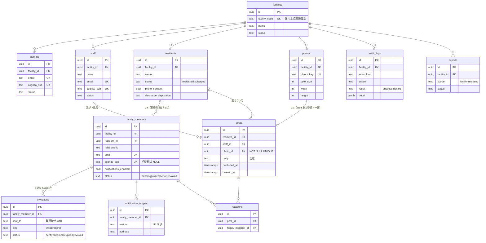

# DB設計

本書は、[06_リソース設計.md](06_リソース設計.md) のリソースを**永続化の形**に落とす（step5）。
あわせて、リソース設計が本書に送った未決事項 **V7・V8・V9** と、要件定義が step5 に送った **U6（テナント分離の実装方式）**・**U7（写真の保存とアクセス制御）** に決着を付ける。

> **本書のスコープ**
> - **含む**：テーブル・列・型・制約・インデックス・行レベルセキュリティ・トリガ・データのライフサイクル・容量見積り。
> - **含まない**：URL・HTTPメソッド・ペイロード形（→ [07_API設計.md](07_API設計.md)）、画面（→ [09_画面設計.md](09_画面設計.md)）、インスタンス構成・可用性・IaC（→ 10）。
> - **設計判断とトレードオフは [ADR.md](ADR.md)（ADR-024〜029）に置く。** 本書は結論と、その結論に基づく具体である。
>
> 要件IDの出典は [05_要件定義.md](05_要件定義.md)、リソースID（R）と不変条件（INV）の出典は [06_リソース設計.md](06_リソース設計.md)。

---

## 0. 本書の出発点

本書は白紙から始まらない。**リソースの構造は [06_リソース設計.md](06_リソース設計.md) で決着済み**であり、本書はそれを覆さない。

| 決定 | 本書への影響 |
|---|---|
| [ADR-013](ADR.md#adr-013) テナント識別子を経路に露出させない | 施設は**接続時に確定**する。クエリの引数として渡らない → RLS と噛み合う（[ADR-025](ADR.md#adr-025)） |
| [ADR-014](ADR.md#adr-014) 識別子は UUIDv7 | 全表の主キーが `uuid`。**本書で改めて決め直さない** |
| [ADR-048](ADR.md#adr-048) 全主体をメールアドレスで識別 | 認証主体の識別子が**3表で同じ形**になる。表を分ける根拠は属性とライフサイクルの違いに絞られた（[ADR-026](ADR.md#adr-026)） |
| [ADR-016](ADR.md#adr-016) 招待は記録として持つ | `invitations` 表を持つ。**引換コードは保持しない** |
| [ADR-017](ADR.md#adr-017) 写真は投稿から独立・2段階 | `photos` を独立した表にする（[ADR-027](ADR.md#adr-027)） |
| [ADR-047](ADR.md#adr-047) 認証主体は職員個人 | **`devices` を持たない。`staff` が認証主体の表になる**（`email`・`cognito_sub`・`status` を持つ） |
| [ADR-019](ADR.md#adr-019) 論理削除／物理削除は退居時のみ | 削除は状態列。物理削除は消去ジョブだけが行う |
| [ADR-020](ADR.md#adr-020) 反応は1家族×1投稿＝1件 | `UNIQUE(post_id, family_member_id)` |
| [ADR-022](ADR.md#adr-022) 同意は入居者の属性、履歴は操作記録 | **同意の履歴表を作らない**。`residents` の列にする |
| [ADR-023](ADR.md#adr-023) 発信状況は派生 | **集計列・集計表を作らない**。都度求める |

### 0-1. 06 との差分

本書で形が変わったものだけを挙げる。**リソースの意味は変えていない。**

| 06 の記述 | 本書での扱い | 理由 |
|---|---|---|
| 写真（R9）が「状態＝仮／確定」を持つ | **状態列を持たない。** 投稿から参照されているかで表す | 保存された状態は更新漏れで静かに壊れる（[ADR-023](ADR.md#adr-023) と同じ理由）。[ADR-027](ADR.md#adr-027) |
| 写真（R9）が「投稿」を属性に持つ | 参照の向きを**逆にする**。`posts.photo_id` が必須・一意 | 写真1枚必須（FR-101）を **NOT NULL でDBに書ける**のはこの向きだけ。写真から見た投稿はこの一意制約の裏返しとして得られる |
| 文例（R13）は「システム共通・読み取り専用」 | **テーブルとして持つ**（`facility_id` を持たない唯一の表） | 06 が識別子と表示順を持つリソースとして定義しているため。V9 の拡張点は 9-3 |
| 発信状況（R14） | **テーブルを作らない** | [ADR-023](ADR.md#adr-023)。クエリとして 7章に置く |

---

## 1. リソースとテーブルの対応

| リソース | テーブル | 備考 |
|---|---|---|
| R1 施設 | `facilities` | `facility_id` を持たない（自身が境界） |
| R2 管理者 | `admins` | 認証主体 |
| ~~R3 端末~~ | **なし** | [ADR-047](ADR.md#adr-047) により欠番。認証主体は `staff` |
| R4 職員 | `staff` | **認証主体ではない**。投稿の帰属先 |
| R5 入居者 | `residents` | 同意を属性として持つ（[ADR-022](ADR.md#adr-022)） |
| R6 家族 | `family_members` | 認証主体。入居者を1件直接持つ |
| R7 招待 | `invitations` | 記録のみ（[ADR-016](ADR.md#adr-016)） |
| R8 投稿 | `posts` | |
| R9 写真 | `photos` | 投稿より先に作られる |
| R10 反応 | `reactions` | |
| R11 通知先 | `notification_targets` | 方式は未決（U4）のため値を固定しない |
| R12 操作記録 | `audit_logs` | 追記専用 |
| R13 文例 | `phrase_templates` | **テナント非依存** |
| R14 発信状況 | **なし（派生）** | [ADR-023](ADR.md#adr-023)。7章 Q3 |
| R15 エクスポート | `exports` | 進行状態を持つため表が要る |

**13表。** 認証主体が3表（`admins`・`staff`・`family_members`）に分かれている理由は [ADR-026](ADR.md#adr-026)。**旧版は `devices` を含めて14表だった**（[ADR-047](ADR.md#adr-047) で廃止）。



---

## 2. 設計方針

### 2-1. 4つの原則

1. **テナント境界を3層で担保する。** 全表に `facility_id` を持ち、**複合外部キー**で越境参照を不可能にし、**RLS** で既定拒否にする（[ADR-025](ADR.md#adr-025)）。[ADR-003](ADR.md#adr-003) が「1箇所の実装漏れが越境事故に直結する」と記録した状態を、アプリ実装だけに背負わせない。これが **V7 への回答**である。
2. **壊れたら回復できない不変条件だけを、DBにも書く。** INV-3（同意なき投稿）・INV-4（家族の到達範囲）・INV-11（退居時の一括失効）は、破れた瞬間に取り返しがつかない。ここだけ二重化し、他はアプリ層に置く（[ADR-029](ADR.md#adr-029)）。
3. **導ける状態を保存しない。** 写真の確定状態（[ADR-027](ADR.md#adr-027)）と発信状況（[ADR-023](ADR.md#adr-023)）は、保存すれば更新漏れで静かに壊れる。**静かに壊れるものを作らない**（C6：運用担当を置けない）。
4. **認証の持ち物をDBに持ち込まない。** パスワード・トークン・引換コードはDBに存在しない（[ADR-002](ADR.md#adr-002)・[ADR-016](ADR.md#adr-016)）。DBが持つのは `cognito_sub` との対応だけである。

> **ただしセッションは例外であり、置き場が未決である（U17）。** [ADR-025](ADR.md#adr-025) は「Cognito のトークンをブラウザに渡さず**サーバ側セッションに封じる**」と決めており、[ADR-035](ADR.md#adr-035) は「**期限切れセッションの掃除**」を定期実行の対象に挙げている。つまり**セッションの実体はどこかに保存される**。本書はその置き場を決めていないため、原則4から「セッション」を外し、U17 として明示する。
> FR-406（明示的ログアウト）と AC-B4 ③（失効・パスワード変更による再認証）は、**主体を指定して既存セッションを破棄できること**を要求する。置き場の決定は、この操作が引けるかどうかで評価する。

### 2-2. 命名・型の規約

| 項目 | 規約 |
|---|---|
| テーブル名 | 複数形・snake_case |
| 主キー | `id uuid`。**UUIDv7 をアプリ側で生成**（[ADR-014](ADR.md#adr-014)）。DB関数に依存させない（バージョン差を持ち込まないため） |
| 外部キー | テナント表への参照は必ず**複合外部キー** `(x_id, facility_id)` |
| 日時 | すべて `timestamptz`。アプリは UTC、表示のみ JST |
| 列挙 | **`text` ＋ `CHECK`**。PostgreSQL の ENUM 型は使わない（値の改名・削除が `ALTER TYPE` を伴い、マイグレーションが重くなる） |
| 論理削除 | 状態列（`status`）または `deleted_at`。[ADR-019](ADR.md#adr-019) |
| 監査列 | `created_at` / `updated_at`（トリガで自動更新） |

---

## 3. テーブル定義

型・制約の全文は 12章の DDL にある。本章は**なぜその形か**を述べる。

### 3-1. `facilities`（R1）

**この表だけが `facility_id` を持たない。** 自身がテナント境界である。

| 列 | 要点 |
|---|---|
| `facility_code` | **人が読める一意の短い文字列**（英小文字と数字、4〜8文字）。提供側が運用で施設を識別するために使う（[ADR-001](ADR.md#adr-001)）。UUIDv7 は現場で照合できないため、人が扱う識別子を別に持つ（[ADR-014](ADR.md#adr-014) の代償への手当て）。**旧版は端末ユーザー名の前半に使っていたが、その用途は [ADR-047](ADR.md#adr-047) で消えた** |
| `status` | `active` / `suspended`。契約終了時に読み取りを止める |

施設の作成は提供側の運用操作である（NFR-71）。`app_user` には `facilities` への書き込み権限を与えない（5-3）。

### 3-2. `admins`（R2）／`staff`（R4）／`family_members`（R6）

**認証主体は3表に分ける**（[ADR-026](ADR.md#adr-026)）。共通するのは `email`・`cognito_sub`・`status` で、それ以外の属性もライフサイクルも重ならない。**旧版は `devices`（R3）が3表目だったが、[ADR-047](ADR.md#adr-047) で `staff` に置き換わった。**

> **3表に分ける根拠が1つ減った。** [ADR-015](ADR.md#adr-015) の時代は「識別子の種類が違う（メールアドレス／ユーザー名）」ことも分割の根拠だったが、[ADR-048](ADR.md#adr-048) で全主体がメールアドレスになったため、**根拠は属性とライフサイクルの違いだけになった。** それでも統合しないのは、[ADR-026](ADR.md#adr-026) が挙げた「主体が違えば認可も到達範囲も別になる」が変わらないためである。

`staff` の要点：

| 列 | 要点 |
|---|---|
| `email` | **全施設で一意**（単一プール＝[ADR-003](ADR.md#adr-003)）。[ADR-048](ADR.md#adr-048) の代償がそのまま現れる——**掛け持ち勤務の職員は施設ごとに別のアドレスが要る**（U16） |
| `cognito_sub` | **NULL 可**。招待を送るまで Cognito ユーザーは存在しない（`family_members` と同じ扱い） |
| `status` | `invited`（招待済・パスワード未設定）／`active`／`revoked`。**FR-502 の利用停止は `revoked`** であり、認証情報の失効（FR-405）を伴う |
| ~~`display_order`~~ | **持たない。** 旧版は投稿時の職員選択を速くするために持っていたが、**選択そのものが無くなった**（[ADR-042](ADR.md#adr-042) 撤回） |

`family_members` の要点：

| 列 | 要点 |
|---|---|
| `resident_id` | **NOT NULL。中間表を作らない**（06 R6）。「1人の家族が複数の入居者に紐づく」はMVP対象外 |
| `email` | **全施設で一意**。[ADR-048](ADR.md#adr-048) が引き受けた「1メールアドレス＝1家族＝1入居者」の代償を、スキーマ側でも同じ形にする |
| `cognito_sub` | **NULL 可**。招待を送るまで Cognito ユーザーは存在しない（[ADR-016](ADR.md#adr-016)）。`status='pending'` と NULL の一致を CHECK で縛る |
| `status` | `pending`（名簿にあるが未招待）／`invited`（招待済・パスワード未設定）／`active`／`revoked`。06 5-1 の状態遷移をそのまま持つ |
| `notifications_enabled` | 受け取る／止める の1ビットのみ（[ADR-010](ADR.md#adr-010)）。**通知の宛先はここに持たない**（`notification_targets`） |

> **`status='revoked'` は削除ではない**（[ADR-019](ADR.md#adr-019)）。行が残ることで「過去に誰が見ていたか」が保たれる。INV-7（失効した資格情報でいかなるリソースにも到達できない）は、**RLS のポリシーが `status='active'` を要求する**ことでDB側にも書かれている（5-2）。

### 3-3. ~~`staff`（R4）~~ → 3-2 へ統合

**`staff` は認証主体になった**ため（[ADR-047](ADR.md#adr-047)）、3-2 で `admins`・`family_members` と並べて扱う。

利用停止（FR-502）は `status='revoked'` であり、**行は消さない。過去の投稿の帰属が消えないこと**が要件である（06 R4）。旧版は `is_active` を使っていたが、認証主体になったことで `admins`・`family_members` と同じ `status` に揃えた。

### 3-4. `residents`（R5）

| 列 | 要点 |
|---|---|
| `photo_consent` | boolean。**履歴表を作らない**（[ADR-022](ADR.md#adr-022)）。変更の履歴は `audit_logs` |
| `photo_consent_recorded_at` / `_by` | 誰がいつ記録したか（FR-504・NFR-51） |
| `status` | `resident` / `discharged` |
| `discharge_disposition` | `retained` / `purged`。退居時の選択（FR-602） |
| `purged_at` | 消去の実行記録。**行自体は残す**（消去したという事実を残すため） |

**健康状態・医療に関する列を持たない**（NFR-53）。これは制約であると同時に防御である（[05_要件定義.md](05_要件定義.md) 5-5 の注記）。**後からバイタル・食事量の列を足さない。**

### 3-5. `invitations`（R7）

**引換コード（仮パスワード）を保持しない**（[ADR-016](ADR.md#adr-016)）。この表が持つのは記録だけである。

| 列 | 要点 |
|---|---|
| `sent_to` | **発行時点のメールアドレスのスナップショット**。家族の `email` が後で変わっても、当時どこへ送ったかが残る |
| `kind` | `initial` / `resend` |
| `status` | `sent` / `redeemed` / `expired` / `revoked` |
| `expires_at` | 初期値は発行から7日（Cognito の仮パスワードの既定に合わせる。**独自に決めない**） |

INV-6（有効な招待は同時に1つ）は、`status='sent'` に対する**部分ユニーク索引**で担保する。

> **Cognito が真実、この表は写像である**（[ADR-016](ADR.md#adr-016) の代償）。`expired` への遷移は Cognito 側では時刻で自動的に起きるが、この表では**誰かが書き換えるまで `sent` のまま**である。表示時に `expires_at` を評価して「期限切れ」と見せることで、書き換えの遅れが画面に出ないようにする——**状態列は遅れるが、画面は遅れない**。

### 3-6. `photos`（R9）と `posts`（R8）

**写真は投稿より先に作られる**（[ADR-017](ADR.md#adr-017)）。参照は `posts.photo_id`（NOT NULL・UNIQUE）の1本だけで表す。

| 表・列 | 要点 |
|---|---|
| `photos.object_key` | ストレージ上の位置。UNIQUE。**推測不能な値**（6-1） |
| `photos` に状態列なし | 仮／確定は「`posts` から参照されているか」で表す（[ADR-027](ADR.md#adr-027)） |
| `posts.photo_id` | **NOT NULL UNIQUE**。FR-101（写真1枚必須）と INV-8（確定後はちょうど1つの投稿に属する）が、この1行の制約で同時に満たされる |
| `posts.body` | NULL 可、200文字以内（**仮置き**＝U14） |
| `posts.deleted_at` / `deleted_by_admin_id` / `deleted_by_staff_id` | 論理削除（[ADR-019](ADR.md#adr-019)）。削除者は管理者か職員のどちらか一方（CHECK）。**職員は自分の投稿しか削除できない**（[ADR-047](ADR.md#adr-047)） |

**承認状態の列を持たない**（[ADR-009](ADR.md#adr-009)）。**宛先の列を持たない**（[ADR-008](ADR.md#adr-008)）——宛先は `residents → family_members` をたどって導出する。06 4章の注記のとおり、**配信先を投稿にコピーしないことで、FR-405（即時失効）が過去の投稿にも遡って効く。**

### 3-7. `reactions`（R10）

`UNIQUE(post_id, family_member_id)` が [ADR-020](ADR.md#adr-020) の全体である。取り消しは**行の物理削除**——反応は「今ついているか」の状態であり、履歴を残す対象ではない（取り消しの記録は `audit_logs` に残るが、職員には見せない＝[ADR-020](ADR.md#adr-020)）。

**種類（`kind`）の列を持たない**（[ADR-011](ADR.md#adr-011)）。

### 3-8. `notification_targets`（R11）

配信経路が未決（U4）であるため、**`method` の値を CHECK で固定しない**。方式が決まった時点で CHECK を足す。

**通知の配信記録を持たない**（06 R11 の決定）。二重配信の防止は配信経路側の冪等性に委ねる。

> **申し送り**：U4 で「冪等キーを受け取れない経路」を選ぶ場合、この決定は見直しが要る（投稿1件×宛先1人の送信記録がないと、再送のたびに重複が起きる）。**U4 の選定基準に「冪等な再送ができること」を加える**ことを 07 へ申し送る。

### 3-9. `audit_logs`（R12）

| 列 | 要点 |
|---|---|
| `actor_kind` / `actor_id` | `admin` / `device` / `family` / `platform` / `system`。**外部キーを張らない**（3種の主体を1列で受けるため）。実体が消えた後も記録が残るべき、という性質にも合う |
| `result` | `success` / `denied`。**拒否も残す**（06 R12）。[ADR-003](ADR.md#adr-003) が求めた「越境の検出」はこの列で成り立つ |
| `detail` | jsonb |

**追記専用**（INV-9）。`app_user` に UPDATE / DELETE を与えない（[ADR-028](ADR.md#adr-028)）。

### 3-10. `exports`（R15）／`phrase_templates`（R13）

- `exports` は**進行状態を持つ**ため表が要る（`accepted` → `generating` → `ready` → `expired`）。生成方式は 06 V3（07で決着）。
- `phrase_templates` は **`facility_id` を持たない唯一の表**である（INV-1 の唯一の例外）。行はマイグレーションで投入し、アプリからは読み取りのみ。

---

## 4. 不変条件の実装場所

06 の INV を、どこで守るかの一覧。**すべてをDBに書かない**理由は [ADR-029](ADR.md#adr-029)。

| # | 不変条件 | 実装 |
|---|---|---|
| INV-1 | すべてのリソースは1つの施設に属する | `facility_id` NOT NULL（`phrase_templates` を除く）＋ CI検査（13章 V10） |
| INV-2 | 関連するリソースは同じ施設に属する | **複合外部キー**（DBが拒否する） |
| INV-3 | 同意なし・退居済みの入居者には投稿できない | **トリガ** T1 |
| INV-4 | 家族が読めるのは自分に紐づく入居者の公開中の投稿のみ | **RLS**（RESTRICTIVE）＋ DAL |
| INV-5 | 反応は読める投稿にのみ、1家族1件 | `UNIQUE` ＋ **トリガ** T2（削除済み投稿への反応を拒否）＋ RLS |
| INV-6 | 有効な招待は同時に1つ | **部分ユニーク索引** |
| INV-7 | 失効した家族はいかなるリソースにも到達できない | **RLS**（`status='active'` を要求）＋ 毎リクエストの状態確認 |
| INV-8 | 写真は確定後ちょうど1つの投稿に属する | `posts.photo_id` の **NOT NULL UNIQUE** |
| INV-9 | 操作記録は追記のみ | **権限**（UPDATE/DELETE を与えない） |
| INV-10 | 投稿の削除は表示からの除外 | `deleted_at` ＋ RLS（家族からは見えない／管理者からは見える） |
| INV-11 | 退居したら紐づく家族はすべて失効する | **トリガ** T3 |
| INV-12 | 外部に出る識別子は推測できない | UUIDv7（[ADR-014](ADR.md#adr-014)） |

---

## 5. テナント分離の実装（U6・V7 の決着）

### 5-1. 3つの層

| 層 | 何を防ぐか | 破られる条件 |
|---|---|---|
| **① 複合外部キー** | 施設Aの投稿が施設Bの入居者を参照すること | 破れない（DBが拒否する） |
| **② RLS** | 施設Aの接続が施設Bの行を読み書きすること | 実行時パラメータの設定漏れ → **既定拒否**（1行も返らない）に倒れる |
| **③ アプリ層** | ①②を通過したうえでの論理的な誤り | 実装ミス。①②が残る |

**②の設定漏れが「全件見える」ではなく「何も見えない」に倒れる**ことが、この構成の要である。未設定の実行時パラメータは NULL になり、`facility_id = NULL` は真にならないため、行は1件も返らない。**壊れ方が安全側に倒れる。**

### 5-2. RLS

トランザクションごとに3つの実行時パラメータを設定する。[ADR-013](ADR.md#adr-013)（テナント識別子を経路に露出させない）により、これらは**常にトークンから解決される**——クライアントが指定する経路がない。

```sql
SET LOCAL app.facility_id  = '...';   -- トークンのテナント
SET LOCAL app.subject_id   = '...';   -- 認証主体の識別子
SET LOCAL app.subject_kind = 'family'; -- admin | device | family
```

`SET LOCAL` はトランザクション終了時に自動で戻るため、**接続プールで接続が再利用されても値が残らない**。裏返せば、**すべてのDBアクセスがトランザクション内で行われること**が前提になる（→ U11）。

ポリシーは2種類を組み合わせる。

- **PERMISSIVE（テナント境界）**：`facility_id = app_facility()`。全表に1本。
- **RESTRICTIVE（家族の到達範囲・書き込み主体）**：INV-4・INV-7 と、06 6-2 の権限表のうち越えると回復不能な行。

> **PERMISSIVE 同士は OR で結合される。** 家族の到達範囲を PERMISSIVE で書くと、テナント境界を「または」で緩めることになる。**必ず RESTRICTIVE で書く**（AND 結合）。実装時に最も間違えやすい点として明記しておく。

家族のポリシーは、06 が「二段の絞り込みを、実装で片方だけ書ける形にしない」（2-2）と要求した箇所である。**テナント条件と入居者条件を、1つのポリシーの中で不可分に書く**ことでこれに応える。

### 5-3. DBロール

| ロール | 用途 | RLS |
|---|---|---|
| `app_owner` | マイグレーション（全表の所有者） | 全表に `FORCE ROW LEVEL SECURITY`（所有者も迂回しない） |
| `app_user` | アプリケーションの通常接続 | 適用。`BYPASSRLS` を**持たせない**。`audit_logs` は INSERT / SELECT のみ。`facilities` は SELECT のみ |
| `app_platform` | 提供側の運用ジョブ（施設の作成・退居時の消去・孤児写真の回収） | `BYPASSRLS` |

`app_platform` は分離の穴である。緩和は2点——①アプリケーションからは使わない（ジョブ専用の資格情報）、②この接続の全操作を `actor_kind='platform'` として記録する。

### 5-4. トリガ

| # | 対象 | 内容 | 根拠 |
|---|---|---|---|
| T1 | `posts` BEFORE INSERT | 入居者が入居中かつ同意あり、職員が在籍 | INV-3・FR-504・FR-501・FR-502 |
| T2 | `reactions` BEFORE INSERT | 対象の投稿が削除済みでない | INV-5 |
| T3 | `residents` AFTER UPDATE | 退居に遷移したら、紐づく家族をすべて失効させる | INV-11・FR-405 |
| T4 | 各表 BEFORE UPDATE | `updated_at` の更新 | ― |

T3 をDBに置く理由は、06 5-3 が「退居処理は複合操作であり、**片方だけ実行された状態を作らない**」と要求しているためである。アプリ側の手続きに任せると、途中で失敗した場合に「退居済みなのに家族が見られる」状態が残る。

---

## 6. 写真の保存とアクセス制御（U7・V2 の一部）

[ADR-027](ADR.md#adr-027) の決定を具体に落とす。配信URLの有効期限そのものは 06 V2 として 07 に送られているため、本書は**保存の形とアクセスの原則**までを決める。

### 6-1. 保存

- **本体はオブジェクトストレージに置き、DBはメタデータのみ持つ。**
- オブジェクトキー：`facilities/{facility_id}/photos/{photo_id}/{22文字のランダム文字列}.jpg`
  - 施設の識別子を先頭に置くのは、**施設単位の書き出し（FR-601）と退居時の消去（FR-602）をプレフィックス走査で行える**ようにするため。
  - 末尾のランダム文字列は、識別子を知られてもキーを組み立てられないようにするための保険（NFR-44）。**ただし推測不能性に依存しない**——アクセス制御は署名で行う。
- バケットは**完全非公開**。パブリックアクセスを一切許可しない（NFR-44）。

### 6-2. アップロード（2段階＝[ADR-017](ADR.md#adr-017)）

```
① 端末側で長辺1600pxに縮小・JPEG化（原本は送らない）
② サーバに写真の登録を要求 → photos に1行、アップロード用の署名付きURLを返す
③ 端末 → ストレージへ直接 PUT（アプリのサーバを経由しない）
④ 投稿の作成時に photo_id を指定 → posts を INSERT
```

- ③が失敗したら③だけを再試行する（NFR-35）。②で作った `photos` の行はそのまま使える。
- ④に到達しなかった `photos` は**孤児**になる。`app_platform` の回収ジョブが、**作成から24時間を過ぎて `posts` から参照されていない行**を、DBとストレージの両方から削除する（INV-8）。

### 6-3. 配信

- 表示時に**短命の署名付きURL**を発行する（有効期限の値は 06 V2 で決着）。
- **署名は「DBが行を返したこと」を根拠に発行する。** 家族向けの一覧では、必ず RLS を通して `posts` を読み、返ってきた行の写真についてのみ署名を作る。この順序を崩さない限り、NFR-41 の到達範囲が写真にもそのまま及ぶ。

### 6-4. 端末側で縮小し、原本を保持しない

`photo_byte_size` の想定は300KB（長辺1600px・JPEG）である。

- **利点**：施設の回線での送信時間が短くなり（NFR-35）、表示も速くなる（NFR-34：3秒以内）。サーバ側の画像変換が不要になり、運用対象が増えない（C6）。
- **代償**：**原本が残らない。** 拡大に耐えず、書き出し（FR-601）でも縮小版しか出せない。家族が「もっと大きく見たい」と言っても応えられない。妥当性は実機計測で確認する（U15）。

---

## 7. 主要クエリとインデックス

| # | 要件 | クエリ | インデックス |
|---|---|---|---|
| Q1 | FR-201 家族のタイムライン | 紐づく入居者の公開中の投稿を新しい順に | `posts (facility_id, resident_id, published_at DESC) WHERE deleted_at IS NULL` |
| Q2 | FR-303 職員が自分の投稿への反応を見る | 職員の投稿に付いた反応を、**反応の新しい順**に（[ADR-021](ADR.md#adr-021)） | `posts (facility_id, staff_id, published_at DESC)` ＋ `reactions (post_id, created_at DESC)` |
| Q3 | FR-503 発信状況（派生） | 入居者ごとの最終投稿日・期間内件数 | Q1 の索引を入居者ごとに逆順走査。**集計を保存しない**（[ADR-023](ADR.md#adr-023)） |
| Q4 | FR-202 通知の宛先解決 | 投稿 → 入居者 → 有効な家族 → 通知先 | `family_members (resident_id) WHERE status='active'` ＋ `notification_targets (family_member_id) WHERE status='active'` |
| Q5 | 認証後の解決 | `cognito_sub` → 施設・種類・状態 | 3表それぞれの `cognito_sub` UNIQUE（[ADR-026](ADR.md#adr-026)） |
| Q6 | FR-404 家族名簿の一覧 | 入居者ごとの家族と招待の状態 | `family_members (facility_id, resident_id)` ＋ `invitations (family_member_id) WHERE status='sent'` |
| Q7 | FR-505 管理者の全投稿閲覧 | 施設の全投稿（削除済み含む）を新しい順に | `posts (facility_id, published_at DESC)` |
| Q8 | 孤児写真の回収 | 24時間以上前で `posts` から参照されていない `photos` | `photos (created_at)` ＋ `posts (photo_id)` UNIQUE |

**Q5 が3表に分かれることの実測的な影響は小さい。** 認証主体の解決は主体の種類がトークンから分かるため、**実際には1表しか引かない**（[ADR-026](ADR.md#adr-026)）。

---

## 8. データのライフサイクル

### 8-1. 削除（[ADR-019](ADR.md#adr-019)）

| 操作 | 方式 | 家族から | 管理者から |
|---|---|---|---|
| 投稿の削除（FR-106） | 論理（`deleted_at`） | **即座に見えない**（RLS） | 削除済みとして見える（FR-505） |
| 家族の失効（FR-405） | 論理（`status='revoked'`） | 以後到達不能（INV-7） | 失効済みとして見える |
| 職員の失効（退職） | 論理（`status='revoked'`） | ― | 見える |
| 職員の利用停止（FR-502） | 論理（`status='revoked'`） | 過去の投稿の投稿者名は残る | サインインできなくなる（FR-405） |
| 反応の取り消し | 物理 | ― | 操作記録に残る |
| 孤児の写真 | 物理（24時間） | ― | ― |
| 退居時の消去（FR-602） | **物理** | ― | ― |

### 8-2. 退居（FR-501・FR-602・INV-11）

1. 管理者が退居処理を実行する。**1つのトランザクションで**：`residents.status='discharged'` に変更 → トリガ T3 が紐づく家族をすべて失効させる → 新規投稿が止まる（トリガ T1）。
2. 管理者が処遇を選ぶ。
   - `retained`：残す。家族のアクセスだけが止まっている状態。
   - `purged`：`app_platform` の消去ジョブが、当該入居者の `posts` / `reactions` / `photos` / `notification_targets` / `invitations` / `family_members` を物理削除し、ストレージのプレフィックス配下を削除する。`residents` の行は `name` を空にし `purged_at` を記録して**残す**。`audit_logs` は消さない（[ADR-028](ADR.md#adr-028)）。

**退居後の保持期間は未決である**（06 V6）。[ADR-019](ADR.md#adr-019) が「保持期間を決めない限りデータは増え続ける」と記録した課題は、本書でも解消していない。

### 8-3. 持ち出し（FR-601・R15）

施設単位で全表を `facility_id` 条件で JSON Lines に書き出し、ストレージのプレフィックス配下を同梱する。**スキーマが標準的な PostgreSQL の型だけで構成されている**（[ADR-024](ADR.md#adr-024)）ことが、この書き出しの可搬性を支えている。

### 8-4. 保存時の保護とバックアップ

- **保存時の保護（NFR-43）**：DBのストレージ暗号化とオブジェクトストレージのサーバ側暗号化で満たす。**列単位の暗号化は行わない**——扱う情報が日常の様子に限られ、要配慮個人情報を持たない（NFR-53）ため、鍵管理の複雑さに見合わない。
- **バックアップ（NFR-77）**：ポイントインタイムリカバリ7日、ストレージのバージョニング。復旧手順は日本語で文書化する（NFR-75）。具体は 09。

---

## 9. 拡張点

### 9-1. 反応の種類を増やす（[ADR-011](ADR.md#adr-011) の次段）

`reactions` に `kind text NOT NULL DEFAULT 'thanks'` を足し、`UNIQUE(post_id, family_member_id)` を `UNIQUE(post_id, family_member_id, kind)` に緩める。**既存行の移行は不要。**

### 9-2. 1人の家族が複数の入居者に紐づく（[05_要件定義.md](05_要件定義.md) 9章の次段）

`family_members.resident_id` を中間表 `family_resident_links` に移す。**家族の識別子と資格情報はそのまま使える**（06 R6）。ただし [ADR-048](ADR.md#adr-048) が記録したとおり、**施設をまたぐ場合はメールアドレスの一意制約で先に壊れる**——中間表だけでは解けない（U16）。

### 9-3. 文例を施設ごとに編集できるようにする（06 V9 への回答）

`phrase_templates` に `facility_id uuid NULL` を足し、**NULL＝全施設共通、値あり＝その施設固有**として解決する。既存行は NULL のまま残るため移行が要らない。RLS は `facility_id IS NULL OR facility_id = app_facility()` に置き換える。**この形にしておくことが、V9 への回答である。**

---

## 10. 規模と容量

NFR-36（1施設：入居者80名・職員50名・家族200名、1入居者あたり月10投稿）を、[ADR-002](ADR.md#adr-002) が費用面の上限とした **40施設**で換算する。

| 対象 | 1施設・1年 | 40施設・1年 |
|---|---|---|
| `posts` / `photos` | 各 9,600行 | 各 384,000行 |
| `reactions` | 〜9,600行 | 〜384,000行 |
| `audit_logs` | 〜30,000行 | 〜1,200,000行 |
| **DB容量** | — | **〜2GB／年** |
| **写真容量** | 〜3GB | **〜120GB／年** |

**DBは小さい。** 支配的なのは写真であり、それをDBの外に出している（[ADR-027](ADR.md#adr-027)）ため、DB自体は最小構成で数年もつ。NFR-76（1施設あたり月額1万円）に対して、DBは制約要因にならない。

---

## 11. トレーサビリティ（要件 → 実装箇所）

| 要件 | 実装 |
|---|---|
| FR-101 写真1枚必須 | `posts.photo_id` NOT NULL |
| FR-103 文例 | `phrase_templates` |
| FR-104 宛先を選ばない | `posts` に宛先列なし。`residents → family_members` から導出 |
| FR-105 中断しても失われない | 端末側の保持（06 V10）。DBに下書きを持たない |
| FR-106 削除 | `posts.deleted_at` ＋ 家族向け RESTRICTIVE ポリシー |
| ~~FR-107~~ 投稿者の帰属 | `posts.staff_id` NOT NULL。**値はセッションから定まる**（[ADR-047](ADR.md#adr-047)。要件は欠番） |
| FR-201 新しい順 | Q1 |
| FR-202 一人ひとりに直接 | Q4（`notification_targets`） |
| FR-203 停止のみ | `family_members.notifications_enabled` |
| FR-301/302 反応が職員本人に | `reactions.post_id → posts.staff_id` |
| FR-303 反応の一覧 | Q2 |
| FR-401 招待 | `invitations`（記録のみ） |
| FR-404 家族名簿 | `family_members` ＋ Q6 |
| FR-405 即時失効 | `family_members.status` ＋ RLS（INV-7） |
| FR-501 退居 | `residents.status` ＋ T1・T3 |
| FR-502 職員の停止 | `staff.status='revoked'` ＋ T1。**認証情報の失効を伴う**（[ADR-047](ADR.md#adr-047)） |
| FR-503 発信状況 | Q3（派生） |
| FR-504 同意なしに投稿不可 | `residents.photo_consent` ＋ T1 |
| FR-505 事後の全件閲覧 | Q7 |
| FR-601/602 持ち出し・退居時の削除 | `exports` ＋ 8-2・8-3 |
| NFR-41 家族の到達範囲 | RESTRICTIVE ポリシー（5-2） |
| NFR-42 自施設のみ | PERMISSIVE ポリシー（5-2） |
| NFR-43 保存時の保護 | 8-4 |
| NFR-44 推測できない | UUIDv7 ＋ 6-1・6-3 |
| NFR-45 操作の記録 | `audit_logs`（`result` に拒否も残す） |
| NFR-47 分離はアプリ側の責任 | 5章（3層） |
| NFR-52 同意 | `residents.photo_consent` |
| NFR-53 要配慮個人情報を扱わない | **該当する列をどの表にも置かない** |

---

## 12. DDL

```sql
-- =====================================================================
-- 介護施設×家族 情報共有システム — スキーマ（MVP）
-- PostgreSQL 16 以上（ADR-024）
-- 識別子は UUIDv7 をアプリ側で生成する（ADR-014）
-- =====================================================================

-- ---------------------------------------------------------------------
-- 実行時パラメータ（RLS から参照する）
-- ---------------------------------------------------------------------
CREATE OR REPLACE FUNCTION app_facility() RETURNS uuid
  LANGUAGE sql STABLE PARALLEL SAFE
  AS $$ SELECT nullif(current_setting('app.facility_id', true), '')::uuid $$;

CREATE OR REPLACE FUNCTION app_subject() RETURNS uuid
  LANGUAGE sql STABLE PARALLEL SAFE
  AS $$ SELECT nullif(current_setting('app.subject_id', true), '')::uuid $$;

CREATE OR REPLACE FUNCTION app_kind() RETURNS text
  LANGUAGE sql STABLE PARALLEL SAFE
  AS $$ SELECT nullif(current_setting('app.subject_kind', true), '') $$;

CREATE OR REPLACE FUNCTION set_updated_at() RETURNS trigger
  LANGUAGE plpgsql AS $$
BEGIN
  NEW.updated_at := now();
  RETURN NEW;
END $$;

-- ---------------------------------------------------------------------
-- R1 施設（テナントの根。facility_id を持たない）
-- ---------------------------------------------------------------------
CREATE TABLE facilities (
  id             uuid PRIMARY KEY,
  facility_code  text NOT NULL CHECK (facility_code ~ '^[a-z0-9]{4,8}$'),
  name           text NOT NULL,
  status         text NOT NULL DEFAULT 'active' CHECK (status IN ('active', 'suspended')),
  created_at     timestamptz NOT NULL DEFAULT now(),
  updated_at     timestamptz NOT NULL DEFAULT now(),
  CONSTRAINT facilities_code_uq UNIQUE (facility_code)
);
CREATE TRIGGER facilities_updated_at BEFORE UPDATE ON facilities
  FOR EACH ROW EXECUTE FUNCTION set_updated_at();

-- ---------------------------------------------------------------------
-- R2 管理者（認証主体：メールアドレス／ADR-015・ADR-026）
-- ---------------------------------------------------------------------
CREATE TABLE admins (
  id           uuid PRIMARY KEY,
  facility_id  uuid NOT NULL REFERENCES facilities(id),
  name         text NOT NULL,
  email        text NOT NULL,
  cognito_sub  text NOT NULL,
  status       text NOT NULL DEFAULT 'active' CHECK (status IN ('active', 'suspended')),
  created_at   timestamptz NOT NULL DEFAULT now(),
  updated_at   timestamptz NOT NULL DEFAULT now(),
  CONSTRAINT admins_id_facility_uq UNIQUE (id, facility_id)
);
CREATE UNIQUE INDEX admins_email_uq       ON admins (lower(email));
CREATE UNIQUE INDEX admins_cognito_sub_uq ON admins (cognito_sub);
CREATE INDEX admins_facility_idx ON admins (facility_id) WHERE status = 'active';
CREATE TRIGGER admins_updated_at BEFORE UPDATE ON admins
  FOR EACH ROW EXECUTE FUNCTION set_updated_at();

-- R3 端末 は ADR-047 により廃止（欠番）。認証主体は下の staff に移った。

-- ---------------------------------------------------------------------
-- R4 職員（認証主体：メールアドレス／ADR-047・ADR-048・ADR-026）
-- ---------------------------------------------------------------------
CREATE TABLE staff (
  id             uuid PRIMARY KEY,
  facility_id    uuid NOT NULL REFERENCES facilities(id),
  name           text NOT NULL,
  email          text NOT NULL,
  cognito_sub    text,                            -- 招待を送るまで NULL（ADR-016）
  status         text NOT NULL DEFAULT 'invited'
                 CHECK (status IN ('invited', 'active', 'revoked')),
  revoked_at     timestamptz,
  created_at     timestamptz NOT NULL DEFAULT now(),
  updated_at     timestamptz NOT NULL DEFAULT now(),
  CONSTRAINT staff_sub_status_consistent CHECK (
    (status = 'invited'                AND cognito_sub IS NULL)
    OR (status IN ('active','revoked') AND cognito_sub IS NOT NULL)
  ),
  CONSTRAINT staff_revoked_consistent CHECK ((status = 'revoked') = (revoked_at IS NOT NULL)),
  CONSTRAINT staff_email_uq       UNIQUE (email),   -- 全施設で一意（ADR-003・ADR-048）
  CONSTRAINT staff_id_facility_uq UNIQUE (id, facility_id)
);
CREATE UNIQUE INDEX staff_cognito_sub_uq ON staff (cognito_sub) WHERE cognito_sub IS NOT NULL;
CREATE INDEX staff_facility_idx ON staff (facility_id, name) WHERE status <> 'revoked';
CREATE TRIGGER staff_updated_at BEFORE UPDATE ON staff
  FOR EACH ROW EXECUTE FUNCTION set_updated_at();

-- ---------------------------------------------------------------------
-- R5 入居者（同意は属性として持つ／ADR-022）
-- ---------------------------------------------------------------------
CREATE TABLE residents (
  id                          uuid PRIMARY KEY,
  facility_id                 uuid NOT NULL REFERENCES facilities(id),
  name                        text NOT NULL,
  name_kana                   text,
  status                      text NOT NULL DEFAULT 'resident'
                                CHECK (status IN ('resident', 'discharged')),
  photo_consent               boolean NOT NULL DEFAULT false,
  photo_consent_recorded_at   timestamptz,
  photo_consent_recorded_by   uuid,
  discharged_at               timestamptz,
  discharge_disposition       text CHECK (discharge_disposition IN ('retained', 'purged')),
  purged_at                   timestamptz,
  created_at                  timestamptz NOT NULL DEFAULT now(),
  updated_at                  timestamptz NOT NULL DEFAULT now(),
  CONSTRAINT residents_discharge_consistent
    CHECK ((status = 'discharged') = (discharged_at IS NOT NULL)),
  CONSTRAINT residents_disposition_after_discharge
    CHECK (discharge_disposition IS NULL OR status = 'discharged'),
  CONSTRAINT residents_consent_recorded
    CHECK (photo_consent = false OR photo_consent_recorded_at IS NOT NULL),
  CONSTRAINT residents_id_facility_uq UNIQUE (id, facility_id),
  FOREIGN KEY (photo_consent_recorded_by, facility_id) REFERENCES admins (id, facility_id)
);
CREATE INDEX residents_facility_status_idx ON residents (facility_id, status);
CREATE TRIGGER residents_updated_at BEFORE UPDATE ON residents
  FOR EACH ROW EXECUTE FUNCTION set_updated_at();

-- ---------------------------------------------------------------------
-- R6 家族（認証主体：メールアドレス。入居者を1件直接持つ）
-- ---------------------------------------------------------------------
CREATE TABLE family_members (
  id                     uuid PRIMARY KEY,
  facility_id            uuid NOT NULL REFERENCES facilities(id),
  resident_id            uuid NOT NULL,
  name                   text NOT NULL,
  relationship           text NOT NULL,          -- 長男・妻・孫 など
  email                  text NOT NULL,
  cognito_sub            text,                   -- 招待するまで存在しない（ADR-016）
  notifications_enabled  boolean NOT NULL DEFAULT true,
  status                 text NOT NULL DEFAULT 'pending'
                           CHECK (status IN ('pending', 'invited', 'active', 'revoked')),
  activated_at           timestamptz,
  revoked_at             timestamptz,
  created_at             timestamptz NOT NULL DEFAULT now(),
  updated_at             timestamptz NOT NULL DEFAULT now(),
  -- 招待前は Cognito ユーザーが存在しない
  CONSTRAINT family_members_sub_by_status
    CHECK ((status = 'pending') = (cognito_sub IS NULL)),
  CONSTRAINT family_members_revoked_consistent
    CHECK ((status = 'revoked') = (revoked_at IS NOT NULL)),
  CONSTRAINT family_members_id_facility_uq UNIQUE (id, facility_id),
  FOREIGN KEY (resident_id, facility_id) REFERENCES residents (id, facility_id)
);
-- 単一ユーザープール（ADR-003・ADR-015）に合わせ、メールは全施設で一意
CREATE UNIQUE INDEX family_members_email_uq       ON family_members (lower(email));
CREATE UNIQUE INDEX family_members_cognito_sub_uq ON family_members (cognito_sub)
  WHERE cognito_sub IS NOT NULL;
CREATE INDEX family_members_resident_idx ON family_members (resident_id) WHERE status = 'active';
CREATE INDEX family_members_roster_idx   ON family_members (facility_id, resident_id);
CREATE TRIGGER family_members_updated_at BEFORE UPDATE ON family_members
  FOR EACH ROW EXECUTE FUNCTION set_updated_at();

-- ---------------------------------------------------------------------
-- R7 招待（記録のみ。引換コードは保持しない／ADR-016）
-- ---------------------------------------------------------------------
CREATE TABLE invitations (
  id                 uuid PRIMARY KEY,
  facility_id        uuid NOT NULL REFERENCES facilities(id),
  family_member_id   uuid NOT NULL,
  issued_by          uuid NOT NULL,
  sent_to            text NOT NULL,              -- 発行時点のアドレス（後の変更に追随しない）
  kind               text NOT NULL CHECK (kind IN ('initial', 'resend')),
  status             text NOT NULL DEFAULT 'sent'
                       CHECK (status IN ('sent', 'redeemed', 'expired', 'revoked')),
  sent_at            timestamptz NOT NULL DEFAULT now(),
  expires_at         timestamptz NOT NULL,        -- 既定は発行から7日（Cognito に合わせる）
  redeemed_at        timestamptz,
  created_at         timestamptz NOT NULL DEFAULT now(),
  updated_at         timestamptz NOT NULL DEFAULT now(),
  CONSTRAINT invitations_redeemed_consistent
    CHECK ((status = 'redeemed') = (redeemed_at IS NOT NULL)),
  FOREIGN KEY (family_member_id, facility_id) REFERENCES family_members (id, facility_id),
  FOREIGN KEY (issued_by,        facility_id) REFERENCES admins         (id, facility_id)
);
-- INV-6: 有効な招待は家族につき同時に1つ
CREATE UNIQUE INDEX invitations_active_uq ON invitations (family_member_id) WHERE status = 'sent';
CREATE INDEX invitations_family_idx ON invitations (family_member_id, sent_at DESC);
CREATE TRIGGER invitations_updated_at BEFORE UPDATE ON invitations
  FOR EACH ROW EXECUTE FUNCTION set_updated_at();

-- ---------------------------------------------------------------------
-- R9 写真（投稿より先に作られる／ADR-017・ADR-027）
--     「仮／確定」の状態列を持たない。posts から参照されているかで表す
-- ---------------------------------------------------------------------
CREATE TABLE photos (
  id            uuid PRIMARY KEY,
  facility_id   uuid NOT NULL REFERENCES facilities(id),
  object_key    text NOT NULL,
  content_type  text NOT NULL CHECK (content_type IN ('image/jpeg', 'image/webp')),
  byte_size     integer NOT NULL CHECK (byte_size > 0),
  width         integer NOT NULL CHECK (width  > 0),
  height        integer NOT NULL CHECK (height > 0),
  created_at    timestamptz NOT NULL DEFAULT now(),
  CONSTRAINT photos_object_key_uq  UNIQUE (object_key),
  CONSTRAINT photos_id_facility_uq UNIQUE (id, facility_id)
);
CREATE INDEX photos_created_idx ON photos (created_at);   -- 孤児の回収（Q8）

-- ---------------------------------------------------------------------
-- R8 投稿
-- ---------------------------------------------------------------------
CREATE TABLE posts (
  id                     uuid PRIMARY KEY,
  facility_id            uuid NOT NULL REFERENCES facilities(id),
  resident_id            uuid NOT NULL,
  staff_id               uuid NOT NULL,
  photo_id               uuid NOT NULL,           -- FR-101・INV-8
  body                   text CHECK (body IS NULL OR char_length(body) <= 200),
  published_at           timestamptz NOT NULL DEFAULT now(),
  deleted_at             timestamptz,
  deleted_by_admin_id    uuid,
  deleted_by_staff_id    uuid,
  created_at             timestamptz NOT NULL DEFAULT now(),
  updated_at             timestamptz NOT NULL DEFAULT now(),
  -- 削除者は管理者か職員のちょうど一方（削除されていなければどちらも NULL）
  CONSTRAINT posts_deleted_by_consistent CHECK (
    (deleted_at IS NULL AND deleted_by_admin_id IS NULL AND deleted_by_staff_id IS NULL)
    OR (deleted_at IS NOT NULL
        AND (deleted_by_admin_id IS NULL) <> (deleted_by_staff_id IS NULL))
  ),
  CONSTRAINT posts_photo_uq UNIQUE (photo_id),
  CONSTRAINT posts_id_facility_uq UNIQUE (id, facility_id),
  FOREIGN KEY (resident_id,          facility_id) REFERENCES residents (id, facility_id),
  FOREIGN KEY (staff_id,             facility_id) REFERENCES staff     (id, facility_id),
  FOREIGN KEY (photo_id,             facility_id) REFERENCES photos    (id, facility_id),
  FOREIGN KEY (deleted_by_admin_id,  facility_id) REFERENCES admins    (id, facility_id),
  FOREIGN KEY (deleted_by_staff_id,  facility_id) REFERENCES staff     (id, facility_id)
);
CREATE INDEX posts_timeline_idx ON posts (facility_id, resident_id, published_at DESC)
  WHERE deleted_at IS NULL;
CREATE INDEX posts_staff_idx    ON posts (facility_id, staff_id, published_at DESC)
  WHERE deleted_at IS NULL;
CREATE INDEX posts_facility_idx ON posts (facility_id, published_at DESC);
CREATE TRIGGER posts_updated_at BEFORE UPDATE ON posts
  FOR EACH ROW EXECUTE FUNCTION set_updated_at();

-- T1: INV-3（同意なし・退居済みには投稿できない／FR-504・FR-501・FR-502）
CREATE OR REPLACE FUNCTION posts_check_preconditions() RETURNS trigger
  LANGUAGE plpgsql AS $$
DECLARE
  r_status  text;
  r_consent boolean;
BEGIN
  SELECT status, photo_consent INTO r_status, r_consent
    FROM residents WHERE id = NEW.resident_id;

  IF r_status IS DISTINCT FROM 'resident' THEN
    RAISE EXCEPTION 'resident % is not currently admitted', NEW.resident_id
      USING ERRCODE = 'check_violation';
  END IF;

  IF r_consent IS NOT TRUE THEN
    RAISE EXCEPTION 'photo consent is missing for resident %', NEW.resident_id
      USING ERRCODE = 'check_violation';
  END IF;

  IF NOT EXISTS (SELECT 1 FROM staff WHERE id = NEW.staff_id AND status = 'active') THEN
    RAISE EXCEPTION 'staff % is not active', NEW.staff_id
      USING ERRCODE = 'check_violation';
  END IF;

  RETURN NEW;
END $$;

CREATE TRIGGER posts_preconditions BEFORE INSERT ON posts
  FOR EACH ROW EXECUTE FUNCTION posts_check_preconditions();

-- ---------------------------------------------------------------------
-- R10 反応（1家族×1投稿＝1件／ADR-020）
-- ---------------------------------------------------------------------
CREATE TABLE reactions (
  id                uuid PRIMARY KEY,
  facility_id       uuid NOT NULL REFERENCES facilities(id),
  post_id           uuid NOT NULL,
  family_member_id  uuid NOT NULL,
  created_at        timestamptz NOT NULL DEFAULT now(),
  CONSTRAINT reactions_post_family_uq UNIQUE (post_id, family_member_id),
  FOREIGN KEY (post_id,          facility_id) REFERENCES posts          (id, facility_id),
  FOREIGN KEY (family_member_id, facility_id) REFERENCES family_members (id, facility_id)
);
CREATE INDEX reactions_post_idx ON reactions (post_id, created_at DESC);

-- T2: INV-5（削除済みの投稿には反応を付けられない）
CREATE OR REPLACE FUNCTION reactions_check_post_visible() RETURNS trigger
  LANGUAGE plpgsql AS $$
BEGIN
  IF EXISTS (SELECT 1 FROM posts WHERE id = NEW.post_id AND deleted_at IS NOT NULL) THEN
    RAISE EXCEPTION 'post % is deleted', NEW.post_id USING ERRCODE = 'check_violation';
  END IF;
  RETURN NEW;
END $$;

CREATE TRIGGER reactions_post_visible BEFORE INSERT ON reactions
  FOR EACH ROW EXECUTE FUNCTION reactions_check_post_visible();

-- ---------------------------------------------------------------------
-- R11 通知先（方式は U4 未決のため CHECK を置かない）
-- ---------------------------------------------------------------------
CREATE TABLE notification_targets (
  id                uuid PRIMARY KEY,
  facility_id       uuid NOT NULL REFERENCES facilities(id),
  family_member_id  uuid NOT NULL,
  method            text NOT NULL,
  address           text NOT NULL,
  status            text NOT NULL DEFAULT 'active' CHECK (status IN ('active', 'inactive')),
  registered_at     timestamptz NOT NULL DEFAULT now(),
  last_success_at   timestamptz,
  created_at        timestamptz NOT NULL DEFAULT now(),
  updated_at        timestamptz NOT NULL DEFAULT now(),
  CONSTRAINT notification_targets_uq UNIQUE (family_member_id, method, address),
  FOREIGN KEY (family_member_id, facility_id) REFERENCES family_members (id, facility_id)
);
CREATE INDEX notification_targets_family_idx
  ON notification_targets (family_member_id) WHERE status = 'active';
CREATE TRIGGER notification_targets_updated_at BEFORE UPDATE ON notification_targets
  FOR EACH ROW EXECUTE FUNCTION set_updated_at();

-- ---------------------------------------------------------------------
-- R12 操作記録（追記専用／NFR-45・ADR-028）
-- ---------------------------------------------------------------------
CREATE TABLE audit_logs (
  id           uuid PRIMARY KEY,
  facility_id  uuid NOT NULL REFERENCES facilities(id),
  occurred_at  timestamptz NOT NULL DEFAULT now(),
  actor_kind   text NOT NULL CHECK (actor_kind IN ('admin','staff','family','platform','system')),
  actor_id     uuid,                              -- 3種の主体を受けるため FK を張らない
  action       text NOT NULL,                     -- post.create / post.delete / family.revoke ...
  target_type  text NOT NULL,
  target_id    uuid,
  result       text NOT NULL CHECK (result IN ('success', 'denied')),
  detail       jsonb NOT NULL DEFAULT '{}'::jsonb,
  request_id   text,
  ip           inet,
  user_agent   text
);
CREATE INDEX audit_logs_facility_time_idx ON audit_logs (facility_id, occurred_at DESC);
CREATE INDEX audit_logs_target_idx        ON audit_logs (facility_id, target_type, target_id);
CREATE INDEX audit_logs_denied_idx        ON audit_logs (facility_id, occurred_at DESC)
  WHERE result = 'denied';                        -- 越境の試行を拾う（ADR-003）

-- ---------------------------------------------------------------------
-- R15 エクスポート
-- ---------------------------------------------------------------------
CREATE TABLE exports (
  id             uuid PRIMARY KEY,
  facility_id    uuid NOT NULL REFERENCES facilities(id),
  requested_by   uuid NOT NULL,
  scope          text NOT NULL CHECK (scope IN ('facility', 'resident')),
  resident_id    uuid,
  status         text NOT NULL DEFAULT 'accepted'
                   CHECK (status IN ('accepted', 'generating', 'ready', 'expired', 'failed')),
  object_key     text,
  requested_at   timestamptz NOT NULL DEFAULT now(),
  completed_at   timestamptz,
  expires_at     timestamptz,
  created_at     timestamptz NOT NULL DEFAULT now(),
  updated_at     timestamptz NOT NULL DEFAULT now(),
  CONSTRAINT exports_scope_consistent
    CHECK ((scope = 'resident') = (resident_id IS NOT NULL)),
  FOREIGN KEY (requested_by, facility_id) REFERENCES admins    (id, facility_id),
  FOREIGN KEY (resident_id,  facility_id) REFERENCES residents (id, facility_id)
);
CREATE TRIGGER exports_updated_at BEFORE UPDATE ON exports
  FOR EACH ROW EXECUTE FUNCTION set_updated_at();

-- ---------------------------------------------------------------------
-- R13 文例（facility_id を持たない唯一の表。INV-1 の例外）
-- ---------------------------------------------------------------------
CREATE TABLE phrase_templates (
  id             uuid PRIMARY KEY,
  body           text NOT NULL,
  display_order  integer NOT NULL DEFAULT 0,
  is_active      boolean NOT NULL DEFAULT true,
  created_at     timestamptz NOT NULL DEFAULT now()
);
CREATE INDEX phrase_templates_order_idx ON phrase_templates (display_order) WHERE is_active;

-- ---------------------------------------------------------------------
-- T3: INV-11（退居したら紐づく家族をすべて失効させる）
-- ---------------------------------------------------------------------
CREATE OR REPLACE FUNCTION residents_revoke_family_on_discharge() RETURNS trigger
  LANGUAGE plpgsql AS $$
BEGIN
  IF NEW.status = 'discharged' AND OLD.status <> 'discharged' THEN
    UPDATE family_members
       SET status = 'revoked', revoked_at = now()
     WHERE resident_id = NEW.id AND status <> 'revoked';
  END IF;
  RETURN NEW;
END $$;

CREATE TRIGGER residents_discharge_cascade AFTER UPDATE ON residents
  FOR EACH ROW EXECUTE FUNCTION residents_revoke_family_on_discharge();

-- =====================================================================
-- 行レベルセキュリティ（ADR-025）
-- =====================================================================

ALTER TABLE facilities           ENABLE ROW LEVEL SECURITY;
ALTER TABLE facilities           FORCE  ROW LEVEL SECURITY;
ALTER TABLE admins               ENABLE ROW LEVEL SECURITY;
ALTER TABLE admins               FORCE  ROW LEVEL SECURITY;
ALTER TABLE staff                ENABLE ROW LEVEL SECURITY;
ALTER TABLE staff                FORCE  ROW LEVEL SECURITY;
ALTER TABLE residents            ENABLE ROW LEVEL SECURITY;
ALTER TABLE residents            FORCE  ROW LEVEL SECURITY;
ALTER TABLE family_members       ENABLE ROW LEVEL SECURITY;
ALTER TABLE family_members       FORCE  ROW LEVEL SECURITY;
ALTER TABLE invitations          ENABLE ROW LEVEL SECURITY;
ALTER TABLE invitations          FORCE  ROW LEVEL SECURITY;
ALTER TABLE photos               ENABLE ROW LEVEL SECURITY;
ALTER TABLE photos               FORCE  ROW LEVEL SECURITY;
ALTER TABLE posts                ENABLE ROW LEVEL SECURITY;
ALTER TABLE posts                FORCE  ROW LEVEL SECURITY;
ALTER TABLE reactions            ENABLE ROW LEVEL SECURITY;
ALTER TABLE reactions            FORCE  ROW LEVEL SECURITY;
ALTER TABLE notification_targets ENABLE ROW LEVEL SECURITY;
ALTER TABLE notification_targets FORCE  ROW LEVEL SECURITY;
ALTER TABLE audit_logs           ENABLE ROW LEVEL SECURITY;
ALTER TABLE audit_logs           FORCE  ROW LEVEL SECURITY;
ALTER TABLE exports              ENABLE ROW LEVEL SECURITY;
ALTER TABLE exports              FORCE  ROW LEVEL SECURITY;

-- --- ① テナント境界（PERMISSIVE。未設定なら1行も返らない） --------------
CREATE POLICY tenant ON facilities
  USING (id = app_facility());

CREATE POLICY tenant ON admins
  USING (facility_id = app_facility()) WITH CHECK (facility_id = app_facility());
CREATE POLICY tenant ON staff
  USING (facility_id = app_facility()) WITH CHECK (facility_id = app_facility());
CREATE POLICY tenant ON residents
  USING (facility_id = app_facility()) WITH CHECK (facility_id = app_facility());
CREATE POLICY tenant ON family_members
  USING (facility_id = app_facility()) WITH CHECK (facility_id = app_facility());
CREATE POLICY tenant ON invitations
  USING (facility_id = app_facility()) WITH CHECK (facility_id = app_facility());
CREATE POLICY tenant ON photos
  USING (facility_id = app_facility()) WITH CHECK (facility_id = app_facility());
CREATE POLICY tenant ON posts
  USING (facility_id = app_facility()) WITH CHECK (facility_id = app_facility());
CREATE POLICY tenant ON reactions
  USING (facility_id = app_facility()) WITH CHECK (facility_id = app_facility());
CREATE POLICY tenant ON notification_targets
  USING (facility_id = app_facility()) WITH CHECK (facility_id = app_facility());
CREATE POLICY tenant ON audit_logs
  USING (facility_id = app_facility()) WITH CHECK (facility_id = app_facility());
CREATE POLICY tenant ON exports
  USING (facility_id = app_facility()) WITH CHECK (facility_id = app_facility());

-- 文例はテナントに属さない（INV-1 の唯一の例外）。読み取りのみ全主体に開く
ALTER TABLE phrase_templates ENABLE ROW LEVEL SECURITY;
ALTER TABLE phrase_templates FORCE  ROW LEVEL SECURITY;
CREATE POLICY readable ON phrase_templates FOR SELECT USING (true);

-- --- ② 家族の到達範囲（RESTRICTIVE。①と AND される）／INV-4・INV-7 ------
-- 「紐づく入居者」かつ「自分が有効な家族である」を、1つの条件として不可分に書く
CREATE POLICY family_scope ON posts AS RESTRICTIVE FOR SELECT
  USING (
    app_kind() <> 'family'
    OR (deleted_at IS NULL
        AND resident_id = (SELECT fm.resident_id FROM family_members fm
                            WHERE fm.id = app_subject() AND fm.status = 'active'))
  );

CREATE POLICY family_scope ON residents AS RESTRICTIVE FOR SELECT
  USING (
    app_kind() <> 'family'
    OR id = (SELECT fm.resident_id FROM family_members fm
              WHERE fm.id = app_subject() AND fm.status = 'active')
  );

-- 家族は、同じ入居者に紐づく家族までを読める（06 6-2 脚注2）
CREATE POLICY family_scope ON family_members AS RESTRICTIVE FOR SELECT
  USING (
    app_kind() <> 'family'
    OR resident_id = (SELECT fm.resident_id FROM family_members fm
                       WHERE fm.id = app_subject() AND fm.status = 'active')
  );

-- 家族が見られる写真は、自分が読める投稿に紐づくものだけ
CREATE POLICY family_scope ON photos AS RESTRICTIVE FOR SELECT
  USING (
    app_kind() <> 'family'
    OR EXISTS (SELECT 1 FROM posts p WHERE p.photo_id = photos.id)
  );

-- 家族が見られる反応は自分のものだけ（誰が反応したかは家族に開かない）
CREATE POLICY family_scope ON reactions AS RESTRICTIVE FOR SELECT
  USING (app_kind() <> 'family' OR family_member_id = app_subject());

-- 家族は自分の通知先だけを扱える
CREATE POLICY family_scope ON notification_targets AS RESTRICTIVE
  USING (app_kind() <> 'family' OR family_member_id = app_subject())
  WITH CHECK (app_kind() <> 'family' OR family_member_id = app_subject());

-- 家族は管理系の表に一切到達しない
CREATE POLICY family_denied ON admins      AS RESTRICTIVE USING (app_kind() <> 'family');
CREATE POLICY family_denied ON staff       AS RESTRICTIVE USING (app_kind() <> 'family');
CREATE POLICY family_denied ON invitations AS RESTRICTIVE USING (app_kind() <> 'family');
CREATE POLICY family_denied ON audit_logs  AS RESTRICTIVE USING (app_kind() <> 'family');
CREATE POLICY family_denied ON exports     AS RESTRICTIVE USING (app_kind() <> 'family');

-- 職員は職員表の自分自身の行のみ読める（06 6-2）
CREATE POLICY staff_self ON staff AS RESTRICTIVE FOR SELECT
  USING (app_kind() <> 'staff' OR id = app_subject());

-- --- ③ 書き込み主体（RESTRICTIVE）／06 6-2 の権限表 ---------------------
-- 投稿を作れるのは職員だけ（管理者・家族は作れない＝05 3-2）。投稿者はセッションと一致する（ADR-047）
CREATE POLICY writer ON posts AS RESTRICTIVE FOR INSERT
  WITH CHECK (app_kind() = 'staff' AND staff_id = app_subject());

-- 写真を作れるのは職員だけ
CREATE POLICY writer ON photos AS RESTRICTIVE FOR INSERT
  WITH CHECK (app_kind() = 'staff');

-- 反応を作れるのは家族だけ、かつ自分名義でのみ
CREATE POLICY writer ON reactions AS RESTRICTIVE FOR INSERT
  WITH CHECK (app_kind() = 'family' AND family_member_id = app_subject());
CREATE POLICY writer_delete ON reactions AS RESTRICTIVE FOR DELETE
  USING (app_kind() = 'family' AND family_member_id = app_subject());

-- 名簿・同意・招待を書けるのは管理者だけ
CREATE POLICY writer ON residents      AS RESTRICTIVE FOR UPDATE USING (app_kind() = 'admin');
CREATE POLICY writer_ins ON residents  AS RESTRICTIVE FOR INSERT WITH CHECK (app_kind() = 'admin');
CREATE POLICY writer ON family_members AS RESTRICTIVE FOR UPDATE
  USING (app_kind() IN ('admin', 'family'));   -- 家族は自分の通知可否のみ（列の制限はアプリ層）
CREATE POLICY writer_ins ON family_members AS RESTRICTIVE FOR INSERT
  WITH CHECK (app_kind() = 'admin');
CREATE POLICY writer_ins ON invitations AS RESTRICTIVE FOR INSERT
  WITH CHECK (app_kind() = 'admin');

-- =====================================================================
-- ロールと権限
-- =====================================================================
GRANT SELECT, INSERT, UPDATE, DELETE ON ALL TABLES IN SCHEMA public TO app_user;

-- 操作記録は追記専用（INV-9・ADR-028）
REVOKE UPDATE, DELETE ON audit_logs FROM app_user;

-- 施設の作成・変更は提供側の運用操作（NFR-71）
REVOKE INSERT, UPDATE, DELETE ON facilities FROM app_user;

-- 文例はマイグレーションで投入する読み取り専用データ
REVOKE INSERT, UPDATE, DELETE ON phrase_templates FROM app_user;
```

---

## 13. 検証の方針

テナント分離は「実装した」ではなく「**破れないことを確かめた**」でなければならない。[ADR-003](ADR.md#adr-003) が「1箇所の実装漏れが越境事故に直結する」と記録した以上、**確認手段まで含めて設計である。**

| # | テスト | 期待 |
|---|---|---|
| V1 | 実行時パラメータを設定せずに全表を SELECT | **0行**（既定拒否） |
| V2 | 施設Aのパラメータで施設Bの `id` を指定して SELECT | 0行 |
| V3 | 施設Aのパラメータで、施設Bの入居者を参照する投稿を INSERT | 外部キー違反（RLS より前に落ちる） |
| V4 | 家族の主体で、紐づかない入居者の投稿を SELECT | 0行（INV-4） |
| V5 | 失効した家族の主体で自分の入居者の投稿を SELECT | 0行（INV-7） |
| V6 | 家族の主体で投稿を INSERT／端末の主体で反応を INSERT | いずれもポリシー違反 |
| V7 | 同意のない入居者・退居済みの入居者に投稿を INSERT | トリガで例外（INV-3） |
| V8 | 削除済み投稿に反応を INSERT | トリガで例外（INV-5） |
| V9 | 入居者を退居に更新 → 紐づく家族の状態 | すべて `revoked`（INV-11） |
| V10 | `app_user` で `audit_logs` を UPDATE / DELETE | 権限エラー（INV-9） |
| V11 | 同じ家族に2件目の有効な招待を作成 | ユニーク違反（INV-6） |
| V12 | 写真のない投稿を INSERT | NOT NULL 違反（FR-101） |
| **V13** | **スキーマ全走査**：`phrase_templates` 以外のすべての表が `facility_id` を持ち、RLS が有効か | CI で自動検査 |

**V13 が最も重要である。** 分離の穴は「新しい表を足したときに RLS を付け忘れる」形で入る。`pg_class` と `pg_policies` を走査し、例外表（`phrase_templates`）以外のすべてで `relrowsecurity` と `relforcerowsecurity` が真であり、`facility_id` 列が存在することを CI で検査する。**人間のレビューに委ねない。**

---

## 14. 未決事項

| # | 未決 | 送り先 |
|---|---|---|
| U4（継続） | 通知の配信経路。**選定基準に「冪等な再送ができること」を加える**（3-8） | 07・09 |
| 06 V2 | 写真の配信URLの有効期限 | 07 |
| 06 V3 | エクスポートの生成方式 | 07 |
| 06 V5 | 同意を「無」に変えたとき既存の投稿をどう扱うか | 07 |
| 06 V6 | 退居後のデータ保持期間（[ADR-019](ADR.md#adr-019) の宿題） | 07 |
| **U11** | DBアクセス層の実装。**トランザクション単位で `SET LOCAL` を確実に発行できることが選定の第一条件**（満たせない実装は5章の設計を無効化する） | 実装着手時 |
| **U12** | マイグレーションツールと、V13（RLS付け忘れ検査）の CI 組み込み | 実装着手時 |
| **U13** | DBのホスティング形態（インスタンス・可用性・接続プーリング）。NFR-83（平日日中99%）が上限を決める | 10 |
| **U14** | `posts.body` の上限200文字の妥当性 | 実地検証 |
| **U15** | 写真の長辺1600px・300KB想定の妥当性（NFR-34：3秒以内） | 実機計測（NFR-22 と同じ扱い） |
| **U16** | 同一メールアドレスが複数施設に現れた場合の扱い（[ADR-048](ADR.md#adr-048) の代償）。**[ADR-047](ADR.md#adr-047) で職員も認証主体になったため、発生確率が上がった**——夫婦入居より**掛け持ち勤務の介護職員**のほうが現実的に多い | 観測されたら [ADR-003](ADR.md#adr-003) を見直す |
| **U17** | **サーバ側セッションの置き場**（DB内の表か、外部のストアか）。[ADR-025](ADR.md#adr-025) が実体の存在を、[ADR-035](ADR.md#adr-035) が掃除を前提にしているが、本書は置き場を決めていない。**要件**：主体ごとの期限延長（[ADR-032](ADR.md#adr-032)）、FR-406 による単一セッションの破棄、AC-B4 ③ による**主体の全セッションの破棄**が引けること。DB内に置く場合はテナント境界（5章）の対象になる | 実装着手時 |

---

## 脚注：本書の前提について

- **本書は [06_リソース設計.md](06_リソース設計.md) を覆していない。** 形が変わった4点は 0-1 に明示した。いずれも「意味を変えずに、DBで表現しやすい形に置き換えた」ものである。
- **DDL は設計の表現であって、そのままの実行を保証するものではない。** ロールの作成、拡張の有効化、マイグレーションの分割は実装時に整える（U12）。
- **数値（200文字・1600px・300KB・24時間）はいずれも仮置き**である。[05_要件定義.md](05_要件定義.md) 脚注と同じ扱いで、実測と実地検証で調整する。

---

## 次のドキュメント候補

- [x] `docs/08_DB設計.md` — 本書
- [ ] `docs/07_API設計.md` — 06 V1〜V6・V10 と、RLS が担保しない層の認可
- [x] `docs/09_画面設計.md` — 画面構成・文言・[07_API設計.md](07_API設計.md) W5
- [ ] `docs/10_インフラ設計.md` — U13・U4
