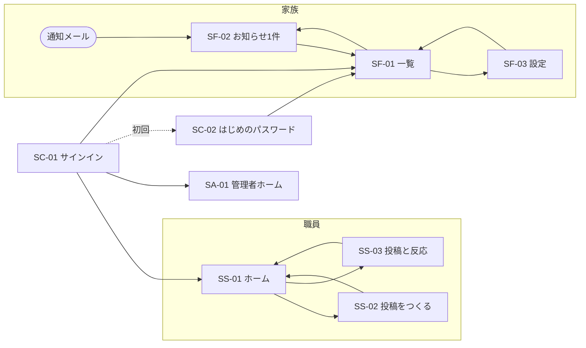
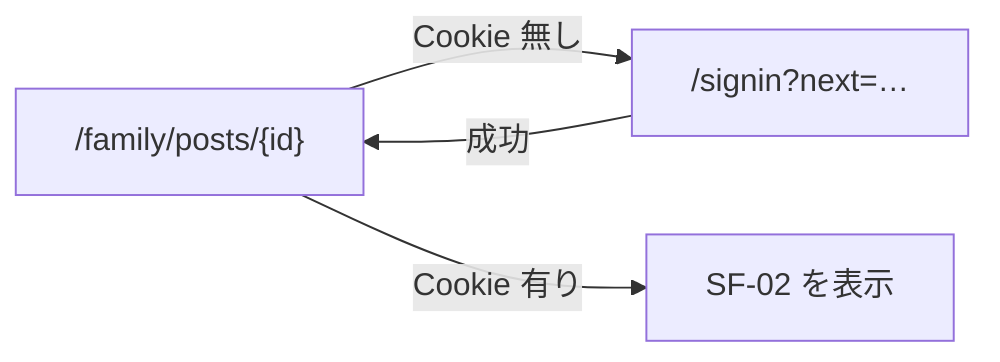
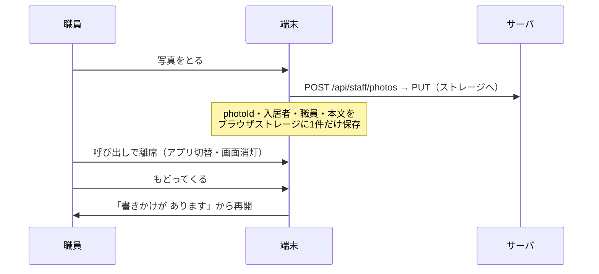

# 画面設計

本書は、[05_要件定義.md](05_要件定義.md) の NFR-1群（P2を床とするユーザビリティ）と、[06_リソース設計.md](06_リソース設計.md)・[07_API設計.md](07_API設計.md)・[08_DB設計.md](08_DB設計.md) が定めた構造を、**利用者が触る画面の形**に落とす。step5 の4本目であり、**step5 の最後の1本**である。

> **本書のスコープ**
> - **含む**：画面の一覧と遷移、各画面が持つ情報と操作、画面の状態（読込中・空・エラー）、**文言の規則とエラー辞書**（[07](07_API設計.md) W5）、寸法とタップ領域の規則、画面と API／DAL の対応。
> - **含まない**：色・書体の最終値、コンポーネントの実装、インスタンス構成・可用性・IaC（→ `10_インフラ設計.md`）。
> - **設計判断とトレードオフは本書に書かず、[ADR.md](ADR.md) に置く。** 本書に現れる判断は [ADR-036](ADR.md#adr-036)〜[ADR-045](ADR.md#adr-045) に対応する。
>
> 要件ID（FR-／NFR-／AC-B／M／C）の出典は [05_要件定義.md](05_要件定義.md)。リソースID（R／INV）は [06_リソース設計.md](06_リソース設計.md)。エンドポイントは [07_API設計.md](07_API設計.md)。

---

## 0. 本書の出発点

### 0-1. 受け取っている決定（本書で覆さない）

| 決定 | 本書への影響 |
|---|---|
| [ADR-012](ADR.md#adr-012) 標準的な認証を採る | **家族の入口にメールアドレスとパスワードの画面が立つ。** NFR-13 の語彙例外はここに閉じる（2-2） |
| [ADR-006](ADR.md#adr-006) 必須入力は写真1枚 | 投稿画面で**必須は写真だけ**。他は空のまま送信できる（5-2） |
| [ADR-007](ADR.md#adr-007) 投稿者は選択で識別 | 投稿画面に「だれが」の選択が要る（5-2・[ADR-042](ADR.md#adr-042)） |
| [ADR-008](ADR.md#adr-008) 宛先を選ばせない | 投稿画面に**宛先・公開範囲の UI が存在しない** |
| [ADR-010](ADR.md#adr-010) 通知は都度・停止のみ | 家族の設定に**頻度の選択肢がない**（3-3） |
| [ADR-011](ADR.md#adr-011) 反応は一押しのみ | 家族の画面に入力欄が1つも無い（3-1・[ADR-038](ADR.md#adr-038)） |
| [ADR-017](ADR.md#adr-017) 写真と投稿は2段階 | 撮った瞬間に送信が始まる。送信ボタンを押す前に写真は着いている（5-2） |
| [ADR-021](ADR.md#adr-021) 反応は端末上の一覧で受け取る | 職員向けの通知画面を作らない。端末のホームが受け取り口（5-1・[ADR-043](ADR.md#adr-043)） |
| [ADR-024](ADR.md#adr-024) 読み取りは RSC・変更は Route Handler | 初期表示はサーバで組み立て、操作だけが `fetch` する（2-5） |
| [ADR-029](ADR.md#adr-029) API は表示文言を返さない | **日本語の文言はすべて画面側が持つ**（2-4・[ADR-044](ADR.md#adr-044)） |
| [ADR-030](ADR.md#adr-030) 範囲外は `404` | 「見えないもの」に説明を出せない。文言は「無い」で統一する（2-4） |
| [ADR-033](ADR.md#adr-033) 同意の撤回は遡及する | 家族の一覧が**予告なく短くなる**。画面はこれを説明しない（3-1・6-3） |
| [ADR-034](ADR.md#adr-034) 退居保存は1年で自動削除 | 削除予定日を管理者に見せ続けるかは**本書で決める**（6-1） |

### 0-2. 送られてきた未決事項への決着

| # | 出所 | 未決事項 | 本書での決着 |
|---|---|---|---|
| U8 | [05](05_要件定義.md) | 画面構成・情報設計（NFR-1群を満たす具体） | 本書全体。特に 2-1（寸法）・3章（家族） |
| U5 | [05](05_要件定義.md) | アプリのインストールを不要とする実現手段 | **ブラウザのみ。** 家族にホーム画面への追加を案内しない（1-3） |
| W5 | [07](07_API設計.md) | エラー `code` と日本語文言の対応表 | 2-4。**主体ごとに別の文言**（[ADR-044](ADR.md#adr-044)） |
| W6 | [07](07_API設計.md) | 家族向け画面にサインアウトを置くか | 決着済み（置く）。**置き場所**を 3-3 で決める（[ADR-039](ADR.md#adr-039)） |
| ― | [ADR-034](ADR.md#adr-034) | 退居データの削除予定日が近いことを管理者に知らせるか | **知らせる。** 管理者ホームの「気をつけること」に出す（6-1） |
| ― | [06](06_リソース設計.md) 6-2 注5 | FR-106「自分の投稿」を画面の既定で絞る | 5-3。既定は「選ばれている職員の投稿」 |
| ― | [08](08_DB設計.md) 3-5 | 招待の状態列は遅れる。表示時に期限を評価する | 6-3。状態は `expires_at` を見て表示する |

### 0-3. [07_API設計.md](07_API設計.md) との差分（1点）

**通知メールのリンク先を `/posts/{postId}` から `/family/posts/{postId}` に変える。**

[07](07_API設計.md) 6-2 はリンク先を `/posts/{postId}` としているが、[07](07_API設計.md) 5-1 の `proxy.ts` は**パスの名前空間（`/staff` `/family` `/admin`）と Cookie の整合**で判定する。名前空間を持たないパスを1つ作ると、そこだけ判定の対象外になり、**楽観的チェックの規則に例外が1つ生まれる**。到達先は家族しか見ないものであり、名前空間を欠く理由がない。

**意味は変えていない**（通知から投稿1件に着地する）。変えたのは経路の綴りだけである。未サインインのときの扱いは 4-4。

### 0-4. 画面が背負う要件

NFR-1群は「画面設計で満たす」とだけ書かれた要件であり（[06](06_リソース設計.md) 8-2）、**本書が最終的な引き受け先**である。実装の言葉に置き換えておく。

| 要件 | 本書での実体 |
|---|---|
| NFR-11 説明を読まずに達成できる | 家族の画面は**1画面に主要な操作を1つ**。移動は前進する導線のみ（[ADR-037](ADR.md#adr-037)） |
| NFR-12 本文18px相当以上 | 全画面共通の下限。**管理者画面でも緩めない**（[ADR-036](ADR.md#adr-036)） |
| NFR-13 技術用語を使わない | 2-2 の語彙表。例外は認証画面とログアウトのみ |
| NFR-14 当たり判定48×48以上 | 全画面共通。表は**行全体**を当たり判定にする（[ADR-036](ADR.md#adr-036)） |
| NFR-15 横スワイプ・長押し・階層移動を必須としない | 家族の画面は**2階層まで**。無限スクロールを使わない（[ADR-037](ADR.md#adr-037)） |
| NFR-16 詰め込まない／写真を最大の要素に | 家族の一覧は**1画面に投稿1件**が概ね収まる寸法にする（3-1） |
| NFR-17 職員の投稿導線は片手で完結 | 送信は画面下端に固定。上端に操作を置かない（5-2） |
| NFR-18 色のみに依存しない／コントラスト4.5:1 | **状態は必ず文字で書く**（2-1） |

---

## 1. 画面の全体像

### 1-1. 画面一覧

| ID | 画面 | 経路 | 主体 | 主な要件 |
|---|---|---|---|---|
| **SC-01** | サインイン | `/signin` | 全 | FR-401・AC-B4 |
| **SC-02** | はじめのパスワードを決める | `/signin/first-password` | 全 | FR-401・AC-B1・AC-B2 |
| **SC-03** | パスワードを忘れたとき（送る） | `/signin/reset` | 全 | NFR-46 |
| **SC-04** | パスワードを忘れたとき（決める） | `/signin/reset/confirm` | 全 | NFR-46 |
| **SF-01** | お知らせの一覧 | `/family` | 家族 | FR-201・FR-301 |
| **SF-02** | お知らせ1件 | `/family/posts/{postId}` | 家族 | FR-201・FR-202 |
| **SF-03** | 設定 | `/family/settings` | 家族 | FR-203・FR-406 |
| **SS-01** | 端末のホーム | `/staff` | 職員 | FR-303・[ADR-021](ADR.md#adr-021) |
| **SS-02** | 投稿をつくる | `/staff/new` | 職員 | FR-101〜105 |
| **SS-03** | 投稿と反応の一覧 | `/staff/posts` | 職員 | FR-106・FR-303 |
| **SA-01** | 管理者ホーム（発信状況） | `/admin` | 管理者 | FR-503・M1 |
| **SA-02** | 入居者 | `/admin/residents` | 管理者 | FR-501 |
| **SA-03** | 入居者の詳細 | `/admin/residents/{id}` | 管理者 | FR-404・FR-504・FR-602 |
| **SA-04** | 職員 | `/admin/staff` | 管理者 | FR-502 |
| **SA-05** | 端末 | `/admin/devices` | 管理者 | [ADR-018](ADR.md#adr-018) |
| **SA-06** | 投稿（事後閲覧） | `/admin/posts` | 管理者 | FR-505・FR-106 |
| **SA-07** | 操作の記録 | `/admin/audit-logs` | 管理者 | NFR-45 |
| **SA-08** | 書き出し | `/admin/exports` | 管理者 | FR-601 |
| **SA-09** | 管理者 | `/admin/administrators` | 管理者 | [06](06_リソース設計.md) R2 |
| **SA-10** | 確認（取り返しのつかない操作） | 各操作の配下 | 管理者 | [ADR-045](ADR.md#adr-045) |

**20画面。** うち家族が触るのは **SC-01〜04 と SF-01〜03 の7つ**、そのうち P2 が日常で触るのは **SF-01 と SF-02 の2つ**である。

`/` は主体に応じた振り分けのみを行う（Cookie があれば主体の名前空間へ、無ければ `/signin`）。画面を持たない。

### 1-2. 主体別の遷移



**家族の遷移は閉じている。** SF-01 と SF-02 は相互に行き来し、SF-03 からは SF-01 にしか戻れない。**行き止まりと、どこにも繋がらない画面を作らない**（[ADR-037](ADR.md#adr-037)）。

### 1-3. 動作の前提

| 主体 | 前提 | 出所 |
|---|---|---|
| 家族 | **ブラウザのみ。インストールを案内しない**（U5 の決着）。縦持ち・幅360px から。発売5年程度の端末 | NFR-31・NFR-32 |
| 職員 | 施設管理下の共用スマホ／タブレット。**導入時にホーム画面へ追加し、全画面で使う**（施設が1度だけ行う作業として NFR-74 の4時間に含める） | NFR-33・C2 |
| 管理者 | 業務PC。幅1280px 以上を主とし、狭い幅では列を落として縦に積む | 01_ペルソナ P5 |

> **家族にホーム画面への追加を案内しない**のは、案内した時点で「説明を読まずに達成できる」（NFR-11）が崩れるためである。P2 の Pain は「アプリのインストールでつまずく」であり、**それが本物のインストールかどうかを P2 は区別しない。** 通知メールのリンクから毎回入れる状態を、そのまま既定の使い方にする。

---

## 2. 共通の規則

### 2-1. 寸法と密度

**文字サイズと当たり判定は全画面で共通**とし、管理者画面でも緩めない（[ADR-036](ADR.md#adr-036)）。密度は**文字を小さくして作らず、余白と列で作る**。

| | 家族 | 職員（端末） | 管理者 |
|---|---|---|---|
| 本文 | **20px** | 18px | 18px |
| 最小の文字（補足） | 18px | 16px | 16px |
| 見出し | 26px | 22px | 20px |
| 当たり判定 | **64×64 以上** | 56×56 以上 | 48×48 以上（表は**行全体**） |
| 操作要素どうしの間隔 | 16px 以上 | 12px 以上 | 8px 以上 |
| 1画面の主要な操作 | **1つ** | 1つ | 制限しない |
| 情報の並び | 縦1列のみ | 縦1列のみ | 表・複数列を許す |

- **端末側の文字拡大設定に追従する**（NFR-12）。寸法は `rem` を基準にし、固定 px の高さで文字を囲わない。**文字が2倍になっても崩れないこと**を、家族の全画面で確認対象にする（7章）。
- **状態は必ず文字で書く**（NFR-18）。「送信済み」を色だけで示さない。反応の有無、投稿の削除、招待の期限切れ、同意の有無——いずれも文字が正である。
- コントラストは 4.5:1 以上。**薄い灰色の補足文を使わない**——P2 に読めない文字を画面に置くくらいなら、その情報を置かない（NFR-16）。

### 2-2. 言葉の規則

NFR-13 の実体。**家族向けの画面に出してよい語を、こちらで決める。**

| 使わない語 | 代わりに使う語 |
|---|---|
| ログイン／ログアウト／サインイン | （認証画面と SF-03 を除き**登場させない**） |
| アカウント／ユーザー／セッション | ―（概念ごと画面に出さない） |
| 投稿／フィード／タイムライン | **お知らせ**／**ようす** |
| リアクション／いいね | **ありがとう** |
| アップロード／同期／更新（再読込の意） | **送る**／**もういちど見る** |
| エラー／失敗しました | **うまくいきませんでした** |
| 通知設定／プッシュ通知 | **おしらせメールを 止める** |
| タップ／スワイプ／メニュー | **おす**／―（操作名を文中に書かない） |
| データ／サーバー／ネットワーク | ―（原因を利用者の言葉にしない。2-4） |

**認証に伴う語の例外**（[ADR-012](ADR.md#adr-012) で引き受けた代償）：

- 「メールアドレス」「パスワード」は **SC-01〜04 でのみ**使う。
- 「ログアウト」は **SF-03 でのみ**使う（FR-406・NFR-13）。この2つが例外の全部であり、**SF-01・SF-02 にはどちらも現れない。**

その他の規則：

- 家族向けの文は**一文一動作**。「〜してから、〜してください」を書かない。
- **時刻は相対で書かない。** 「3時間前」ではなく「きょう 14:31」「9月10日 14:31」。相対表記は、開いたまま放置された画面で嘘になる。
- 入居者は必ず「**田中 一郎さん**」の形で、敬称つき・氏名で書く。「ご家族」「対象者」のような役割語で呼ばない。
- 職員名は投稿に添える（[07](07_API設計.md) 2-3 の `author.name`）。**職員への呼びかけ導線は作らない**（[ADR-011](ADR.md#adr-011)）。

### 2-3. 画面の4状態

すべての画面が次の4つを持つ。**どれか1つでも欠けたら、その画面は未完成とする。**

| 状態 | 規則 |
|---|---|
| 通常 | ― |
| 読込中 | **写真は寸法を先に確保**してから読む（2-6）。家族の画面に回転するだけの表示を出さず、**「よみこみ中です」と文字で書く**（NFR-18） |
| 空 | 何が無いかと、**次にできること**を書く。家族の一覧が空なら「まだ お知らせは ありません」だけを置き、操作を足さない |
| エラー | 2-4 の辞書から引く。**画面を丸ごと差し替えない**——すでに読めていた投稿を、後続の失敗で消さない |

### 2-4. 文言の辞書（W5 の決着）

[ADR-029](ADR.md#adr-029) により API は `code` しか返さない。**`code` → 日本語の対応は画面側が持ち、主体ごとに別の文言を割り当てる**（[ADR-044](ADR.md#adr-044)）。

| `code` | 家族向け | 職員向け | 管理者向け |
|---|---|---|---|
| `session_required` | もう一度、はじめから開いてください | サインインが必要です | サインインが必要です |
| `session_expired` | 久しぶりのご利用です。メールアドレスとパスワードを入れてください | サインインの期限が切れました。管理者に連絡してください | セッションの期限が切れました |
| `credentials_invalid` | メールアドレスか パスワードが ちがうようです | 利用者名かパスワードが違います | メールアドレスかパスワードが違います |
| `rate_limited` | すこし時間をおいて、もう一度おためしください | 回数が多すぎます。少し待ってください | 試行回数の上限に達しました |
| `family_revoked` | いまは ご覧いただけません。施設におたずねください | ― | この家族は失効しています |
| `invitation_expired` | おまねきの期限が切れています。施設におたずねください | ― | 招待の期限が切れています。再送してください |
| `post_deleted` | この お知らせは 取り消されました | この投稿は削除済みです | 削除済みの投稿です |
| `resident_consent_missing` | ― | この方は写真の同意がありません。管理者に確認してください | 写真掲載同意がありません |
| `resident_discharged` | ― | この方は退居されています | 退居済みの入居者です |
| `photo_not_uploaded` | ― | 写真がまだ送れていません。もう一度おためしください | 写真が未アップロードです |
| `photo_already_used` | ― | この写真はもう使われています。撮り直してください | 使用済みの写真です |
| `idempotency_key_conflict` | ― | 送信中です。そのままお待ちください | 重複したリクエストです |
| （辞書に無い `code`・`500`） | うまくいきませんでした。もう一度おためしください | うまくいきませんでした。もう一度お試しください | 処理に失敗しました（`traceId` を併記） |

画面側だけで起きるもの（API を呼ぶ前に判定する）：

| 状況 | 家族向け | 職員向け |
|---|---|---|
| 通信できない | いまは つながりません。電波のよいところで もう一度 | 電波が届いていません。送信は保留しています（5-2） |
| 写真が大きすぎる（`413`） | ― | 写真が大きすぎます。撮り直してください |
| 本文が長すぎる（`422`） | ― | 文字が多すぎます（200文字まで） |

**規則**：

- **原因を利用者の言葉にしない。** 「サーバーが混雑しています」と書いても、家族にできることは増えない。**書くのは「いま何が起きたか」と「次に何をするか」の2つだけ**とする。
- `404`（[ADR-030](ADR.md#adr-030)）は**存在しないものとして扱う**。「見る権限がありません」と書かない——書いた時点で、存在を伝えてしまう。
- **管理者向けにだけ `traceId` を出す**（[07](07_API設計.md) 3-10）。操作記録（SA-07）と突き合わせるため。家族・職員の画面には出さない。

### 2-5. 読み取りと操作の置き方

[ADR-024](ADR.md#adr-024) の画面側の表現。

| | 経路 | 例 |
|---|---|---|
| 初期表示 | **Server Component が DAL を直接呼ぶ**（HTTP を経由しない） | SF-01 の最初の20件、SS-01 のホーム、SA-* の一覧 |
| 追加の読み取り | Route Handler を `fetch` | SF-01 の「もっと前を見る」、SS-03 のさかのぼり |
| 状態の変更 | Route Handler を `fetch` | ありがとう、投稿の作成・削除、名簿の編集 |

- **操作の直後は、画面をその場で書き換える**（サーバの応答を待ってから全体を読み直さない）。反応の一押しが 1秒待たされると、それだけで「押せたのか分からない」状態が生まれる。
- ただし**失敗したら元に戻し、2-4 の文言を出す**。書き換えたまま放置しない。
- `proxy.ts` は Cookie とパスの名前空間の整合だけを見る（[07](07_API設計.md) 5-1）。**画面側で認可を判断しない**——出す／出さないの判断は、DAL が返したデータの有無に従う。

### 2-6. 写真の扱い

| 項目 | 決定 | 根拠 |
|---|---|---|
| `` | `/api/{role}/photos/{photoId}`（安定した経路） | [ADR-027](ADR.md#adr-027)。時限URLを画面に埋めない |
| 寸法 | `width` / `height` を先に適用して**場所を確保してから読む** | [07](07_API設計.md) 2-3。写真が最大の要素である以上、がたつきが最も目立つ（NFR-16） |
| 読み込み | 最初の1件は即時、以降は遅延 | NFR-34（3秒以内） |
| 表示比 | **切り抜かない。** 縦横比を保ったまま幅いっぱいに置く | 撮ったものが欠ける形にしない（P2 の Need は「夫の顔」） |
| 失敗時 | 枠と「写真を よみこめませんでした」の文字。**再読込のボタンを置く** | 時限URLの失効（5分）で起きうる |

**開いたまま放置された画面**では、時限URLが切れて写真が読めなくなる。`` の読み込み失敗を捕まえて、**同じ `photoId` で読み直す**（安定した経路なので、読み直せば新しい時限URLが発行される）。これが [ADR-027](ADR.md#adr-027) の「埋めない」判断が効く場面である。

---

## 3. 家族の画面（SF）

**本システムの賭けが最も薄い場所であり、最も丁寧に作る場所でもある。** [ADR-012](ADR.md#adr-012) により、MVP では P2 がここに到達できるとは限らない。それでも **到達したあとの体験は P2 の水準に置く**（[05](05_要件定義.md) 3-1：閲覧と反応の導線だけが P2 の水準にある）。

### SF-01 お知らせの一覧（`/family`）

```
┌────────────────────────────┐
│  田中 一郎さんの ようす        │ ← 見出し 26px。これが唯一の常設表示
├────────────────────────────┤
│  ┌──────────────────────┐  │
│  │                      │  │
│  │      （写真）          │  │ ← 幅いっぱい。切り抜かない
│  │                      │  │
│  └──────────────────────┘  │
│  お昼に お庭を 散歩しました     │ ← 20px
│  きょう 14:31  佐藤 さくら     │ ← 18px
│  ┌──────────────────────┐  │
│  │     ありがとう          │  │ ← 64px 高。文字のみ（ADR-038）
│  └──────────────────────┘  │
├────────────────────────────┤
│          （次の1件）           │
│             ⋮                │
├────────────────────────────┤
│  ┌──────────────────────┐  │
│  │   もっと前を 見る        │  │ ← 明示的なタップ。無限スクロールにしない
│  └──────────────────────┘  │
│  ┌──────────────────────┐  │
│  │        設定             │  │ ← 末尾にのみ置く（ADR-039）
│  └──────────────────────┘  │
└────────────────────────────┘
```

| 項目 | 決定 |
|---|---|
| 取得 | 初期20件を RSC が DAL から。以降は `GET /api/family/posts`（カーソル） |
| 並び | 投稿日時の降順のみ。**並び替えの操作を置かない**（FR-201） |
| 1件の情報 | 写真・本文・日時・職員名・ありがとう。**これ以上増やさない**（NFR-16） |
| ヘッダ | 入居者名のみ。**戻る・メニュー・検索・通知ベルを置かない** |
| さかのぼり | 「もっと前を 見る」ボタン（[ADR-037](ADR.md#adr-037)） |
| 空 | 「まだ お知らせは ありません」。操作を足さない |
| 常設のナビゲーション | **無し。** 設定への導線は一覧の末尾だけ（[ADR-039](ADR.md#adr-039)） |

> **一覧が急に短くなることがある。** 同意が撤回されると、その入居者の投稿はすべて見えなくなる（[ADR-033](ADR.md#adr-033)）。**画面はこれを説明しない**——説明する言葉が NFR-13 の範囲に無く、かつ説明すること自体が撤回の事実を家族間に伝えることになる。同ADRの代償をそのまま引き受け、**運用（導入手順書＝NFR-75）に送る。**

### SF-02 お知らせ1件（`/family/posts/{postId}`）

**通知メールからの着地点**（0-3）。構成は SF-01 の1件と同一で、末尾に「**ほかの お知らせも 見る**」を置く。

- **「戻る」と書かない。行き先を書く**（[ADR-037](ADR.md#adr-037)）。ブラウザの戻るを使えることは前提にしない。
- 削除済み・同意撤回後の投稿には `404`（[ADR-030](ADR.md#adr-030)）。画面は「この お知らせは 取り消されました」と、SF-01 への導線だけを出す。
- 未サインインで開かれたときの扱いは 4-4。

### SF-03 設定（`/family/settings`）

家族が持つ操作は**2つだけ**である。

| 操作 | 表示 | API |
|---|---|---|
| 通知の停止・再開 | 「**おしらせメールを 止める**」／止めているときは「**おしらせメールを 受け取る**」 | `PUT /api/family/notification` |
| ログアウト | 「**ログアウト**」（語彙例外の唯一の持ち出し先＝NFR-13） | `DELETE /api/auth/session` |

- 通知を止めるときに、**「止めても、ここを開けば ようすは 見られます」**と添える（[ADR-010](ADR.md#adr-010) の代償：停止は「見られない」ではない）。
- 「この方の ようすを 見ている人」として、同じ入居者に紐づく家族の**氏名と続柄**を一覧する（`GET /api/family/relatives`・[06](06_リソース設計.md) 6-2 注2）。**名簿を変える操作は置かない**（[ADR-008](ADR.md#adr-008)：編集できるのは管理者のみ）。「増やしたいときは 施設に おたずねください」と書く。
- ログアウトは**確認を挟む**。「もう一度 入るには、メールアドレスと パスワードが 必要です」。P2 がここまで到達して押してしまった場合、それは利用の終わりになりうる（[ADR-039](ADR.md#adr-039) の代償）。

### 3-4. ありがとう（FR-301・FR-302）

| 状態 | 表示 | 操作 |
|---|---|---|
| まだ押していない | `ありがとう` | 押す → `PUT /api/family/posts/{id}/reaction` |
| 押した | `ありがとうを つたえました ✓` ＋ 直下に小さく「まちがえたら、もう一度 おしてください」 | 押す → `DELETE .../reaction` |
| 送信中 | 押した状態を先に出す（2-5）。失敗したら戻して 2-4 の文言 | ― |

- **文字で書く。アイコンだけにしない**（[ADR-038](ADR.md#adr-038)・NFR-18）。
- **長押しを使わない**（NFR-15）。取り消しは同じボタンをもう一度押す。
- 誰が反応したかは**表示しない**（[07](07_API設計.md) 2-3：`myReaction` のみ）。家族どうしで「押した／押していない」が見える状態を作らない。

---

## 4. 認証の画面（SC・全主体共通）

**NFR-13 の例外が立つ唯一の場所**である（[ADR-012](ADR.md#adr-012)）。ここで使った語を、認証後の画面に持ち込まない。

### SC-01 サインイン（`/signin`）

```
┌────────────────────────────┐
│   ○○ホーム                  │
│   ご家族のみなさまへ           │
│                            │
│   メールアドレス              │
│   ┌──────────────────────┐ │
│   └──────────────────────┘ │
│   パスワード                  │
│   ┌──────────────────────┐ │
│   └──────────────────────┘ │
│   ┌──────────────────────┐ │
│   │        すすむ           │ │
│   └──────────────────────┘ │
│   パスワードを 忘れたとき        │
└────────────────────────────┘
```

| 項目 | 決定 |
|---|---|
| 入力欄 | **2つだけ**（`identifier` と `password`）。主体の種類を選ばせない（[07](07_API設計.md) 4-1・NFR-11） |
| ラベル | 家族から開かれる想定で「メールアドレス」と書く。**端末はユーザー名を入れる**（[ADR-015](ADR.md#adr-015)）が、入力欄は同じ1つであり、施設への手順書（NFR-75）でカバーする |
| 入力の補助 | `autocomplete` を効かせ、**端末に記憶されたものが出る状態にする**（AC-B3 の趣旨を、期限切れの再認証時に効かせる） |
| パスワードの表示 | 「文字を 見る」のトグルを置く。入力できないことが脱落の原因になる（P2） |
| 遷移先 | 応答の `subject` に従う（`family`→SF-01／`device`→SS-01／`admin`→SA-01） |
| 初回 | `next: "initial_password"` なら SC-02 へ |
| 失敗 | `credentials_invalid`（2-4）。**どちらが間違っているかを書かない** |

### SC-02 はじめのパスワードを決める（`/signin/first-password`）

- 入力は**新しいパスワード1つだけ**（AC-B2：付随する入力を求めない）。氏名も続柄も聞かない——**施設がすでに名簿に持っている**（FR-404）。
- 条件は**入力しながら見せる**（「8文字以上」など）。送信してから叱らない。
- 成功するとそのまま SF-01 へ入る。**確認画面を挟まない。**

### SC-03 / SC-04 パスワードを忘れたとき

- SC-03：メールアドレスを入れる → `POST /api/auth/password-reset`。**送ったかどうかを結果で変えない**（存在しないアドレスでも同じ文言を出す。列挙を防ぐ）。
- SC-04：メールに届いたコードと新しいパスワード → `PUT /api/auth/password`。
- 完了後、**そのセッションだけでなく当該主体の既存セッションが破棄される**（AC-B4 ③・[07](07_API設計.md) 3-3）。「ほかの 端末では、もう一度 入りなおしてください」と明示する。

### 4-4. 通知メールから未サインインで開かれたとき



- `next` は**自サイト内の、`/family/` で始まるパスだけを受け付ける**。それ以外は無視して SF-01 へ送る（外部への持ち出しを作らない）。
- 家族には「もう一度 入ってください」とだけ見せ、**リンクが無効になったとは書かない**（無効ではない）。
- **この往復は、P2 にとって最も脱落しやすい地点である。** MVP はここを解かないと決めた（[ADR-012](ADR.md#adr-012)）。本書はそれを画面で糊塗せず、**次段で AC-A に戻るときに最初に消える画面が SC-01 であること**を記録しておく。

---

## 5. 職員の画面（SS・共用端末）

**評価軸は M2（撮影開始〜送信完了の中央値60秒）ただ1つ**である。以下の設計はすべてこの数字に従属する。

### SS-01 端末のホーム（`/staff`）

```
┌──────────────────────────────────────┐
│  ○○ホーム 2階ナースステーション            │
│  ┌────────────────────────────────┐  │
│  │      ＋ 投稿をつくる               │  │ ← 最大の要素。常に画面上部
│  └────────────────────────────────┘  │
│  あたらしい「ありがとう」                  │
│  ┌────────────────────────────────┐  │
│  │ [写真] 田中 一郎さん  佐藤さくら     │  │
│  │        ありがとう 2件  14:52       │  │
│  ├────────────────────────────────┤  │
│  │ [写真] 鈴木 花子さん  山田 みゆき    │  │
│  │        ありがとう 1件  11:20       │  │
│  └────────────────────────────────┘  │
│  ┌────────────────────────────────┐  │
│  │  自分の分だけ 見る                 │  │ → SS-03
│  └────────────────────────────────┘  │
└──────────────────────────────────────┘
```

| 項目 | 決定 |
|---|---|
| 最上段 | **投稿をつくる。** 端末を開いた直後に押せる位置に固定する（M2 の最初の1タップ） |
| 反応 | **施設全体の新しい反応を、投稿者名つきで時刻順に出す**（[ADR-043](ADR.md#adr-043)） |
| 並び | 時刻の降順のみ。**件数の多い順に並べない。ランキングを作らない** |
| 絞り込み | 「自分の分だけ 見る」→ SS-03（`staffId` で絞る） |
| 端末名 | ヘッダに表示（`GET /api/staff/device`）。どの端末から投稿しているか職員が分かる状態にする |

> **反応は「気づかれなければ存在しないのと同じ」である。** 職員は認証主体ではないため、個人宛ての通知経路が無い（[ADR-021](ADR.md#adr-021)）。**端末を開いた人が必ず目にする場所に置く**ことが、FR-302（投稿した職員本人に届く）を画面で成立させる唯一の手段になる。名前が併記されていれば、本人にも、本人に伝える同僚にも届く。

### SS-02 投稿をつくる（`/staff/new`）

**1画面の縦1列**。ウィザードにしない（[ADR-040](ADR.md#adr-040)）。

```
┌──────────────────────────────────────┐
│  1. どなたの ようすですか                 │
│  ┌────┐┌────┐┌────┐┌────┐           │ ← 入居者を選ぶ（同意なし・退居済みは出ない）
│  │田中 ││鈴木 ││佐藤 ││ …  │           │
│  └────┘└────┘└────┘└────┘           │
│  2. 写真                                │
│  ┌────────────────────────────────┐  │
│  │        📷 写真をとる               │  │ ← OSのカメラへ（ADR-041）
│  └────────────────────────────────┘  │
│  3. ひとこと（なくても送れます）            │
│  ┌────────────────────────────────┐  │
│  └────────────────────────────────┘  │
│  ［お食事を完食されました］［お元気でした］…    │ ← 文例を1タップ挿入（FR-103）
│                                        │
│  ─────────────────────────────────    │
│  投稿する人： 佐藤 さくら    （かえる）      │ ← 既定で選択済み（ADR-042）
│  ┌────────────────────────────────┐  │ ← 画面下端に固定（NFR-17）
│  │           送る                    │  │
│  └────────────────────────────────┘  │
└──────────────────────────────────────┘
```

| 段 | 決定 | 根拠 |
|---|---|---|
| 1. 入居者 | `GET /api/staff/residents` が返すものだけを出す。**同意が無い・退居済みは一覧に現れない** | [07](07_API設計.md) 4-2・INV-3 |
| 2. 写真 | `<input type="file" accept="image/*" capture="environment">` で **OS のカメラに委ねる**（[ADR-041](ADR.md#adr-041)） | NFR-31・NFR-32 |
| 2'. 送信 | 戻ってきた瞬間に**端末側で長辺1600px に縮小し、`POST /api/staff/photos` → ストレージへ `PUT`** を始める。進み具合は写真の上に文字で出す | [ADR-017](ADR.md#adr-017)・[08](08_DB設計.md) 6-4 |
| 3. ひとこと | 任意。**空のまま送れることを画面に書く** | [ADR-006](ADR.md#adr-006) |
| 3'. 文例 | 横に並べた文例を1タップで本文末尾に挿入。挿入後は編集できる。**どの文例から始めたかは送らない** | FR-103・[07](07_API設計.md) 4-2 |
| 4. 投稿する人 | 直近の選択を既定にする（[ADR-042](ADR.md#adr-042)）。**送るボタンの直上に大きく名前を出す** | [ADR-007](ADR.md#adr-007)・M2 |
| 5. 送る | 画面下端に固定。**写真が着くまでは押せない状態**にし、理由を文字で書く（「写真を 送っています」） | NFR-17・`photo_not_uploaded` を出さないため |

**中断からの復帰（FR-105・V10）**



- 保持するのは **`photoId`・入居者・職員・本文の4つだけ**。写真の実体は既にサーバにある（[ADR-017](ADR.md#adr-017)）ので、端末には残らない。
- **1件だけ保持する。** 2件目の作成を始めたら前の書きかけは捨てる——複数の下書きを管理する画面を作らない（[06](06_リソース設計.md) R8：下書きリソースを持たない）。
- 送信に失敗したときは**書きかけとして残し、「もう一度 送る」を出す**（NFR-35）。`Idempotency-Key` は書きかけと一緒に保持し、再送で二重投稿にならないようにする（[ADR-028](ADR.md#adr-028)）。

**60秒の内訳（M2）**

| 段 | 想定 | 備考 |
|---|---|---|
| 端末を開く〜入居者を選ぶ | 10秒 | ホーム最上段の1タップを含む |
| 撮る（OSのカメラ） | 20秒 | 撮り直し1回を含む |
| 投稿する人 | **0〜5秒** | 既定で選択済み（[ADR-042](ADR.md#adr-042)）。変更時のみ発生 |
| ひとこと（文例1タップ） | 5秒 | 自由入力なら増える |
| 送る | 5〜15秒 | **写真の送信は撮影直後から始まっている**ので、ここは投稿の作成のみ |
| **合計** | **40〜55秒** | 最大の変動要因は回線（NFR-35） |

**この見積もりは実測ではない。** NFR-22 が「開発者の主観評価では合格としない」と定めており、**実機での計測（7章）で置き換える。**

### SS-03 投稿と反応の一覧（`/staff/posts`）

| 項目 | 決定 |
|---|---|
| 既定 | **SS-01 で選ばれている職員の投稿**に絞る（`GET /api/staff/posts?staffId=`）。FR-106・[06](06_リソース設計.md) 6-2 注5 の「画面の既定で絞る」の実体 |
| 職員の切替 | 一覧上部で切り替えられる。**これは保護境界ではない**（[ADR-007](ADR.md#adr-007)）——切り替えられることを隠さない |
| 1件の情報 | 写真（小）・入居者名・日時・本文・**ありがとうの件数と最新時刻** |
| 削除 | 各件に「取り消す」。**確認を1度挟み、「ご家族には すでに おしらせが 届いています」と書く**（[ADR-009](ADR.md#adr-009) の代償を、押す前に見せる） |
| さかのぼり | カーソル。「もっと前を 見る」 |

---

## 6. 管理者の画面（SA）

**唯一「情報密度が高くてよい」画面群**である（01_ペルソナ P5）。ただし文字サイズと当たり判定は共通の下限を守る（[ADR-036](ADR.md#adr-036)）。

### SA-01 ホーム（`/admin`）

2つの区画からなる。

**(1) 気をつけること** — 放っておくと壊れるものを、上に集める。

| 項目 | 出所 |
|---|---|
| **7日以上 投稿がない入居者** が N人 | FR-503・M1（週2回） |
| **招待していない家族** が N人 | [06](06_リソース設計.md) R6（状態＝招待前） |
| **招待の期限が切れた家族** が N人 | INV-6・[08](08_DB設計.md) 3-5（`expires_at` を表示時に評価） |
| **30日以上 使われていない端末** が N台 | [06](06_リソース設計.md) R3（最終利用日時） |
| **退居データの削除予定日が 60日以内** の入居者が N人 | **[ADR-034](ADR.md#adr-034) の宿題への回答** |

> **最後の1行が [ADR-034](ADR.md#adr-034) への回答である。** 同ADRは「削除されたことに施設が気づかない可能性がある／期限が近づいたときに知らせるかは画面設計で扱う」と宿題を残した。**知らせる。** ただし通知は送らず、**管理者が開く画面に出す**に留める——1年後に届くメールを送る仕組みは、[ADR-035](ADR.md#adr-035)（定期実行を1つに集約）に処理を1つ足すだけでは済まず、宛先の正しさを1年間保証する話になる。**60日という猶予は、月1回ホームを開けば必ず目に入る長さ**として置いた（値は仮置き。9章）。

**(2) 発信状況** — `GET /api/admin/residents/activity`（FR-503）。

| 列 | 内容 |
|---|---|
| 入居者 | 氏名・状態 |
| 最終投稿日 | **古い順に並べる**（発信が止まっている人を上に出す） |
| 直近30日の件数 | ― |
| 同意 | 有／無（**文字で書く**。色だけにしない＝NFR-18） |
| 家族 | 利用中／招待済／招待前 の内訳 |

**並びの既定を「最終投稿日の古い順」にする。** 一覧の目的は「気づくこと」であって「眺めること」ではない（FR-503 の括弧書き：発信が止まっている入居者に気づける）。

### SA-02 入居者（`/admin/residents`）／ SA-03 入居者の詳細（`/admin/residents/{id}`）

SA-03 は4つの区画を持つ。

| 区画 | 内容 | API |
|---|---|---|
| 基本 | 氏名・状態・退居日 | `PATCH /api/admin/residents/{id}` |
| **写真掲載同意** | 有／無・記録日時・記録者。変更は SA-10 を経由 | `PUT .../photo-consent` |
| **家族名簿** | 氏名・続柄・メールアドレス・状態・招待の履歴。**登録と招待は別の操作**（[07](07_API設計.md) 4-5） | `.../family`・`.../invitations`・`.../access` |
| 退居 | 退居処理の起点。SA-10 を経由 | `POST .../discharge` |

- 家族の行には**状態を文字で**出す：`招待前` / `招待済（あと3日）` / `利用中` / `失効`。**「招待済」の期限は保存された状態列ではなく `expires_at` から計算して出す**（[08](08_DB設計.md) 3-5）。
- 家族の登録時、**メールアドレスが必須であること**と、**届かない家族がありうること**を画面に書く（[ADR-012](ADR.md#adr-012) の代償・[07](07_API設計.md) 4-5）。「メールを お使いでない ご家族には、施設から お渡しください」。
- 失効（FR-405）は**1タップで到達できる位置**に置く。端末紛失は急ぐ操作である。ただし SA-10 を経由する（6-3）。

### SA-04 職員 ／ SA-05 端末 ／ SA-09 管理者

| 画面 | 要点 |
|---|---|
| SA-04 職員 | 氏名・**表示順**・利用可否。表示順は SS-02 の選択肢の並びになる（よく投稿する職員を上に置ける） |
| SA-05 端末 | 表示名・最終利用日時・状態。**登録の応答に1度だけ現れる資格情報**を、コピーできる形で大きく出し、**「この画面を閉じると 二度と表示されません」と明記**する（[07](07_API設計.md) 4-5）。失効は端末単位（[ADR-018](ADR.md#adr-018)） |
| SA-09 管理者 | 氏名・メールアドレス・状態。**施設の作成・停止は置かない**（[06](06_リソース設計.md) R1：提供側の運用操作） |

### SA-06 投稿 ／ SA-07 操作の記録 ／ SA-08 書き出し

| 画面 | 要点 |
|---|---|
| SA-06 投稿 | **削除済みを含む全投稿**（FR-505）。削除済みは文字で `削除済み`（削除者・削除日時つき）。管理者は削除できるが、**作成の導線は存在しない**（[05](05_要件定義.md) 3-2・[07](07_API設計.md) 5-3） |
| SA-07 操作の記録 | 日時・実行主体・操作・対象・結果。**`結果＝拒否` を既定で上に出す**（[ADR-003](ADR.md#adr-003)：越境を検出できるようにする）。`traceId` で SA-06 と突き合わせられる |
| SA-08 書き出し | 依頼 → `受付` → `生成中` → `生成済` → `期限切れ`。**生成は定期実行なので、その場では終わらないことを画面に書く**（[ADR-035](ADR.md#adr-035)）。「できあがったら、この画面に表示されます」 |

### 6-3. 取り返しのつかない操作（SA-10）

[ADR-045](ADR.md#adr-045)。対象は次の4つ。

| 操作 | 戻せるか | 確認の形 |
|---|---|---|
| 同意を「無」にする | **戻せる**（[ADR-033](ADR.md#adr-033)：有に戻せば再び見える） | 確認画面。実行後に影響件数を示す |
| 家族のアクセスを失効する | 戻せる（再開できる＝[06](06_リソース設計.md) 5-1） | 確認画面 |
| 退居（データを**保存**） | 戻せない（家族はすべて失効＝INV-11） | 確認画面＋削除予定日の明示 |
| 退居（データを**削除**） | **戻せない**（物理削除＝[ADR-019](ADR.md#adr-019)） | 確認画面＋**入居者の氏名の入力** |

**確認画面は独立した画面として持ち、ダイアログで済ませない。** 加えて——

> **確認画面は件数を約束しない。** [07](07_API設計.md) 4-5 は、影響件数（`affectedPosts`）を**実行の応答で**返すと決め、プレビュー用の `GET` を持たないとした（操作を2段階にすると確認せずに通す経路が増えるため）。したがって**確認画面は「何件消えるか」を知らない。** 書けるのは「**この方の これまでの お知らせが、すべて ご家族から見えなくなります**」という**起きることの説明**だけであり、件数は実行後に「42件の お知らせが 見えなくなりました」として示す。これは [ADR-045](ADR.md#adr-045) が引き受けた代償である。

---

## 7. 受け入れの確かめ方

NFR-21・NFR-22 を、画面の言葉に落とす。

| # | 対象 | 方法 | 合格 |
|---|---|---|---|
| **A1** | SF-01・SF-02・3-4（閲覧と反応） | **70歳以上・スマホの利用がメッセージアプリに限られる被験者3名以上**。無支援・無説明 | 全員が「写真を見る」と「ありがとうを押す」に到達 |
| **A2** | 同上 | 端末の文字サイズを**最大**に設定した状態で A1 を再実施 | 崩れず、同じ操作に到達できる |
| **A3** | SS-02 | **実機で計測**（NFR-22）。施設の回線・実際の共用端末 | 撮影開始〜送信完了の**中央値60秒以内**（M2） |
| **A4** | SS-02 | 写真の送信中にアプリを切り替え／画面を消灯し、1分後に戻る | 書きかけから再開でき、二重投稿にならない |
| **A5** | SF-01 | 全画面の文字と背景 | コントラスト **4.5:1 以上**（NFR-18） |
| **A6** | SF-01・SF-02 | 開いたまま10分放置し、写真を再表示 | 時限URLの失効後も写真が出る（2-6） |

> **A1 の対象は「認証を通過したあと」に限る**（NFR-21）。SC-01〜04 は対象外である——[ADR-012](ADR.md#adr-012) が、そこを MVP の検証対象から外したため。**次段で AC-A に戻るときは、SC-01 を含めて A1 をやり直す。**

---

## 8. トレーサビリティ

### 8-1. 要件 → 画面

| 要件 | 画面 |
|---|---|
| FR-101〜104 写真1枚・文例・宛先を選ばない | SS-02 |
| FR-105 中断で失われない | SS-02（書きかけ） |
| FR-106 事前承認なし／削除 | SS-03・SA-06 |
| FR-107 個人ログインなしで帰属 | SS-02（4段目）・[ADR-042](ADR.md#adr-042) |
| FR-201 新しい順・さかのぼり | SF-01 |
| FR-202 一人ひとりへ直接通知 | 通知メール → SF-02（0-3・4-4） |
| FR-203 都度通知・停止のみ | SF-03 |
| FR-204 技術用語を使わない | 2-2・2-4 |
| FR-301・302 一度の操作で職員本人へ | 3-4 → SS-01 |
| FR-303 反応の一覧 | SS-01・SS-03 |
| FR-401〜403 招待から開始・再入力なし | SC-01・SC-02 |
| FR-405 即時失効 | SA-03 → SA-10 |
| FR-406 明示的なログアウト | SF-03 |
| FR-501・504・602 入居者・同意・退居 | SA-02・SA-03・SA-10 |
| FR-502 職員 | SA-04 |
| FR-503 最終投稿日と件数 | SA-01 |
| FR-505 事後閲覧 | SA-06 |
| FR-601 持ち出し | SA-08 |
| AC-B1・B2 招待から開始・入力は最小 | SC-02（新しいパスワードのみ） |
| AC-B3・B4 再入力なし／3つの契機 | SC-01（再認証の入口）・SF-03（②） |

### 8-2. NFR-1群 → 画面の規則

| 要件 | 実体 | 検証 |
|---|---|---|
| NFR-11 | [ADR-037](ADR.md#adr-037)（前進導線のみ）・3章 | A1 |
| NFR-12 | 2-1（全画面共通の下限）・[ADR-036](ADR.md#adr-036) | A2 |
| NFR-13 | 2-2 の語彙表・2-4 の辞書・[ADR-044](ADR.md#adr-044) | ― |
| NFR-14 | 2-1（表は行全体） | ― |
| NFR-15 | [ADR-037](ADR.md#adr-037)（2階層・無限スクロールなし）・[ADR-038](ADR.md#adr-038)（長押しなし） | A1 |
| NFR-16 | 3-1（1件の情報を増やさない）・2-6（切り抜かない） | ― |
| NFR-17 | 5-2（送信を下端に固定） | A3 |
| NFR-18 | 2-1（状態は文字で書く） | A5 |
| NFR-34 | 2-6（寸法先行・遅延読み込み） | A6 |
| NFR-35 | 5-2（撮影直後に送信開始・書きかけ） | A4 |

### 8-3. 画面 → 経路

| 画面 | 初期表示（RSC→DAL） | 操作（Route Handler） |
|---|---|---|
| SF-01 | `family/posts`（20件） | `GET /api/family/posts`（さかのぼり）・`PUT`/`DELETE .../reaction` |
| SF-02 | `family/posts/{id}` | `PUT`/`DELETE .../reaction` |
| SF-03 | `family/notification`・`family/relatives` | `PUT /api/family/notification`・`DELETE /api/auth/session` |
| SC-01〜04 | ― | `POST /api/auth/session`・`.../initial-password`・`.../password-reset`・`PUT /api/auth/password` |
| SS-01 | `staff/device`・`staff/posts`（施設全体） | ― |
| SS-02 | `staff/residents`・`staff/members`・`staff/phrases` | `POST /api/staff/photos` → ストレージ `PUT` → `POST /api/staff/posts` |
| SS-03 | `staff/posts?staffId=` | `DELETE /api/staff/posts/{id}` |
| SA-01 | `admin/residents/activity` ＋ 各種の件数 | ― |
| SA-03 | `admin/residents/{id}`・`.../family`・`.../invitations` | `PATCH`・`PUT .../photo-consent`・`POST .../invitations`・`DELETE .../access`・`POST .../discharge` |
| SA-05 | `admin/devices` | `POST`・`DELETE /api/admin/devices/{id}` |
| SA-06 | `admin/posts` | `DELETE /api/admin/posts/{id}` |
| SA-08 | `admin/exports` | `POST /api/admin/exports` |

---

## 9. 未決事項

| # | 内容 | 送り先 |
|---|---|---|
| **X1** | 色・書体の具体値（トークンの実装）。**決めるのは 2-1 の規則を満たす範囲で**あり、規則そのものは本書で確定した | 実装着手時 |
| **X2** | 文例（R13）の初期セットの中身。FR-103 が要求するのは「1タップ挿入」までで、**文面は施設の言葉に合わせる必要がある** | 実地検証（施設ヒアリング） |
| **X3** | SA-01「気をつけること」の閾値（7日・30日・60日）。いずれも**仮置き**であり、[ADR-034](ADR.md#adr-034) の1年と同じ扱い | 実運用 |
| **X4** | [ADR-042](ADR.md#adr-042) の「8時間で忘れる」の妥当性（シフトの実態に合っているか） | 実地検証 |
| **X5** | 通知メールの本文の文面。[ADR-031](ADR.md#adr-031) が「内容を含めない」と決めたが、**2-2 の語彙規則を通した文面は未確定** | 実装着手時 |
| **X6** | 家族の端末で文字を最大にしたときの実挙動（A2）。NFR-12 の「崩れない」の基準は実機でしか決まらない | 実機計測 |
| U8 以外の [05](05_要件定義.md) 未決 | U9（環境構築の自動化と複数施設の収容） | `10_インフラ設計.md` |

---

## 脚注：本書の前提について

- **本書は [07_API設計.md](07_API設計.md) を1点だけ変えた**（0-3：通知リンクの経路）。それ以外に上流の決定を覆していない。
- **画面の図は構造の説明であって、ビジュアルデザインではない。** 位置関係と情報の優先順位だけを示しており、色・余白・書体は X1 で決める。
- **寸法の数値（20px・64px・1600px・60日）は仮置き**である。[05_要件定義.md](05_要件定義.md) 脚注と同じ扱いで、実地検証（7章）で調整する。
- **本書は K6 を解かない。** [ADR-012](ADR.md#adr-012) により、家族の入口には SC-01 が立っている。**3章がどれだけ P2 に寄っていても、P2 はそこへ自力で到達しない。** 本書がしたのは、*到達したあとの床を用意しておくこと*だけである。次段で AC-A に戻るとき、**変わるのは SC-01〜04 と 4-4 だけで、SF-01〜03 は変わらない**——そうなるように、認証に関わるものを SC と 4-4 に閉じ込めた。これは意図した設計である（[06](06_リソース設計.md) 脚注と同じ方針）。

---

## 次のドキュメント候補

- [x] `docs/ADR.md` — [ADR-036](ADR.md#adr-036)〜[ADR-045](ADR.md#adr-045) を追加
- [ ] `docs/10_インフラ設計.md` — [05](05_要件定義.md) U9・[08](08_DB設計.md) U13・[07](07_API設計.md) W4
- [ ] 実装着手（[08](08_DB設計.md) U11・U12・U17、本書 X1・X5）
