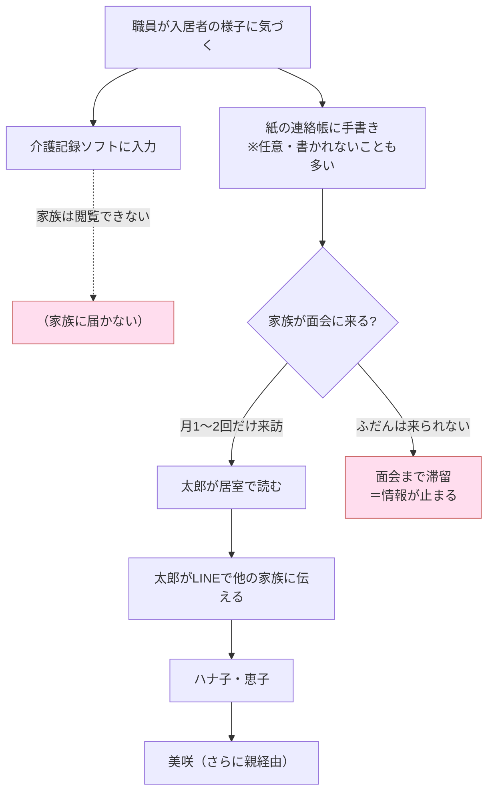
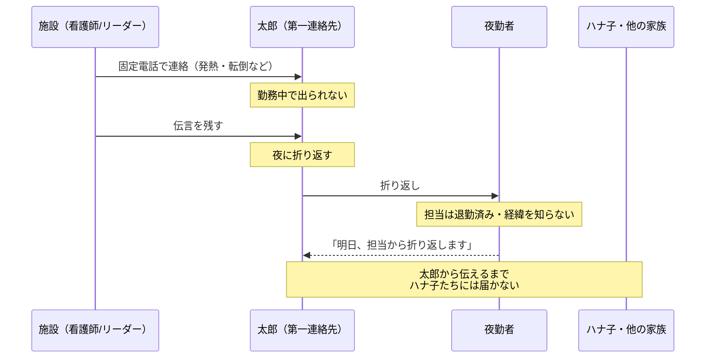
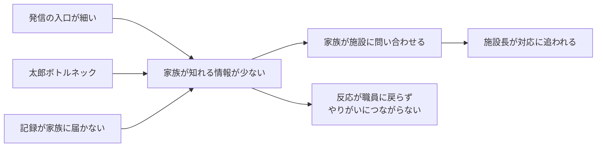

# As-Is（現状分析）

本書は、本システムが**存在しない現在**の情報共有の状況と、そこから生じている問題を整理する。
解決策・機能・画面・技術は扱わない（それらは要件定義以降で決める）。

登場人物は [personas.md](personas.md) を参照。

> 本書のスコープは「施設で暮らす高齢者の**日常の様子**が、職員から家族へ伝わる流れ」に限る。
> 医療・ケアプラン・請求・介護記録の中身そのものは対象外とする。

---

## 1. ひとことでいうと

施設で暮らす高齢者の日常は、**二重に細い管**を通ってしか家族に届かない。

1. **入口が細い** — 職員には、日常を発信する**時間も手段もない**。記録はされても家族には届かない。
2. **経路が細い** — わずかに出た情報も、**長男（太郎）1人を経由しないと**他の家族に広がらない。周辺にいる家族（孫の美咲など）は、さらにその親を経由する。

この二重の細さの結果、**家族は日常をほとんど知れない**。知れないから**家族は施設へ問い合わせる**。その問い合わせ対応が**施設長の時間を奪う**。

ここから、次の3つの問題が生じている。

- **施設からの情報が少ない**（発信の入口が細い）
- **情報の共有がしにくい**（伝達の経路が細い・一方向）
- **施設長が問い合わせ対応に追われる**（情報の少なさが招く連鎖）

---

## 2. 情報伝達の全体像

### 2-1. 現在の伝達手段

家族が施設の様子を知る手段は、専用の仕組みがなく、複数の手段の寄せ集めで成り立っている。

| 手段 | 誰が出すか | 中身 | 頻度 | 家族に届くか |
|---|---|---|---|---|
| 介護記録ソフト（ほのぼのNEXT） | 職員 | バイタル・食事・排泄・特記 | 毎日 | **届かない**（家族は閲覧できない） |
| 紙の連絡帳（居室のノート） | 職員（任意・ばらつき） | 気づいた日常の一言 | 不定期 | **面会時のみ**読める |
| 施設だより（A4紙） | 施設 | 行事の報告（全体向け） | 月1回 | 届く（が個々の様子は載らない） |
| LINE公式アカウント | 施設 | 行事の写真など | 不定期 | 一斉配信のみ／**個別の様子は出せない** |
| 電話 | 施設（緊急時） | 発熱・転倒・受診など | 随時 | 第一連絡先（太郎）へのみ |
| 面会 | 家族が来訪 | 直接見る | 月1〜2回（太郎）／2〜3ヶ月に1回（ハナ子） | 来られる人だけ |

### 2-2. 情報の流れ（日常報告）

日常の様子は、記録はされるが、家族が読めるのは面会まで持ち越される。

### 2-3. 情報の流れ（緊急連絡）

緊急時は電話に一本化されており、太郎が出られないと折り返しのループに入る。

### 2-4. 全体像から見える構造

- **施設 → 家族**：日常を届ける手段が、面会・紙・月1のたよりに限られ、リアルタイム性がない。記録ソフトの情報は家族に開かれていない。
- **家族の中**：情報は必ず**太郎を経由**する。太郎が忙しければ全員に届かない。周辺の家族（美咲）は経由が二重になる。
- **家族 → 施設**：情報が少ないため、家族は電話・LINEで**問い合わせる**。受けるのは主に施設長。
- **職員 → 家族の反応**：家族からの感謝や反応が職員に**戻る経路がない**。

---

## 3. 問題点の整理

### 3-1. 構造の問題（全体に効く）

| # | 問題 | 原因（一言） |
|---|---|---|
| K1 | 発信の入口が細い（施設からの情報が少ない） | 職員に発信の時間・手段がない＋書くとクレーム化を恐れる |
| K2 | 情報の共有がしにくい（太郎ボトルネック） | 家族へ届く経路が太郎1人に依存し、施設は太郎以外に連絡しない |
| K3 | 反応が一方向で終わる | 家族から職員へ感謝・反応を返す経路が存在しない |
| K4 | 記録はされるのに家族に届かない | 介護記録は家族非公開、日常の記録（連絡帳）は面会時しか読めない |
| K5 | 施設長が問い合わせ対応に追われる | 情報不足で家族が問い合わせ、窓口が施設長に集中する |

### 3-2. 個別の問題（人ごと）

| 人物 | 問題 | 原因（一言） |
|---|---|---|
| P2 ハナ子（妻） | 夫の様子が自分にはまったく届かない | 施設は太郎にのみ連絡＋本人はLINE以外に到達手段がなく、認証や操作でつまずく |
| P1 太郎（長男） | 施設の電話を取り逃し、折り返しても担当不在。自分も最新を持たず妹に答えられない | 連絡が同期的な電話依存＋担当のシフトで受け手が変わる |
| P3 美咲（孫） | 祖父の"素"の様子が見えず、家族の輪への入り口もない | 情報が母経由のLINEに限られ不定期、周縁の家族に届く仕組みがない |
| P4 さくら（職員） | 家族に様子を伝えたいが書けない。反応も得られずやりがいにつながらない | 撮影は共用カメラ→事務室PC待ち、入力はPC専用、書く時間がない |
| P5 中村（施設長） | 問い合わせ・クレーム対応に時間を取られ、報告の集計も手作業 | 情報不足が問い合わせを生む＋集計が非効率 |

### 3-3. 問題どうしのつながり

これらは独立した問題ではなく、**1つの構造から連鎖している**。

---

## 脚注：本書の前提について

本書の記述のうち、以下は**設定上の前提**であり、実際の施設への取材に基づくものではない。将来、実ユーザーへのヒアリング時に検証・更新する。

- **現在の連絡フロー**：緊急時は看護師／フロアリーダーが固定電話で第一連絡先（太郎）へ連絡し、出られない場合は伝言と折り返しになる。日常の定期報告の義務はなく、個別の様子は紙の連絡帳のみ。施設はハナ子（松山）へ直接連絡せず、太郎経由とする。
- **LINE公式アカウントの実態**：家族向けに施設が運用。行事の写真などを一斉配信し、個別入居者の様子は出せない。問い合わせは1対1トークで来るが、返信担当が定まっておらず、やり取りは記録として残らない。
- **記録の二重構造**：介護記録ソフト（ほのぼのNEXT、法定記録・家族非公開）と紙の連絡帳（任意・面会時のみ閲覧）は別物で、連絡帳に書く際に記録内容の一部を手書きで書き写す転記が生じている。
- **職員の端末環境**：業務用スマホは支給されず、私物スマホでの入居者撮影は禁止。写真は施設共用のカメラで撮り、事務室PCに取り込む。

以下は根拠が薄く、**仮定**として置いた項目（要検証）。

- 写真掲載の同意は入居契約時に紙で一括取得している。
- 家族の連絡先（第一連絡先＋緊急連絡先）は施設長がExcelで管理している。
- 家族からの問い合わせ・クレームの具体的な内容と発生経路。
