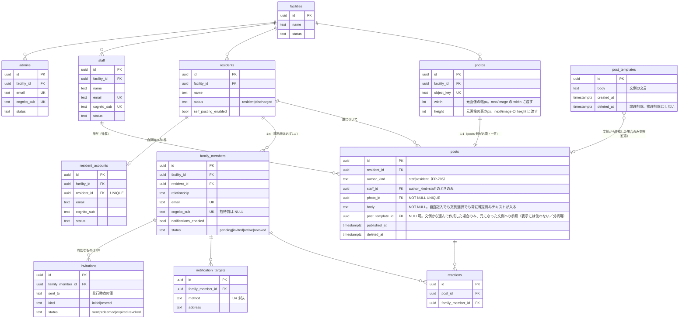

```mermaid
erDiagram
    facilities ||--o{ admins : ""
    facilities ||--o{ staff : ""
    facilities ||--o{ residents : ""
    residents ||--o| resident_accounts : "自律時のみ1件"
    facilities ||--o{ photos : ""

    residents      ||--o{ family_members : "1:n（家族側は必ず1人）"
    family_members ||--o{ invitations : "有効なものは1件"
    family_members ||--o{ notification_targets : ""

    residents ||--o{ posts : "誰について"
    staff     ||--o{ posts : "誰が（帰属）"
    photos    ||--|| posts : "1:1（posts 側が必須・一意）"
    post_templates }o--o| posts : "文例から作成した場合のみ参照（任意）"

    posts          ||--o{ reactions : ""
    family_members ||--o{ reactions : ""

    facilities {
        uuid id PK
        text name
        text status
    }
    admins {
        uuid id PK
        uuid facility_id FK
        text email UK
        text cognito_sub UK
        text status
    }
    staff {
        uuid id PK
        uuid facility_id FK
        text name
        text email UK
        text cognito_sub UK
        text status
    }
    residents {
        uuid id PK
        uuid facility_id FK
        text name
        text status "resident|discharged"
        bool self_posting_enabled 
    }
    resident_accounts {
        uuid id PK
        uuid facility_id FK
        uuid resident_id FK "UNIQUE"
        text email
        text cognito_sub
        text status
    }
    family_members {
        uuid id PK
        uuid facility_id FK
        uuid resident_id FK
        text relationship
        text email UK
        text cognito_sub UK "招待前は NULL"
        bool notifications_enabled
        text status "pending|invited|active|revoked"
    }
    invitations {
        uuid id PK
        uuid family_member_id FK
        text sent_to "発行時点の値"
        text kind "initial|resend"
        text status "sent|redeemed|expired|revoked"
    }
    photos {
        uuid id PK
        uuid facility_id FK
        text object_key UK
        int width "元画像の幅px。next/image の width に渡す"
        int height "元画像の高さpx。next/image の height に渡す"
    }
    posts {
        uuid id PK
        uuid resident_id FK
        text author_kind "staff|resident（FR-705）"
        uuid staff_id FK "author_kind=staff のときのみ"
        uuid photo_id FK "NOT NULL UNIQUE"
        text body "NOT NULL。自由記入でも文例選択でも常に確定済みテキストが入る"
        uuid post_template_id FK "NULL可。文例から選んで作成した場合のみ、元になった文例への参照（表示には使わない／分析用）"
        timestamptz published_at
        timestamptz deleted_at
    }
    post_templates {
        uuid id PK
        text body "文例の文言"
        timestamptz created_at
        timestamptz deleted_at "論理削除。物理削除はしない"
    }
    reactions {
        uuid id PK
        uuid post_id FK
        uuid family_member_id FK
    }
    notification_targets {
        uuid id PK
        uuid family_member_id FK
        text method "U4 未決"
        text address
    }
```